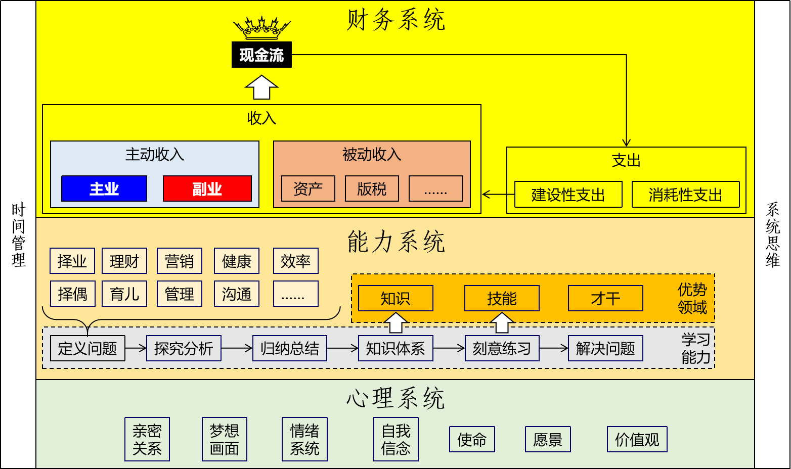
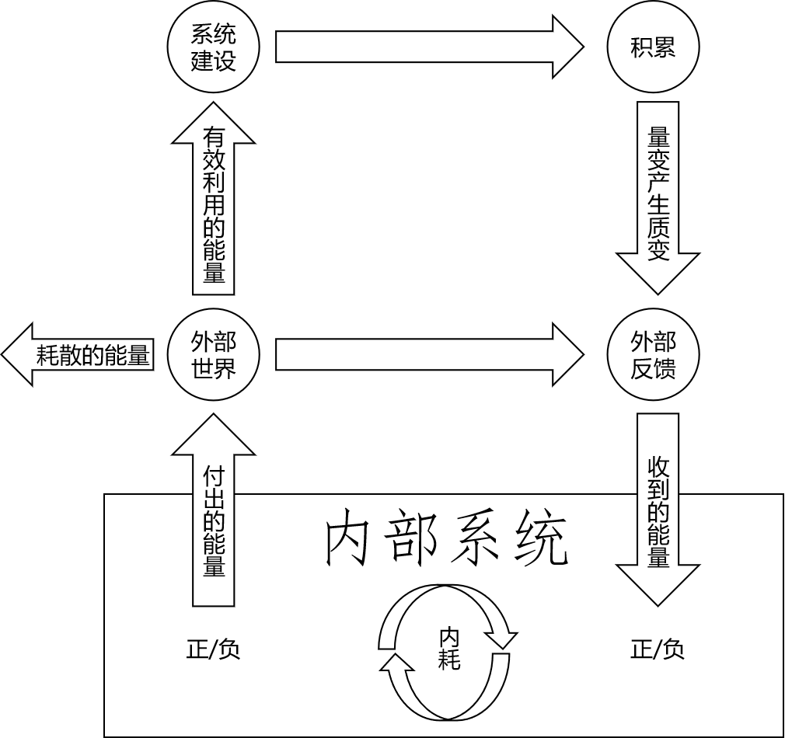
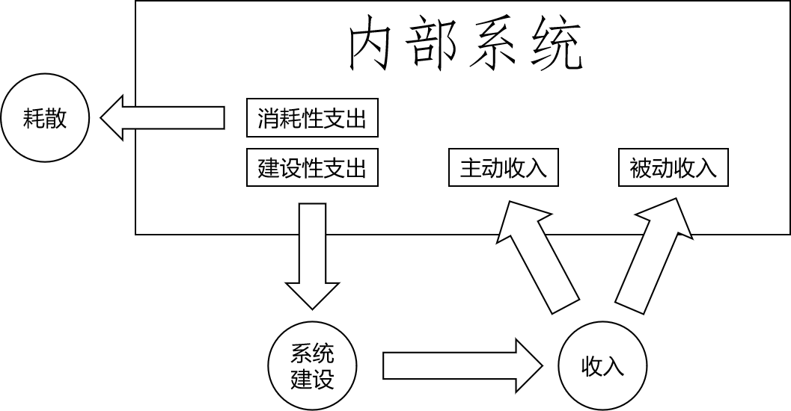
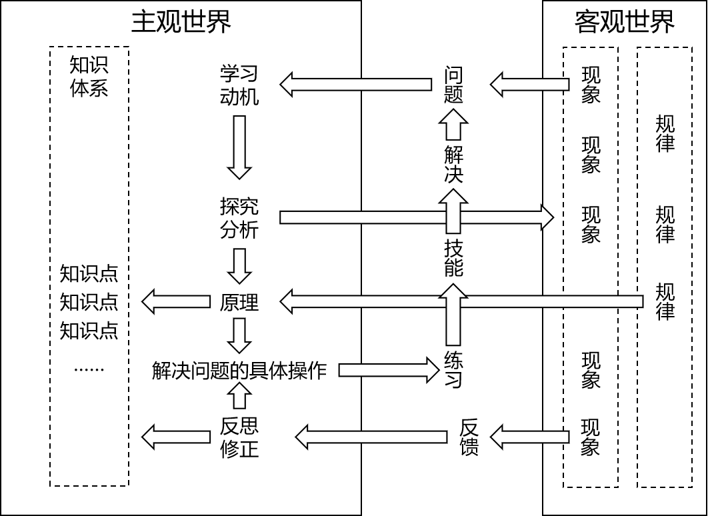

[TOC]

# 学习那些事

## 一、为什么学习

学习本身不是目的，我们不是为了学习而学习。学习真正的目的是为了解决现实生活中真实存在的问题，这也是衡量学习效果的终极标准。要举例子的话那就太多太多了：你参加了一个减肥训练营，最终衡量标准就是瘦了几斤；你参加了一个时间管理训练营，最终衡量标准就是工作、生活效率是否提高，你的幸福指数是否提高；你参加一个职业培训，最终衡量标准就是有没有找到工作。问题有大有小，而我们当然应该先关注最重大的问题而非细枝末节。

## 二、人生的终极问题

这里咱们就不去探讨“我是谁”、“我从哪来”、“我要去哪”这些问题了，我想说的是『人生规划』。对，你没看错，不是『职业规划』，是『人生规划』。有啥区别呢？

看到了吧？『人生规划』的范围比『职业规划』的范围要大得多。那么下一个问题是为什么要跳出职业规划在更大范围内来讨论人生规划呢？

- 理由1：职业是手段不是目的，最终我们追求的还是更好的人生。
- 理由2：随着社会的进步，科技的发展，我们这代人大概率会活到100岁，职业生涯在我们整个人生中的比例越来越小了。
- 理由3：职业发展是基于公司的，而从个人职业生涯发展的角度来看，公司只不过就是一个买卖劳动时间的交易场所。随着寿命的延长，我们会有更长的时间活在老年阶段。靠贩卖劳动时间而获取的收入越来越不足以负担自己老年阶段的开销。更不要说我们背后还有依赖我们的家庭。
- 理由4：互联网的发展给了个体崛起最好的契机。社会和市场一定会以最高效的方式来组织和运作，社群或许是取代公司形式的新的可尝试方式。
- 理由5：赚钱并不是人生的唯一主题。美好的人生应该是在实现财富自由之后才真正开始。有的人一辈子也没有实现财富自由，有的人到退休后开始领退休金姑且算是实现最低限度的财富自由了，有的人50岁退休，有的人40岁退休，有的人30岁退休……但是不管怎么样一个人确实不应该一辈子都被束缚在“赚钱”这件事上。迈过这个坎儿，人生还有很多事值得去做。而翻过大山后的事情同样应该纳入到我们的整体规划中。我们要先敢想才有希望去实现；想都不敢想就完全没有实现的可能了。
- 理由6：在互联网时代职业应该被重新定义了。从时间上来说它是人生的一个阶段；从空间上来说它有各种不同的形式——至少主业、副业要区分一下吧，打工、兼职、创业和自由职业要区分一下吧。
- 理由7：我们现在这个时代时时都处在飞速的变化中，职业生涯中不确定的因素太多了。行业、企业、职位都要随时准备好打碎重组。即使我们必然会有一段时间对职业有严重依赖也必须到职业之外给自己找到确定性的力量来对冲职业之内的所有不确定。
- 理由8：线下的空间两极化，小城市和乡村人口净流出，大城市人口净流入。小城市有空间，但是那里的空间越来越不值钱。大城市空间值钱，被越来越密集的填满。线下有价值的空间越来越难挤进去了。都知道一线城市核心地段的房子是稀缺资源，但是想上车越来越难了。但是线上的空间是无限的。而如果我们能够在线上的无限空间里占据一块属于我们自己的品牌高地，那还有什么比这更好的资产呢？不仅如此，线上的品牌资产同样会为你带来源源不断的现金流，进而让你的工作从基于公司的办公环境变成基于互联网，让你只要能上网就能工作。这就是对传统公司通勤工作的极大改变。职业再也不是我们以为的职业。

好吧，那么人生应该如何规划呢？从时间的角度来说完全可以简单粗暴的划分成『财富自由之前』和『财富自由之后』；而『财富自由之后』那基本就是你想干什么就干什么了，不需要我教你——更不要说我也还没到这一步。所以很简单：对现在的我们来说努力达到财富自由就行了。

那么达到『财富自由』有确定的路径吗？

有，但是不敢保证每个人都能达到。理由也很简单：对每一个人来说内部和外部的不确定因素太多了。而最大的不确定因素是：你是不是相信自己一定能够达到这个目标。我承认，这句话背后的意思几乎就是：只要你相信你能够成功你就一定能成功。我承认这句话没法证伪：你没达到我可以狡辩说你相信的不够虔诚或者时机还没到。

但是人生中终究还是需要在最底层有一些不需要论证的信条。比如：无脑相信“天生我材必有用”，无脑相信“乞食也有出头天”，无脑相信“任何失败都是不是终局，我永远可以爬起来重新开始”，无脑相信“我行，我可以”，无脑相信“我值得被爱”，无脑相信“我有资格拥有一切美好”。在这个层面上不接受任何论证。这些信条是其他所有结论的前提而不是任何其他道理的结论。

这相当于是我们在系统初始化的时候写入的底层代码。遗憾的是很多人这里写入的是“我不行”、“我不够好”、“我不值得爱”、“我不配”。

如果非要量化，这些信念的重要性占到99%。别觉得底层代码很容易修改，它几乎就是一个人整个人生的底色，一切行为的终极底层逻辑。一个陶罐不会因为贴上一张“金罐”的标签就改变了材质。

所以通往财富自由这个目标的路上，我们需要一辆好车。我们会在路上不断调整方向，不断对照地图，不断给车加油，甚至可以给车升级。

你可以认为这是一个实现财富自由的『框架』。

## 三、财富框架

### 1、静态图

王冠给了『现金流』是因为从生存的层面来说，没有现金流我们连基本的生活都保障不了；从发展的层面来说，我们追求的终极目标就是『被动收入』带来的『源源不断的现金流』。

但同样不要忽略的是『心理系统』是我们的最后一道防线。当我们在生活的连番暴击下节节败退，曾经拥有的一切纷纷离开了我们，除了沉重的债务之外一无所有。不断后退的我们终于撞上了一道坚实的障壁，此时已退无可退，这道无比坚实的障壁不允许再往后一步。此后踏出的脚步只可以向前，向前的每一步都比之前更好，它支撑着我们走出困境，再现辉煌。

这道无比坚实的障壁就是『自我肯定的信念』。

『现金流』是天，『信念』是地，天地之间就是我们的舞台。

很多人认为的『职业规划』其实仅仅是这个图中的『主业』，很明显这远远不够。

### 2、动态图

#### ①增强回路

#### ②能量流循环

#### ③财富流循环

### 3、我的定位

财富框架→能力系统→学习能力

## 四、能力框架

### 1、世界有多复杂

#### ①系统叠加

#### ②思维模型

##### [1]点状结构

##### [2]线性结构

##### [3]树形结构

##### [4]网状结构

##### [5]立体网状结构

##### [6]时间立体网状结构

### 2、系统思维

### 3、价值网络和优势领域

### 4、学习框架

## 五、学习框架

### 1、大脑有话说

#### ①思考能力

#### ②记忆能力

#### ③路径依赖

- 快思维
- 慢思维

### 2、知识的知识叫元知识

#### ①知识点

#### ②知识链

#### ③知识树

#### ④知识网络

### 3、打造自己的武器库——实用笔记术

#### ①草稿

#### ②归档存储

##### [1]Word

##### [2]印象笔记

##### [3]Markdown

③

### 4、卖油翁的微笑

#### ①刻意练习

#### ②肌肉记忆

#### ③打破肌肉记忆

### 5、费曼学习法精要

### 6、总结

- 理解原理
- 管理知识
- 练习技能