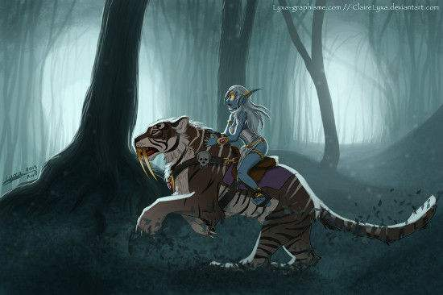
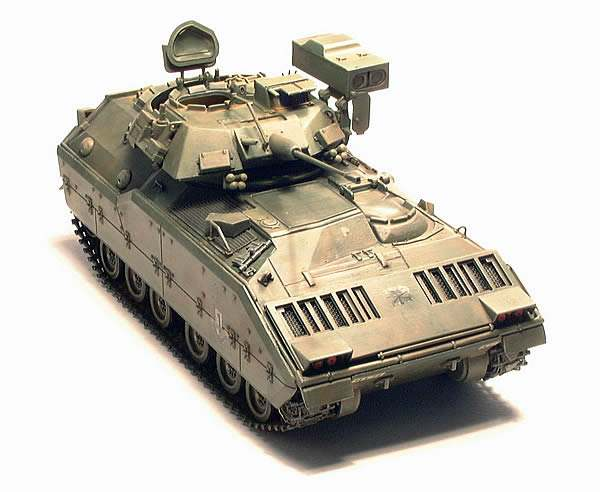

[TOC]

# 一、立项

## 1、传统软件开发项目

企事业单位或政府部门面向社会发布项目招标计划，软件开发企业进行投标、竞标。软件开发企业中标后开始开发。双方会签订合同，在合同中明确所需开发的软件项目应该包含什么功能。开发团队将产品开发完成后需要甲方签字确认。此后如果需要对软件项目进行修改或增加功能则往往需要再付钱才行。

## 2、互联网项目

### ①个人发起

### ②企业发起

# 二、软件工程

## 1、概念

随着应用软件的功能越来越复杂，一个能够满足用户需求的软件产品越来越不是一些if...else或for循环的简单组合。复杂的软件产品必须在开发之前进行规划，按照工程化的方式进行管理和控制，协调各个部门、小组、成员才能够有序的推进项目开发工作的进行，进而达到预期的效果。

我们想象一下在建筑工程中建设一座大楼：绝不可能是某个人一时兴起就挥舞铁锹开始挖地基。软件开发也是一样，真正能够在现实生活中投入使用的软件项目是不可能直接从敲代码开始的。

## 2、瀑布模型

将软件生存周期的各项活动规定为按照固定顺序连接的若干阶段工作，从上到下推进，如同瀑布一样，因此称为瀑布模型。

### ①瀑布模型的优点

开发规范清晰严格

每一个阶段都严格定义了要完成的任务，每一个阶段都有清晰的目标，甚至有明确的可以检查的结果，从而可以强制要求程序员按照规范开发。

文档齐备

严格规定了每个阶段必须提交的文档，最终在项目开发完成时同时产生一套齐备的项目文档，便于日后维护和新成员接手。

### ②瀑布模型的缺点

僵硬死板

由于瀑布模型几乎完全依赖于书面的规格说明，很可能导致最终开发出的软件产品不能真正满足用户的需要。也就是说灵活性太差，越后面的阶段发现问题越难以调整。瀑布模型只适用于项目开始时需求已确定的情况。

总的来说，瀑布模型是一种应付需求变化能力非常弱的开发模型。

## 3、其他模型

- 边做边改模型(Build-and-Fix Model)
- 快速原型模型(Rapid Prototype Model)
- 增量模型(Incremental Model)
- 螺旋模型(Spiral Model)
- 演化模型(evolution model)
- 喷泉模型(fountain model)
- 智能模型(四代技术(4GL))
- 混合模型(hybrid model)
- RAD模型

# 三、敏捷开发

## 1、曾经

在传统软件项目开发过程中，开发团队会和具体的客户基于项目功能需求签订协议，根据合同中规定的功能进行开发。所以开发过程中能够基于相对稳定的功能需求基于瀑布模型开发。

## 2、互联网时代的新挑战

发展到互联网时代后，软件开发的方方面面都遇到了前所未有的挑战。在软件工程方面，程序员发现他们不再面对具体的用户，而是互联网上一个又一个人群。你既不能明确说出来他们是哪个城市、哪个公司、哪个部门或学校又更不能跟某个人签订固定功能的软件开发协议来确定任务。所以互联网时代的项目开发面临这样五个问题：

- 特定受众模糊，所以产品经理们会根据典型用户的特征创建用户画像，作为一个假想的用户个体。
- 项目功能边界不稳定，需要在市场运作中摸索
- 项目功能需要根据用户的新需求进行迭代更新
- 项目的终端设备日新月异，从PC客户端到PC浏览器再到移动客户端再到移动端浏览器不断发展，相应的交互方式和系统界面都需要持续改进
- 竞争激烈，不及时占领市场很可能被淘汰

上述种种情况已经不允许程序员再按照瀑布模型按部就班开发系统，这样太慢而且不灵活。敏捷开发理念就是在这样的时代背景下应运而生。

## 3、敏捷

### ①概念

如果把互联网环境比作一个丛林，那么基于敏捷理念进行开发的一个互联网应用就是丛林中奔跑觅食的一只猎豹。为了生存它会在还不是很强大的时候就进入丛林捕猎，在奔跑中强化肌肉，在受伤后修复伤口，甚至是磨砺尖牙厉爪。如果有需要，它会进化出一对翅膀。当然，一个错误的决定也可能导致它的败亡。比如长出三对翅膀后不堪重负无法捕获猎物饿死。

基于敏捷理念开发的项目更应该被看作是一个生命体。环境一直在改变，它也一直在改变。环境发生了变化，它也要及时作出应对：丛林突然变冷，猎豹需要长出更厚的皮毛。它自己新的想法也要尽快付诸实践，在环境中检验自己的想法是不是正确：长出不同花色的皮毛看看异性是否喜欢从而让自己更受欢迎。

虽然敏捷开发和传统瀑布模型开发都会把项目划分为模块分别开发，但是敏捷开发中的大部分时间是在项目正在运行的同时不断做出修正和改进。想象一下一台高速飞驰的汽车，一边行驶一边加装了一门等离子炮，一边行驶一边把燃油发动起替换为了核聚变发动机。

必须指出的是：项目总体采用敏捷方式开发，但是具体模块、具体功能内部开发还是会遵循瀑布模型的顺序：先确定需求、然后设计逻辑结构、代码实现、测试、上线。

### ②实现

原型

将最初的功能创意想法绘制成草图，基于这个草图让功能需求更加直观，前端和后端工程师据此分头开始各自的工作。相比较瀑布模型省略了大量的中间环节，快速启动项目。

<a target="_blank" href="yuncheng/index.html">点这里查看一个原型示例</a>

持续部署

项目不能满足于单元测试通过，而需要在开发过程中保证本模块可以在服务器上运行，避免大范围返工。

持续集成

项目不能满足于模块独立运行正确，还必须要保证各个模块集成在一起后可以正常工作，对于庞大复杂的系统尤其如此。

持续交付

要在项目有细微升级时就交付给最终用户，及时获得反馈，而不是很长时间后推出一个重大更新版本——这会导致对用户体验的感知严重滞后。

[返回上一级](../index.html)