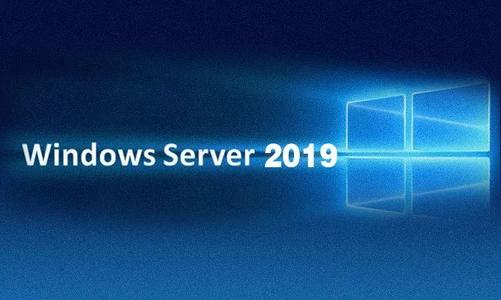

[TOC]

# 一、概述

“服务器”是一个非常宽泛的概念，Tomcat是服务器，MySQL是服务器，Redis也是服务器。同时Linux是服务器，阿里云上租用的虚拟机也是服务器。此时有的小伙伴就会混淆。

其实具体来说，服务器分为下面这些类型。

# 二、硬件服务器

## 1、刀片式服务器

## 2、塔式服务器

## 3、机房

# 三、虚拟机服务器

## 1、VMWare虚拟机

通常来说VMWare用于开发人员在本地电脑上搭建一个模拟的服务器环境，或自己装一些东西测试，不是团队共同使用的正式环境。

## 2、弹性云服务器

使用弹性云服务器最大的好处就是弹性伸缩。什么是弹性伸缩呢？我现在的服务器是20G内存，因为访问量暴涨我需要把内存扩容到80G，要是物理的硬件服务器就需要买来新的内存条插入主板上的内存插槽。而弹性云服务器只需要改一下内存容量的参数就行了，非常方便。等访问量下降了，再把内存容量调回来就可以，不仅方便，而且可以精准的在访问高峰期提高服务器配置而不是一直维持高配，节约成本。

# 四、服务器系统

## 1、总述

有了服务器这台计算机，不管它是物理机还是虚拟机，我们都需要在上面安装操作系统，才能进行其他工作。

## 2、Linux

使用最多的服务器系统，安全稳定、性能强劲、开源免费（或少许费用）。

## 3、Unix

和硬件服务器捆绑销售，版权不公开，用法和Linux一样。

## 4、Windows

源代码不开放，费用高昂，漏洞较多，性能较差，运维成本高。

# 五、软件服务器

硬件服务器装好系统，就可以安装应用软件了，像我们熟知的Tomcat、MySQL、Redis、FastDFS、ElasticSearch等等都是服务器应用软件。它们分别提供自己特定的服务器功能。如果一台服务器上安装了Tomcat，我们会就会把这台服务器叫做Tomcat服务器；如果装了MySQL，就叫做MySQL服务器。很显然，开发过程中需要很多这样的服务器。

[返回上一级](../index.html)