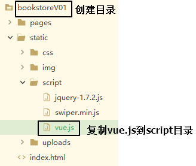
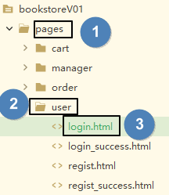

[TOC]

# 第三节 第一阶段要实现的功能

## 0、准备工作

创建目录后，把一整套现成的前端页面复制到新建的目录下，然后用HBuilderX打开这个目录。然后把vue.js文件复制到script目录下。




## 1、登录页面的表单验证

### ①规则设定

- 用户名非空
- 密码非空


### ②在login.html页面中加入Vue的环境

```html
	</body>
	<script src="/bookstoreV01/static/script/vue.js" type="text/javascript" charset="utf-8"></script>
</html>
```




### ③思路


### ④代码实现

#### [1]HTML代码

```html
<form id="loginForm" action="login_success.html">
	<label>用户名称：</label>
	<input class="itxt" type="text" v-model:value="username" placeholder="请输入用户名" autocomplete="off" tabindex="1" name="username" id="username" />
	<br />
	<br />
	<label>用户密码：</label>
	<input class="itxt" type="password" v-model:value="password" placeholder="请输入密码" autocomplete="off" tabindex="1" name="password" id="password" />
	<br />
	<br />
	<button type="submit" id="sub_btn" @click="loginCheck">登录</button>
</form>
```


#### [2]Vue代码

```javascript
new Vue({
	"el":"#loginForm",
	"data":{
		"username":"",
		"password":""
	},
	"methods":{
		"loginCheck":function(){
			
			// 判断用户名或密码是否为空
			if(this.username == "" || this.password == "") {
				// 如果不满足验证条件，那么阻止表单提交
				event.preventDefault();
			}
			
		}
	}
});
```


## 2、注册页面的表单验证

### ①HTML代码

```html
<form id="registerForm" action="regist_success.html">
	<div class="form-item">
		<div>
			<label>用户名称:</label>
			<input v-model:value="username" type="text" placeholder="请输入用户名" />
			<span></span>
		</div>
		<span>{{usernameCheckMessage}}</span>
	</div>
	<div class="form-item">
		<div>
			<label>用户密码:</label>
			<input v-model:value="password" type="password" placeholder="请输入密码" />
		</div>
		<span class="errMess">密码的长度至少为8位</span>
	</div>
	<div class="form-item">
		<div>
			<label>确认密码:</label>
			<input v-model:value="passwordConfirm" type="password" placeholder="请输入确认密码" />
		</div>
		<span class="errMess">密码两次输入不一致</span>
	</div>
	<div class="form-item">
		<div>
			<label>用户邮箱:</label>
			<input v-model:value="email" type="text" placeholder="请输入邮箱" />
		</div>
		<span class="errMess">请输入正确的邮箱格式</span>
	</div>
	<div class="form-item">
		<div>
			<label>验证码:</label>
			<div class="verify">
				<input v-model:value="code" type="text" placeholder="" />
				
			</div>
		</div>
		<span class="errMess">请输入正确的验证码</span>
	</div>
	<button type="submit" @click="registerCheck" class="btn">注册</button>
</form>
```


### ②Vue代码

```javascript
new Vue({
	"el":"#registerForm",
	"data":{
		"username":"",
		"password":"",
		"passwordConfirm":"",
		"email":"",
		"code":"",
		"usernameCheckMessage":""
	},
	"watch":{
		"username":function(inputValue){
			var usernameRegExp = /^[A-Z,a-z,0-9,_]{5,8}$/;
			
			if (usernameRegExp.test(this.username)) {
				this.usernameCheckMessage = "";						
			}else{
				this.usernameCheckMessage = "用户名不符合规则";
			}
		}
	},
	"methods":{
		"registerCheck":function(){
			
			// 1.检查用户名
			var usernameRegExp = /^[A-Z,a-z,0-9,_]{5,8}$/;
			
			if (!usernameRegExp.test(this.username)) {
				
				// 如果不满足条件，则阻止表单提交
				event.preventDefault();
				
				// 有任何一个条件不满足，后面就没必要检查了，所以函数可以停止执行
				return ;
			}
			
			// 2.检查密码
			var passwordRegExp = /^[A-Z,a-z,0-9,_]{5,8}$/;
			
			if (!passwordRegExp.test(this.password)) {
				
				// 如果不满足条件，则阻止表单提交
				event.preventDefault();
				
				// 有任何一个条件不满足，后面就没必要检查了，所以函数可以停止执行
				return ;
			}
			
			// 3.检查确认密码是否和密码一致
			if (this.password != this.passwordConfirm) {
				
				// 如果不满足条件，则阻止表单提交
				event.preventDefault();
				
				// 有任何一个条件不满足，后面就没必要检查了，所以函数可以停止执行
				return ;
				
			}
			
			// 4.检查电子邮件
			var emailRegExp = /^[a-zA-Z0-9_\.-]+@([a-zA-Z0-9-]+[\.]{1})+[a-zA-Z]+$/;
			
			if (!emailRegExp.test(this.email)) {
				
				// 如果不满足条件，则阻止表单提交
				event.preventDefault();
				
				// 有任何一个条件不满足，后面就没必要检查了，所以函数可以停止执行
				return ;
			}
			
			// 5.检查验证码
			var codeRegExp = /[A-Z,a-z,0-9]{5}/;
			
			if(!codeRegExp.test(this.code)) {
				// 如果不满足条件，则阻止表单提交
				event.preventDefault();
				
				// 有任何一个条件不满足，后面就没必要检查了，所以函数可以停止执行
				return ;
			}
		}
	}
});
```


[上一节](verse02.html) [回目录](index.html)