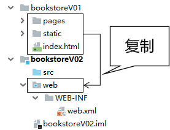
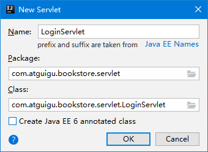
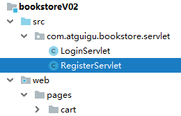

[TOC]

# 第一节 不带数据库的登录注册

## 1、创建动态Web工程


## 2、把V1中的页面粘贴过来




## 3、使用base标签统一设置路径基准

### ①base标签的语法规则

- base标签要写在head标签内
- base标签必须写在所有其他有路径的标签的前面
- base标签使用href属性设置路径的基准
- base标签生效的机制是：最终的访问地址=base标签href属性设置的基准+具体标签内的路径
- 对于想要参考base标签的具体标签，如果路径是以斜杠开头，那么它将不参考base标签


### ②base标签使用举例

```html
<head>
    <meta charset="UTF-8"/>
    <meta name="viewport" content="width=device-width, initial-scale=1.0"/>
    <title>书城首页</title>
    <base href="/bookstore/"/>
    <link rel="stylesheet" href="static/css/minireset.css"/>
    <link rel="stylesheet" href="static/css/common.css"/>
    <link rel="stylesheet" href="static/css/iconfont.css"/>
    <link rel="stylesheet" href="static/css/index.css"/>
    <link rel="stylesheet" href="static/css/swiper.min.css"/>
</head>
```


## 4、基于base标签调整整个页面的路径

### ①base标签的代码

在需要的页面把下面的base标签代码粘贴到head标签内、需要路径的标签前即可

```html
<base href="/bookstore/"/>
```


### ②对需要统一调整的路径执行替换

Ctrl+r调出替换操作窗口


具体操作时请参考页面的实际情况进行替换。


## 5、基本假设

为了实现『不带数据库』的登录注册，我们需要假设：系统中目前已有用户：

| 用户名 | 密码   |
| ------ | ------ |
| tom    | 123456 |


## 6、登录功能

### ①明确目标

在服务器端检查用户通过表单提交的用户名、密码是否正确。

- 成功：跳转到login_success.html页面
- 失败：返回错误消息


### ②思路

友情提示：分析业务功能，捋清思路最好的办法就是画流程图


### ③代码

#### [1]创建LoginServlet



> 创建Packages时的规范：
>
> 公司或组织域名倒序.项目名.模块名.具体包名
>
> 或
>
> 公司或组织域名倒序.项目名.具体包名

下面是完整的Servlet配置信息：

```xml
<servlet>
    <servlet-name>LoginServlet</servlet-name>
    <servlet-class>com.atguigu.bookstore.servlet.LoginServlet</servlet-class>
</servlet>
<servlet-mapping>
    <servlet-name>LoginServlet</servlet-name>
    <url-pattern>/LoginServlet</url-pattern>
</servlet-mapping>
```


#### [2]完成doPost()方法中的代码

```java
protected void doPost(HttpServletRequest request, HttpServletResponse response) throws ServletException, IOException {

    // 1.声明两个变量，用于存储假设的用户名、密码
    String usernameSystem = "tom";
    String passwordSystem = "123456";

    // 2.获取请求参数中的用户名、密码
    String usernameForm = request.getParameter("username");
    String passwordForm = request.getParameter("password");

    // 3.执行判断
    if(usernameSystem.equals(usernameForm) && passwordSystem.equals(passwordForm)) {

        // 4.登录成功：重定向到登录成功页面
        response.sendRedirect(request.getContextPath() + "/pages/user/login_success.html");

    }else{

        // 5.登录失败
        response.setContentType("text/html;charset=UTF-8");
        response.getWriter().write("抱歉！用户名或密码不正确，请重新输入！");

    }

}
```


#### [3]HTML页面设置表单提交地址

```html
<form id="loginForm" action="LoginServlet" method="post">
	<label>用户名称：</label>
	<input class="itxt" type="text" v-model:value="username" placeholder="请输入用户名" autocomplete="off" tabindex="1" name="username" id="username" />
	<br />
	<br />
	<label>用户密码：</label>
	<input class="itxt" type="password" v-model:value="password" placeholder="请输入密码" autocomplete="off" tabindex="1" name="password" id="password" />
	<br />
	<br />
	<button type="submit" id="sub_btn" @click="loginCheck">登录</button>
</form>
```


### ④提示消息改进探索

以下代码仅供参考：

```java
// 5.登录失败
// 返回提示消息方案一：过于简陋
// response.setContentType("text/html;charset=UTF-8");
// response.getWriter().write("抱歉！用户名或密码不正确，请重新输入！");

// 返回提示消息方案二：没有提示消息，让用户非常困惑
// request.getRequestDispatcher("/pages/user/login.html").forward(request, response);

// 返回提示消息方案三：确实能在登录页面显示提示消息，但是实现的方式让我想骂人
response.setContentType("text/html;charset=UTF-8");
PrintWriter writer = response.getWriter();
writer.write("<!DOCTYPE html>");
writer.write("<html>");
writer.write("	<head>");
writer.write("		<base href='/bookstore/' />");
```


## 7、注册功能

### ①明确目标

用户提交注册表单后，检查用户名是否被占用

- 没有被占用：注册成功
- 已经被占用：注册失败


### ②思路


### ③代码

#### [1]创建RegisterServlet



完整配置信息：

```xml
<servlet>
    <servlet-name>RegisterServlet</servlet-name>
    <servlet-class>com.atguigu.bookstore.servlet.RegisterServlet</servlet-class>
</servlet>
<servlet-mapping>
    <servlet-name>RegisterServlet</servlet-name>
    <url-pattern>/RegisterServlet</url-pattern>
</servlet-mapping>
```


#### [2]完成doPost()方法中的代码

```java
protected void doPost(HttpServletRequest request, HttpServletResponse response) throws ServletException, IOException {

    // 1.声明变量保存系统内置的用户名
    String usernameSystem = "jerry";

    // 2.获取请求参数
    String usernameForm = request.getParameter("username");

    // 3.比较
    if (usernameSystem.equals(usernameForm)) {

        // 4.说明用户名已经被占用，需要提示错误消息
        response.setContentType("text/html;charset=UTF-8");
        PrintWriter writer = response.getWriter();
        writer.write("抱歉！用户名已经被占用，请重新输入！");

    }else{

        // 5.说明用户名可用，跳转到注册成功页面
        response.sendRedirect(request.getContextPath() + "/pages/user/regist_success.html");

    }

}
```


#### [3]HTML页面调整表单中的设置

```html
<form id="registerForm" action="RegisterServlet" method="post">
	<div class="form-item">
		<div>
			<label>用户名称:</label>
			<input v-model:value="username" type="text" name="username" placeholder="请输入用户名" />
			<span></span>
		</div>
		<span>{{usernameCheckMessage}}</span>
	</div>
	<div class="form-item">
		<div>
			<label>用户密码:</label>
			<input v-model:value="password" type="password" name="password" placeholder="请输入密码" />
		</div>
		<span class="errMess">密码的长度至少为8位</span>
	</div>
	<div class="form-item">
		<div>
			<label>确认密码:</label>
			<input v-model:value="passwordConfirm" type="password" placeholder="请输入确认密码" />
		</div>
		<span class="errMess">密码两次输入不一致</span>
	</div>
	<div class="form-item">
		<div>
			<label>用户邮箱:</label>
			<input v-model:value="email" type="text" name="email" placeholder="请输入邮箱" />
		</div>
		<span class="errMess">请输入正确的邮箱格式</span>
	</div>
	<div class="form-item">
		<div>
			<label>验证码:</label>
			<div class="verify">
				<input v-model:value="code" type="text" name="code" placeholder="" />
				
			</div>
		</div>
		<span class="errMess">请输入正确的验证码</span>
	</div>
	<button type="submit" @click="registerCheck" class="btn">注册</button>
</form>
```


[回目录](index.html) [下一节](verse02.html)