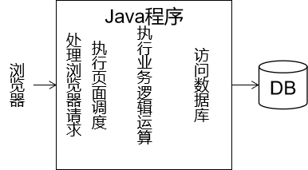

[TOC]

# 第二节 三层架构

## 1、三层架构划分


- 表述层：负责处理浏览器请求、返回响应、页面调度
- 业务逻辑层：负责处理业务逻辑，根据业务逻辑把持久化层从数据库查询出来的数据进行运算、组装，封装好后返回给表述层，也可以根据业务功能的需要调用持久化层把数据保存到数据库、修改数据库中的数据、删除数据库中的数据
- 持久化层：根据上一层的调用对数据库中的数据执行增删改查的操作


## 2、三层架构好处

如果不做三层架构形式的拆分：



所有和当前业务功能需求相关的代码全部耦合在一起，如果其中有任何一个部分出现了问题，牵一发而动全身，导致其他无关代码也要进行相应的修改。这样的话代码会非常难以维护。

所以为了提高开发效率，需要对代码进行模块化的拆分。整个项目模块化、组件化程度越高，越容易管理和维护，出现问题更容易排查。


## 3、三层架构和模型的关系


模型对整个项目中三层架构的每一层都提供支持，具体体现是使用模型对象<span style="color:blue;font-weight:bold;">封装业务功能数据</span>。

> Java实体类有很多不同名称：
>
> - POJO：Plain old Java Object，传统的普通的Java对象
> - entity：实体类
> - bean或Java bean
> - domain：领域模型


## 4、模型开发的要求

### ①ORM

ORM：Object Relative Mapping对象关系映射

对象：Java对象

关系：关系型数据库

映射：Java对象和数据库表之间的对应关系

| Java类             | 数据库表                       |
| ------------------ | ------------------------------ |
| 类                 | 表                             |
| 属性               | 字段/列                        |
| 对象               | 记录/行                        |
| 属性按照驼峰式命名 | 字段名各个单词之间用下划线分开 |


### ②Java实体类的要求

- 必须有一个无参构造器

  将来使用框架后，大量的对象都是框架通过反射来创建的。

  Class&lt;T&gt; clazz = Class.forName("全类名");

  clazz.newInstance();

- 通过getXxx()、setXxx()方法定义属性：getXxx()或setXxx()方法去掉get或set后，Xxx把首字母小写，得到的xxx就是属性名。

```java
public class User {

	private String safeUserName;
	
	public String getUserName(){
		return this.safeUserName;
	}
	
	public void setUserName(String userName){
		this.safeUserName = userName;
	}

}
```

在上面例子中，getXxx()、setXxx()方法定义的属性是userName，不是safeUserName。


[上一节](verse01.html) [回目录](index.html) [下一节](verse03.html)