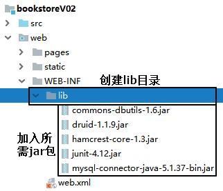
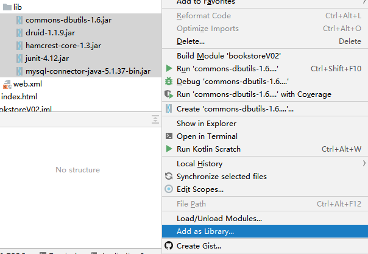
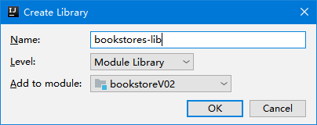
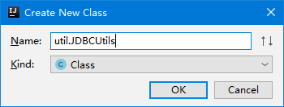
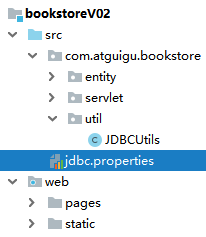
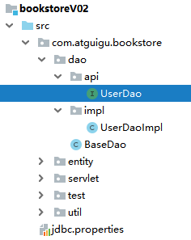

[TOC]

# 第四节 持久化层

## 1、加入所需jar包








## 2、创建连接数据库的工具类




## 3、创建外部属性文件



```properties
driverClassName=com.mysql.jdbc.Driver
url=jdbc:mysql://192.168.198.100:3306/bookstore210107
username=root
password=atguigu
initialSize=10
maxActive=20
maxWait=10000
```

注意：这里是上课演示时使用的参数，大家操作时要改成自己的。


## 4、在JDBCUtils类中创建数据源对象

```java
private static DataSource dataSource;

static {

    // 1.创建一个用于存储外部属性文件信息的Properties对象
    Properties properties = new Properties();

    // 2.使用当前类的类加载器加载外部属性文件：jdbc.properties
    InputStream inputStream = JDBCUtils.class.getClassLoader().getResourceAsStream("jdbc.properties");

    try {

        // 3.将外部属性文件jdbc.properties中的数据加载到properties对象中
        properties.load(inputStream);

        // 4.创建数据源对象
        dataSource = DruidDataSourceFactory.createDataSource(properties);

    } catch (Exception e) {
        e.printStackTrace();
    }

}
```


## 5、声明工具方法操作数据库连接

```java
    /**
     * 从数据源中获取数据库连接
     * @return 数据库连接对象
     */
    public static Connection getConnection() {

        Connection connection = null;

        try {
            connection = dataSource.getConnection();
        } catch (SQLException e) {
            e.printStackTrace();
            throw new RuntimeException(e);
        }

        return connection;

    }

    /**
     * 释放数据库连接
     * @param connection 要执行释放操作的连接对象
     */
    public static void releaseConnection(Connection connection) {

        if (connection != null) {

            try {
                connection.close();
            } catch (SQLException e) {
                e.printStackTrace();
                throw new RuntimeException(e);
            }

        }

    }
```

测试代码如下：

```java
public class BookstoreTest {

    @Test
    public void testConnection() {

        Connection connection = JDBCUtils.getConnection();
        System.out.println("connection = " + connection);

    }

}
```


## 6、创建BaseDao

### ①DAO概念

DAO：Data Access Object数据访问对象

DAL：Data Access Layer数据访问层


### ②创建Java类


### ③编写通用方法

```java
/**
 * 各个具体Dao类的基类，泛型T对应具体实体类类型
 * @param <T>
 */
public class BaseDao<T> {

    private QueryRunner queryRunner = new QueryRunner();

    /**
     * 通用的增删改方法
     * @param sql 要执行的SQL语句
     * @param param 为SQL语句准备好的参数
     * @return 受影响的行数
     */
    public int update(String sql, Object ... param) {

        int updatedRowCount = 0;

        Connection connection = JDBCUtils.getConnection();

        try {

            updatedRowCount = queryRunner.update(connection, sql, param);

        }
        // 为了让上层方法调用方便，将编译时异常捕获
        catch (SQLException e) {
            e.printStackTrace();

            // 为了不掩盖问题，将编译时异常封装为运行时异常抛出
            throw new RuntimeException(e);
        } finally {
            
            // 关闭数据库连接
            JDBCUtils.releaseConnection(connection);
            
        }

        return updatedRowCount;

    }

    /**
     * 查询单个对象
     * @param clazz 单个对象所对应的实体类类型
     * @param sql   查询单个对象所需要的SQL语句
     * @param param SQL语句的参数
     * @return      查询到的单个对象
     */
    public T getBean(Class<T> clazz, String sql, Object ... param) {

        Connection connection = JDBCUtils.getConnection();

        T t = null;

        try {

            t = queryRunner.query(connection, sql, new BeanHandler<>(clazz), param);
        } catch (SQLException e) {
            e.printStackTrace();

            throw new RuntimeException(e);
        } finally {
            
            // 关闭数据库连接
            JDBCUtils.releaseConnection(connection);
            
        }

        return t;
    }

    /**
     * 查询集合对象
     * @param clazz 集合中单个对象所对应的实体类类型
     * @param sql   查询集合所需要的SQL语句
     * @param param SQL语句的参数
     * @return      查询到的集合对象
     */
    public List<T> getBeanList(Class<T> clazz, String sql, Object ... param) {

        Connection connection = JDBCUtils.getConnection();

        List<T> list = null;

        try {

            list = queryRunner.query(connection, sql, new BeanListHandler<>(clazz), param);
        } catch (SQLException e) {
            e.printStackTrace();

            throw new RuntimeException(e);
        } finally {
            
            // 关闭数据库连接
            JDBCUtils.releaseConnection(connection);
            
        }

        return list;
    }

}
```

测试方法：

```java
@Test
public void testUpdate() {
    BaseDao<Object> baseDao = new BaseDao<>();

    String sql = "insert into t_user(user_name,user_pwd) values(?,?)";

    int count = baseDao.update(sql, "罗志祥", "789456");

    System.out.println("count = " + count);
}

@Test
public void testGetBean() {
    BaseDao<User> baseDao = new BaseDao<>();

    // user_id userId
    // user_name userName
    // user_pwd userPwd
    String sql = "select user_id userId,user_name userName,user_pwd userPwd from t_user where user_id=?";

    User user = baseDao.getBean(User.class, sql, 2);

    System.out.println("user = " + user);
}

@Test
public void testGetBeanList() {
    BaseDao<User> baseDao = new BaseDao<>();

    String sql = "select user_id userId,user_name userName,user_pwd userPwd from t_user";

    List<User> userList = baseDao.getBeanList(User.class, sql);

    for (User user : userList) {
        System.out.println("user = " + user);
    }
}
```


## 7、创建UserDao

### ①用户登录注册功能中的组件关系图


### ②声明UserDao接口



```java
public interface UserDao {

    /**
     * 根据用户名查询User对象
     * @param username 用户名
     * @return 查询到的User对象
     */
    User selectUserByName(String username);

    /**
     * 将User对象保存到数据库
     * @param user 要保存的User对象
     * @return 受影响的行数
     */
    int insertUser(User user);

}
```


### ③声明UserDaoImpl实现类

```java
public class UserDaoImpl extends BaseDao<User> implements UserDao {
    @Override
    public User selectUserByName(String username) {

        String sql = "select user_id userId,user_name userName,user_pwd userPwd,email from t_user where user_name=?";

        return super.getBean(User.class, sql, username);
    }

    @Override
    public int insertUser(User user) {

        String sql = "insert into t_user(user_name,user_pwd,email) values(?,?,?)";

        return super.update(sql, user.getUserName(), user.getUserPwd(), user.getEmail());
    }
}
```


### ④测试方法

```java
@Test
public void testUserDaoGetUserByName() {

    UserDao userDao = new UserDaoImpl();

    User user = userDao.selectUserByName("陈冠希");

    System.out.println("user = " + user);

}

@Test
public void testUserDaoSaveUser() {
    UserDao userDao = new UserDaoImpl();

    User user = new User(null, "陈冠希", "666666", "aaa@qq.com");

    int count = userDao.insertUser(user);

    System.out.println("count = " + count);
}
```


[上一节](verse03.html) [回目录](index.html) [下一节](verse05.html)