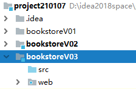

[TOC]

# 第一节 创建module，迁移代码

## 1、创建module



把index.jsp删除


## 2、加入jar包

> attoparser-2.0.5.RELEASE.jar
> commons-dbutils-1.6.jar
> druid-1.1.9.jar
> hamcrest-core-1.3.jar
> javassist-3.20.0-GA.jar
> junit-4.12.jar
> log4j-1.2.15.jar
> mysql-connector-java-5.1.37-bin.jar
> ognl-3.1.26.jar
> slf4j-api-1.7.25.jar
> slf4j-log4j12-1.7.25.jar
> thymeleaf-3.0.12.RELEASE.jar
> unbescape-1.1.6.RELEASE.jar


## 3、从V02迁移代码

### ①src目录下的Java源代码

- 在V02的module中的src目录上点右键
- show in explorer在操作系统的窗口内打开
- 在操作系统的窗口内复制package目录和jdbc.properties
- 在操作系统的窗口内粘贴到V03的module中的src目录下
- 在V03的src目录下，找到上一个版本的Servlet，全部删除
- 创建两个子包
  - 存放Servlet基类：com.atguigu.bookstore.servlet.base
  - 存放Servlet子类：com.atguigu.bookstore.servlet.model
- 从view-demo中，将两个基类迁移过来
  - 视图基类：ViewBaseServlet
  - 方法分发基类：ModelBaseServlet


### ②前端页面

- 将V02中的pages目录整体复制到V03 module的<span style="color:blue;font-weight:bold;">WEB-INF目录</span>下
- 将V02中的static目录整体复制到V03 module的<span style="color:blue;font-weight:bold;">web目录</span>下
- 将V02中的index.html复制到V03 module的WEB-INF/pages目录下，将来通过Servlet访问


## 4、显示首页

### ①配置web.xml

```xml
<!-- 在上下文参数中配置视图前缀和视图后缀 -->
<context-param>
    <param-name>view-prefix</param-name>
    <param-value>/WEB-INF/pages/</param-value>
</context-param>
<context-param>
    <param-name>view-suffix</param-name>
    <param-value>.html</param-value>
</context-param>
```

<span style="color:blue;font-weight:bold;">注意</span>：这里需要将WEB-INF下的view改成pages，和当前项目环境的目录结构一致。


### ②创建PortalServlet

<span style="color:blue;font-weight:bold;">注意</span>：这个PortalServlet映射的地址是/index.html，这样才能保证访问首页时访问它。

```xml
<servlet>
    <servlet-name>PortalServlet</servlet-name>
    <servlet-class>com.atguigu.bookstore.servlet.model.PortalServlet</servlet-class>
</servlet>
<servlet-mapping>
    <servlet-name>PortalServlet</servlet-name>
    <url-pattern>/index.html</url-pattern>
</servlet-mapping>
```

<span style="color:blue;font-weight:bold;">注意</span>：PortalServlet服务于首页的显示，为了降低用户访问首页的门槛，不能附加任何请求参数，所以不能继承ModelBaseServlet，只能继承ViewBaseServlet。

```java
public class PortalServlet extends ViewBaseServlet {

    protected void doGet(HttpServletRequest request, HttpServletResponse response) throws ServletException, IOException {

        // 将两种请求方式的处理逻辑合并到一个方法
        doPost(request, response);
    }

    protected void doPost(HttpServletRequest request, HttpServletResponse response) throws ServletException, IOException {

        // 声明视图名称
        String viewName = "index";
        
        // 解析模板视图
        processTemplate(viewName, request, response);

    }

}
```


### ③调整index.html

- 加入Thymeleaf名称空间

```html
<html lang="en" xmlns:th="http://www.thymeleaf.org">
```

- 修改base标签

```html
<base th:href="@{/}" href="/bookstore/"/>
```


[回目录](index.html) [下一节](verse02.html)