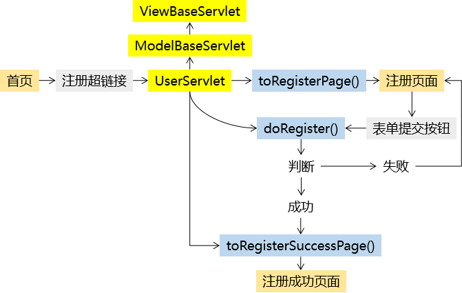

[TOC]

# 第二节 完成用户模块

## 1、重构登录功能

### ①思路


### ②实现：创建并组装组件

#### [1]创建UserServlet

web.xml中的配置：

```xml
<servlet>
    <servlet-name>UserServlet</servlet-name>
    <servlet-class>com.atguigu.bookstore.servlet.model.UserServlet</servlet-class>
</servlet>
<servlet-mapping>
    <servlet-name>UserServlet</servlet-name>
    <url-pattern>/UserServlet</url-pattern>
</servlet-mapping>
```

Java代码：

```java
public class UserServlet extends ModelBaseServlet {
    protected void doLogin(HttpServletRequest request, HttpServletResponse response) throws ServletException, IOException {

    }

    protected void toLoginPage(HttpServletRequest request, HttpServletResponse response) throws ServletException, IOException {

    }

    protected void toLoginSuccessPage(HttpServletRequest request, HttpServletResponse response) throws ServletException, IOException {

    }
}
```

<span style="color:blue;font-weight:bold;">注意</span>：记得修改UserServlet继承的类ModelBaseServlet。


#### [2]把UserService组件组装到UserServlet中

```java
public class UserServlet extends ModelBaseServlet {
    
    private UserService userService = new UserServiceImpl();
    
```


### ③实现：前往登录页面

#### [1]修改首页中登录超链接

```html
<a href="UserServlet?method=toLoginPage" class="login">登录</a>
```


#### [2]完成UserServlet.toLoginPage()方法

```java
protected void toLoginPage(HttpServletRequest request, HttpServletResponse response) throws ServletException, IOException {
    String viewName = "user/login";
    
    processTemplate(viewName, request, response);
}
```


#### [3]调整登录页面代码

- 加入Thymeleaf名称空间

```html
<html lang="en" xmlns:th="http://www.thymeleaf.org">
```

- 修改base标签

```html
<base th:href="@{/}" href="/bookstore/" />
```

- 修改form标签action属性

```html
<form id="loginForm" action="UserServlet" method="post">
```

- 增加method请求参数的表单隐藏域

```html
<input type="hidden" name="method" value="doLogin" />
```

- 根据条件显示登录失败消息

```html
<p style="color: red;font-weight: bold;" th:if="${not #strings.isEmpty(message)}" th:text="${message}">这里根据条件显示登录失败消息</p>
```


#### [4]回显表单中的用户名

遇到问题：使用th:value="${param.username}"确实实现了服务器端渲染，但是实际打开页面并没有看到。原因是页面渲染顺序：

- 服务器端渲染
- 服务器端将渲染结果作为响应数据返回给浏览器
- 浏览器加载HTML文档
- 读取到Vue代码后，执行Vue代码
- Vue又进行了一次浏览器端渲染，覆盖了服务器端渲染的值

解决办法：将服务器端渲染的结果设置到Vue对象的data属性中。

```javascript
new Vue({
	"el":"#loginForm",
	"data":{
		"username":"[[${param.username}]]",
		"password":""
	},
```


### ④实现：前往登录成功页面

UserServlet.toLoginSuccessPage()

```java
protected void toLoginSuccessPage(HttpServletRequest request, HttpServletResponse response) throws ServletException, IOException {
    String viewName = "user/login_success";
    
    processTemplate(viewName, request, response);
}
```

login_success.html

```html
<html lang="en" xmlns:th="http://www.thymeleaf.org">
    ……
<base th:href="@{/}" href="/bookstore/"/>
```


### ⑤实现：完成登录操作

```java
protected void doLogin(HttpServletRequest request, HttpServletResponse response) throws ServletException, IOException {

    // 1.从请求参数中获取用户名和密码
    String username = request.getParameter("username");
    String password = request.getParameter("password");

    // 2.封装为User对象
    User userForm = new User(null, username, password, null);

    // 3.调用UserService的方法执行登录验证
    try {
        User userDB = userService.doLogin(userForm);

        // 4.登录成功后跳转到登录成功页面
        response.sendRedirect(request.getContextPath() + "/UserServlet?method=toLoginSuccessPage");
    } catch (Exception e) {
        e.printStackTrace();

        // 5.登录失败则显示提示消息
        // ①将登录失败的提示消息存入请求域
        request.setAttribute("message", e.getMessage());

        // ②执行登录页面的模板渲染
        String viewName = "user/login";

        processTemplate(viewName, request, response);
    }

}
```


## 2、重构注册功能

### ①思路




### ②实现：前往注册页面

#### [1]修改首页中注册超链接

```html
<a href="UserServlet?method=toRegisterPage" class="register">注册</a>
```


#### [2]完成UserServlet.toRegisterPage()方法

```java
protected void toRegisterPage(HttpServletRequest request, HttpServletResponse response) throws ServletException, IOException {

    String viewName = "user/regist";

    processTemplate(viewName, request, response);
    
}
```


#### [3]调整注册页面代码

```html
<html lang="en" xmlns:th="http://www.thymeleaf.org">
    ……
<base th:href="@{/}" href="/bookstore/"/>
    ……
    <form id="registerForm" action="UserServlet" method="post">
					<input type="hidden" name="method" value="doRegister" />
        ……
        <p style="color: red;font-weight: bold;" th:if="${not #strings.isEmpty(message)}" th:text="${message}">这里根据条件显示注册失败消息</p>
```

```javascript
new Vue({
	"el":"#registerForm",
	"data":{
		"username":"[[${param.username}]]",
		"password":"",
		"passwordConfirm":"",
		"email":"[[${param.email}]]",
		"code":"",
		"usernameCheckMessage":""
	}
```


### ③实现：前往注册成功页面

UserServlet：

```java
protected void toRegisterSuccessPage(HttpServletRequest request, HttpServletResponse response) throws ServletException, IOException {

    String viewName = "user/regist_success";

    processTemplate(viewName, request, response);

}
```

regist_success.html：

```html
<html lang="en" xmlns:th="http://www.thymeleaf.org">
    ……
<base th:href="@{/}" href="/bookstore/"/>
```


### ④实现：完成注册操作

```java
protected void doRegister(HttpServletRequest request, HttpServletResponse response) throws ServletException, IOException {
    // 1.从请求参数中获取数据封装为User对象
    String username = request.getParameter("username");
    String password = request.getParameter("password");
    String email = request.getParameter("email");

    User userForm = new User(null, username, password, email);

    // 2.调用UserService的方法执行注册
    try {
        userService.doRegister(userForm);

        // 3.如果没有抛出异常那么就跳转到注册成功的页面
        // 选择重定向的原因：跳转到regist_success.html页面后，用户刷新浏览器不会重复提交注册表单
        response.sendRedirect(request.getContextPath()+"/UserServlet?method=toRegisterSuccessPage");
    } catch (Exception e) {
        e.printStackTrace();

        // 4.如果抛出了异常
        request.setAttribute("message", e.getMessage());
        
        String viewName = "user/regist";

        processTemplate(viewName, request, response);
    }
}
```


[上一节](verse01.html) [回目录](index.html) [下一节](verse03.html)