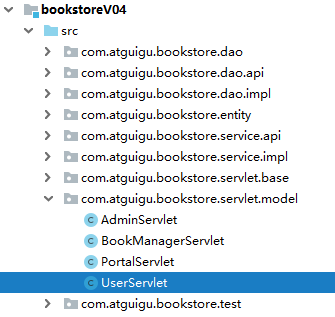

[TOC]

# 第一节 保持登录状态

## 1、创建module

- 迁移src目录下的Java代码
- 迁移web目录下的static目录
- 迁移web/WEB-INF目录下的lib目录和pages目录
- 将lib目录下的jar包添加到运行时环境
- 将旧的web.xml中的配置复制到新module的web.xml中


## 2、将登录成功的User对象存入会话域



```java
protected void doLogin(HttpServletRequest request, HttpServletResponse response) throws ServletException, IOException {

    // 1.从请求参数中获取用户名和密码
    String username = request.getParameter("username");
    String password = request.getParameter("password");

    // 2.封装为User对象
    User userForm = new User(null, username, password, null);

    // 3.调用UserService的方法执行登录验证
    try {
        User userDB = userService.doLogin(userForm);

        // ※保持登录状态，将User对象存入会话域
        HttpSession session = request.getSession();
        
        // 注意：不要放错，这里要使用从数据库查询得到的User对象
        session.setAttribute("user", userDB);

        // 4.登录成功后跳转到登录成功页面
        response.sendRedirect(request.getContextPath() + "/UserServlet?method=toLoginSuccessPage");
    } catch (Exception e) {
        e.printStackTrace();

        // 5.登录失败则显示提示消息
        // ①将登录失败的提示消息存入请求域
        request.setAttribute("message", e.getMessage());

        // ②执行登录页面的模板渲染
        String viewName = "user/login";

        processTemplate(viewName, request, response);
    }

}
```


## 3、修改欢迎信息

### ①登录成功页面

```html
<span>欢迎<span class="um_span" th:text="${session.user.username}">张总</span>光临尚硅谷书城</span>
```


### ②首页

```html
<div class="topbar-right" th:if="${session.user == null}">
    <a href="UserServlet?method=toLoginPage" class="login">登录</a>
    <a href="UserServlet?method=toRegisterPage" class="register">注册</a>
    <a href="pages/cart/cart.html" class="cart iconfont icon-gouwuche">
        购物车
        <div class="cart-num">3</div>
    </a>
    <a href="AdminServlet?method=toPortalPage" class="admin">后台管理</a>
</div>
<!--          登录后风格-->
<div class="topbar-right" th:if="${session.user != null}">
    <span>欢迎你<b th:text="${session.user.userName}">张总</b></span>
    <a href="#" class="register">注销</a>
    <a href="pages/cart/cart.jsp" class="cart iconfont icon-gouwuche">
        购物车
        <div class="cart-num">3</div>
    </a>
    <a href="pages/manager/book_manager.html" class="admin">后台管理</a>
</div>
```


## 4、退出登录功能

### ①页面超链接

```html
<a href="UserServlet?method=logout">注销</a>
```


### ②UserServlet.logout()

```java
protected void logout(HttpServletRequest request, HttpServletResponse response) throws ServletException, IOException {

    HttpSession session = request.getSession();

    // 退出登录方案一：从会话域移除User对象
    // session.removeAttribute("user");

    // 退出登录方案二：强制Session对象失效
    session.invalidate();

    processTemplate("index", request, response);
}
```


[回目录](index.html) [下一节](verse02.html)