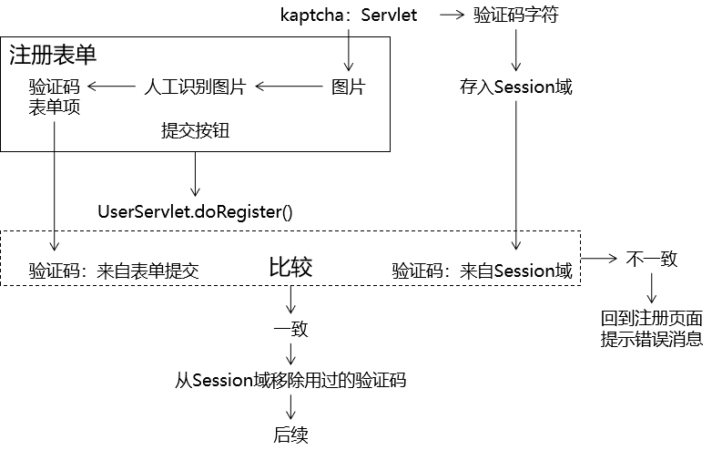
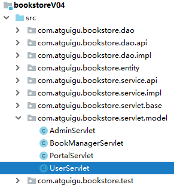

[TOC]

# 第二节 验证码

## 1、目标

通过让用户填写验证码并在服务器端检查，防止浏览器端使用程序恶意访问。


## 2、思路




## 3、操作

### ①导入jar包

kaptcha-2.3.2.jar


### ②配置KaptchaServlet

jar包中已经写好了Servlet的Java类，我们只需要在web.xml中配置这个Servlet即可。

```xml
<servlet>
    <servlet-name>KaptchaServlet</servlet-name>
    <servlet-class>com.google.code.kaptcha.servlet.KaptchaServlet</servlet-class>
</servlet>
<servlet-mapping>
    <servlet-name>KaptchaServlet</servlet-name>
    <url-pattern>/KaptchaServlet</url-pattern>
</servlet-mapping>
```


### ③通过页面访问测试

> http://localhost:8080/bookstore/KaptchaServlet


### ④在注册页面显示验证码图片


```html

```


### ⑤调整验证码图片的显示效果

#### [1]去掉边框

KaptchaServlet会在初始化时读取init-param，而它能够识别的init-param在下面类中：

> com.google.code.kaptcha.util.Config

web.xml中具体配置如下：

```xml
<servlet>
    <servlet-name>KaptchaServlet</servlet-name>
    <servlet-class>com.google.code.kaptcha.servlet.KaptchaServlet</servlet-class>

    <!-- 通过配置初始化参数影响KaptchaServlet的工作方式 -->
    <!-- 可以使用的配置项参考com.google.code.kaptcha.util.Config类 -->
    <!-- 配置kaptcha.border的值为false取消图片边框 -->
    <init-param>
        <param-name>kaptcha.border</param-name>
        <param-value>no</param-value>
    </init-param>
</servlet>
<servlet-mapping>
    <servlet-name>KaptchaServlet</servlet-name>
    <url-pattern>/KaptchaServlet</url-pattern>
</servlet-mapping>
```

> 开发过程中的工程化细节：
>
> no、false、none等等单词从含义上来说都表示『没有边框』这个意思，但是这里必须使用no。
>
> 参考的依据是下面的源码：

```java
public boolean getBoolean(String paramName, String paramValue, boolean defaultValue) {
	boolean booleanValue;
	if (!"yes".equals(paramValue) && !"".equals(paramValue) && paramValue != null) {
		if (!"no".equals(paramValue)) {
			throw new ConfigException(paramName, paramValue, "Value must be either yes or no.");
		}

		booleanValue = false;
	} else {
		booleanValue = defaultValue;
	}

	return booleanValue;
}
```


#### [2]设置图片大小

```html

```


### ⑥点击图片刷新

#### [1]目的

验证码图片都是经过刻意扭曲、添加了干扰、角度偏转，故意增加了识别的难度。所以必须允许用户在看不出来的时候点击图片刷新，生成新的图片重新辨认。


#### [2]实现的代码

修改图片的img标签：

```html

```

Vue代码：将refreshCodeImage()单击响应函数声明到注册表单验证功能的Vue对象的methods属性中

```javascript
,
"refreshCodeImage":function () {

	// 通过event事件对象的target属性获取当前正在点击的img标签
	var imgEle = event.target;

	// 设置img标签的src属性
	imgEle.src = "KaptchaServlet?random=" + Math.random();
}
```


### ⑦执行注册前检查验证码




#### [1]确认KaptchaServlet将验证码存入Session域时使用的属性名


通过查看源码，找到验证码存入Session域时使用的属性名是：

> KAPTCHA_SESSION_KEY


#### [2]在执行注册的方法中添加新的代码

```java
    protected void doRegister(HttpServletRequest request, HttpServletResponse response) throws ServletException, IOException {

        // ※检查验证码
        // 1.从请求参数中获取用户提交的验证码
        String codeForm = request.getParameter("code");

        // 2.获取Session域中保存的验证码
        HttpSession session = request.getSession();
        String codeSystem = (String) session.getAttribute("KAPTCHA_SESSION_KEY");

        // 3.将表单验证码和系统验证码进行比较
        if (Objects.equals(codeForm, codeSystem)) {

            // 4.如果比较后发现二者一致，则将用过的验证码从Session域移除
            session.removeAttribute("KAPTCHA_SESSION_KEY");

        }else{

            // 5.如果比较后发现二者不一致，则返回注册的表单页面显示提示信息
            request.setAttribute("message", "验证码不正确，请重新填写");

            String viewName = "user/regist";

            processTemplate(viewName, request, response);

            // 6.停止执行当前方法
            return ;
        }
        
        // 后续是原来的代码……
```


[上一节](verse01.html) [回目录](index.html) [下一节](verse03.html)