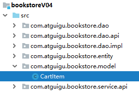
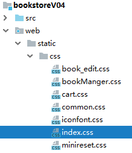

[TOC]

# 第三节 购物车

## 1、功能清单

- 添加购物车
- 显示购物车信息
- 修改购物车中具体商品的数量
- 删除购物车中某个具体商品
- 清空购物车


## 2、创建购物车模型


### ①购物车详情类：CartItem



```java
public class CartItem {

    private String bookId;
    private String bookName;
    private String imgPath;
    private Double price;
    private Integer count;
    private Double amount;
    
    // 获取金额时需要计算得到
    public Double getAmount() {
        return this.count * this.price;
    }
```


### ②购物车类：Cart

```java
public class Cart {

    private Map<String, CartItem> cartItemMap = new HashMap<>();

    // 添加购物车
    public void addCartItem(Book book) {

        // 1.获取当前Book对象的id值
        String bookId = book.getBookId() + "";

        // 2.根据id值到Map中检查是否已存在
        if (cartItemMap.containsKey(bookId)) {
            // 3.如果存在，则给原有的CartItem增加数量
            CartItem cartItem = cartItemMap.get(bookId);

            int newCount = cartItem.getCount() + 1;

            cartItem.setCount(newCount);
        } else {
            // 4.如果不存在，则创建新的CartItem对象
            CartItem cartItem = new CartItem();
            cartItem.setBookId(bookId);
            cartItem.setBookName(book.getBookName());
            cartItem.setCount(1);
            cartItem.setImgPath(book.getImgPath());
            cartItem.setPrice(book.getPrice());

            // 5.将新的CartItem对象存入cartItemMap
            cartItemMap.put(bookId, cartItem);
        }

    }

    // 从购物车中删除CartItem
    public void removeCartItem(String bookId) {

        cartItemMap.remove(bookId);

    }

    // 把某个CartItem的数量修改为指定值
    public void updateItemCount(String bookId, Integer newCount) {

        // 根据bookId从Map中获取对应的CartItem对象
        CartItem cartItem = cartItemMap.get(bookId);

        // 设置新的数量值
        cartItem.setCount(newCount);

    }

    // 把某个CartItem的数量+1
    public void itemCountIncrease(String bookId) {

        CartItem cartItem = cartItemMap.get(bookId);

        cartItem.setCount(cartItem.getCount() + 1);

    }

    // 把某个CartItem的数量-1
    public void itemCountDecrease(String bookId) {

        CartItem cartItem = cartItemMap.get(bookId);

        cartItem.setCount(cartItem.getCount() - 1);

        if (cartItem.getCount() == 0) {
            removeCartItem(bookId);
        }
    }

    public Map<String, CartItem> getCartItemMap() {
        return cartItemMap;
    }

    // 计算总数量
    public Integer getTotalCount() {

        // 1.声明一个变量用于存储累加结果
        Integer sum = 0;

        // 2.遍历Map集合
        Set<String> keySet = cartItemMap.keySet();

        for (String key : keySet) {
            CartItem cartItem = cartItemMap.get(key);
            Integer count = cartItem.getCount();
            sum = sum + count;
        }

        // 3.返回累加结果
        return sum;
    }

    // 计算总金额
    public Double getTotalAmount() {

        // 1.声明一个变量用于存储累加结果
        Double sum = 0.0;

        // 2.遍历Map集合
        Set<String> keySet = cartItemMap.keySet();

        for (String key : keySet) {
            CartItem cartItem = cartItemMap.get(key);
            Double amount = cartItem.getAmount();

            sum = sum + amount;
        }

        // 3.返回累加结果
        return sum;

    }
}
```


## 3、添加购物车功能

### ①目标

在首页点击『加入购物车』将该条图书加入『购物车』。


### ②思路

首页→加入购物车→CartServlet.addCart()→执行添加操作→回到首页


### ③代码实现

#### [1]创建CartServlet


```java
public class CartServlet extends ModelBaseServlet {

    private BookService bookService = new BookServiceImpl();

    protected void addCart(HttpServletRequest request, HttpServletResponse response) throws ServletException, IOException {

        // 1.从请求参数中获取bookId
        String bookId = request.getParameter("bookId");

        // 2.根据bookId查询图书数据
        Book book = bookService.getBookById(bookId);

        // 3.获取Session对象
        HttpSession session = request.getSession();

        // 4.尝试从Session域获取购物车对象
        Cart cart = (Cart) session.getAttribute("cart");

        // 5.判断Cart对象是否存在
        if (cart == null) {

            // 6.如果不存在，则创建新的Cart对象
            cart = new Cart();

            // 7.将新创建的Cart对象存入Session域
            session.setAttribute("cart", cart);
        }

        // 8.添加购物车
        cart.addCartItem(book);

        // 9.回首页
        response.sendRedirect(request.getContextPath() + "/index.html");
    }

}
```


#### [2]index.html页面

购物车数量显示：

```html
<!--          登录后风格-->
<div class="topbar-right" th:if="${session.user != null}">
    <span>欢迎你<b th:text="${session.user.userName}">张总</b></span>
    <a href="#" class="register">注销</a>
    <a href="pages/cart/cart.jsp" class="cart iconfont icon-gouwuche">
        购物车
        <div class="cart-num" th:if="${session.cart != null}" th:text="${session.cart.totalCount}">3</div>
    </a>
    <a href="pages/manager/book_manager.html" class="admin">后台管理</a>
</div>
```

加入购物车：

```html
<div class="list-content" th:if="${not #lists.isEmpty(bookList)}">
    <div class="list-item" th:each="book : ${bookList}">
        
        <p>书名:<span th:text="${book.bookName}">活着</span></p>
        <p>作者:<span th:text="${book.author}">余华</span></p>
        <p>价格:￥<span th:text="${book.price}">66.6</span></p>
        <p>销量:<span th:text="${book.sales}">230</span></p>
        <p>库存:<span th:text="${book.stock}">1000</span></p>
        <!--<button>加入购物车</button>-->
        <a th:href="@{/CartServlet(method=addCart,bookId=${book.bookId})}">加入购物车</a>
    </div>
</div>
```


### ④CSS样式



```css
.books-list .list-content .list-item a {
  display: block;
  width: 80px;
  height: 30px;
  border: none;
  line-height: 30px;
  background-color: #39987c;
  margin-top: 5px;
  outline: none;
  color: #fff;
  cursor:pointer;
  font-size:12px;
  text-align:center;
}
```

如果修改完成后页面效果没有改变，可以使用Ctrl+F5强制刷新。


## 4、显示购物车页面

### ①目标

把购物车信息在专门的页面显示出来


### ②思路

首页→购物车超链接→CartServlet.showCart()→cart.html


### ③代码实现

#### [1]购物车超链接

登录状态和未登录状态

```html
<a href="CartServlet?method=showCart" class="cart iconfont icon-gouwuche">购物车</a>
```


#### [2]CartServlet

```java
protected void showCart(HttpServletRequest request, HttpServletResponse response) throws ServletException, IOException {

    String viewName = "cart/cart";

    processTemplate(viewName, request, response);

}
```


#### [3]cart.html

```html
<html lang="en" xmlns:th="http://www.thymeleaf.org">
<head>
    <base th:href="@{/}"/>
    ……
    <div class="header-right" th:include="segment/welcome :: welcome-page"></div>
    ……
    <tbody th:if="${session.cart == null || session.cart.cartItemMap.size() == 0}">
        <tr>
            <td colspan="6">购物车还是空空的，赶紧去添加吧！</td>
        </tr>
    </tbody>
    <tbody th:if="${session.cart != null && session.cart.cartItemMap.size() > 0}">
    <tr th:each="cartItemEntry : ${session.cart.cartItemMap}">
        <td>
            
        </td>
        <td th:text="${cartItemEntry.value.bookName}">活着</td>
        <td>
            <span class="count">-</span>
            <input class="count-num" type="text" th:value="${cartItemEntry.value.count}" value="1"/>
            <span class="count">+</span>
        </td>
        <td th:text="${cartItemEntry.value.price}">36.8</td>
        <td th:text="${cartItemEntry.value.amount}">36.8</td>
        <td><a href="">删除</a></td>
    </tr>
    </tbody>
</table>
<div class="footer" th:if="${session.cart != null && session.cart.cartItemMap.size() > 0}">
    <div class="footer-left">
        <a href="#" class="clear-cart">清空购物车</a>
        <a href="index.html">继续购物</a>
    </div>
    <div class="footer-right">
        <div>共<span th:text="${session.cart.totalCount}">3</span>件商品</div>
        <div class="total-price">总金额<span th:text="${session.cart.totalAmount}">99.9</span>元</div>
        <a class="pay" href="checkout.html">去结账</a>
    </div>
</div>
```


## 5、清空购物车

### ①目标

当用户确定点击清空购物车，将Session域中的Cart对象移除。


### ②思路

cart.html→清空购物车超链接→绑定单击响应函数→confirm()确认→确定→CartServlet.clearCart()→从Session域移除Cart对象


### ③代码实现

#### [1]清空购物车超链接

```html
<a href="CartServlet?method=clearCart" class="clear-cart">清空购物车</a>
```


#### [2]绑定单击响应函数

##### (1)引入Vue

```html
<script src="static/script/vue.js" type="text/javascript" charset="utf-8"></script>
```


##### (2)编写Vue代码

```javascript
new Vue({
    "el":"#appCart",
    "methods":{
        "clearCart":function () {
            // 1.使用confirm()弹框向用户确认是否要清空
            var confirmResult = confirm("您真的要清空购物车吗？");

            // 2.如果用户点击了取消
            if (!confirmResult) {

                // 3.调用事件对象的方法阻止超链接跳转页面
                event.preventDefault();
            }

        }
    }
});
```


#### [3]CartServlet.clearCart()

```java
protected void clearCart(HttpServletRequest request, HttpServletResponse response) throws ServletException, IOException {
    
    // 1.通过request对象获取Session对象
    HttpSession session = request.getSession();
    
    // 2.将Session域的Cart对象移除
    session.removeAttribute("cart");

    // 3.渲染视图
    String viewName = "cart/cart";

    processTemplate(viewName, request, response);
}
```


## 6、减号

### ①目标

- 在大于1的数值基础上-1：执行-1的逻辑
- 在1的基础上-1：执行删除item的逻辑


### ②思路

减号span绑定单击响应函数→获取文本框中的数据：当前数量→检查数量是否大于1

- 数量大于1：发送请求访问CartServlet.decrease()方法→回到cart.html
- 数量等于1：confirm确认→发送请求访问CartServlet.removeItem()方法→回到cart.html


### ③后端代码

CartServlet.decrease()

```java
protected void decrease(HttpServletRequest request, HttpServletResponse response) throws ServletException, IOException {

    // 1.通过请求参数获取bookId
    String bookId = request.getParameter("bookId");

    // 2.通过request对象获取Session对象
    HttpSession session = request.getSession();

    // 3.从Session域获取购物车对象
    Cart cart = (Cart) session.getAttribute("cart");

    // ※考虑到如果Session超时会导致购物车数据丢失，所以先判断购物车数据是否为空
    if (cart != null) {

        // 4.从购物车对象中根据bookId执行-1操作
        cart.itemCountDecrease(bookId);

    }

    // 5.回到购物车页面
    String viewName = "cart/cart";

    processTemplate(viewName, request, response);

}
```


### ④前端代码

HTML代码：

```html
<td>
    <input type="hidden" name="bookId" th:value="${cartItemEntry.value.bookId}" />
    <span @click="itemDecrease" class="count">-</span>
    ……
</td>
```

Vue代码：

```javascript
,
"itemDecrease":function () {

    // 0.不管执行两种逻辑中的哪一种，都需要将当前item的bookId发送到Servlet
    // event：事件对象
    // event.target：当前事件操作的控件（HTML元素）
    // previousSibling：上一个兄弟节点。当前span标签的上一个兄弟节点是空格，所以要再找上一个兄弟
    var bookId = event.target.previousSibling.previousSibling.value;

    console.log("bookId="+bookId);

    // 1.获取文本框中的value属性值：当前item的数量
    // event：事件对象
    // event.target：当前事件操作的控件（HTML元素）
    // nextSibling：下一个兄弟节点。当前span标签的下一个兄弟节点是空格，所以要再找下一个兄弟
    // value：获取input标签的value属性值
    var currentCount = event.target.nextSibling.nextSibling.value;

    console.log("currentCount="+currentCount);

    // 2.判断currentCount是否大于1
    if (currentCount > 1) {

        // 3.应用-1逻辑
        console.log("currentCount > 1");

        window.location.href = "CartServlet?method=decrease&bookId="+bookId;

    } else {

        // 通过DOM树形结构获取图书名称数据
        // event：事件对象
        // event.target：当前事件操作的控件（HTML元素）
        // parentNode：访问父节点
        // parentNode.getElementsByTagName()：在父节点范围内根据标签名称查找元素，返回数组
        // innerHTML：返回标签内部HTML代码
        var bookName = event.target.parentNode.parentNode.getElementsByTagName("td")[1].innerHTML;

        // 4.应用删除item的逻辑
        var confirmResult = confirm("你真的要从购物车中删除『"+bookName+"』这条记录吗？");

        if (confirmResult) {

            window.location.href = "CartServlet?method=removeItem&bookId="+bookId;
        }

    }
}
```


## 7、删除

### ①目标

点击删除超链接后，把对应的CartItem从Cart中删除


### ②思路

cart.html→删除超链接→CartServlet.removeItem()→回到cart.html


### ③代码实现

#### [1]后端代码

CartServlet.removeItem()

```java
protected void removeItem(HttpServletRequest request, HttpServletResponse response) throws ServletException, IOException {

    // 1.从请求参数获取bookId
    String bookId = request.getParameter("bookId");

    // 2.通过request对象获取Session对象
    HttpSession session = request.getSession();

    // 3.从Session域获取购物车对象
    Cart cart = (Cart) session.getAttribute("cart");

    // ※考虑到如果Session超时会导致购物车数据丢失，所以先判断购物车数据是否为空
    if (cart != null) {

        // 4.执行删除item操作
        cart.removeCartItem(bookId);

    }

    // 5.回到购物车页面
    String viewName = "cart/cart";

    processTemplate(viewName, request, response);

}
```


#### [2]前端代码

HTML代码：

```html
<a @click="removeConfirm" th:href="@{/CartServlet(method=removeItem,bookId=${cartItemEntry.value.bookId})}">删除</a>
```

Vue代码：

```javascript
,
"removeConfirm":function () {

    // 通过DOM树形结构获取图书名称数据
    // event：事件对象
    // event.target：当前事件操作的控件（HTML元素）
    // parentNode：访问父节点
    // parentNode.getElementsByTagName()：在父节点范围内根据标签名称查找元素，返回数组
    // innerHTML：返回标签内部HTML代码
    var bookName = event.target.parentNode.parentNode.getElementsByTagName("td")[1].innerHTML;
    console.log("bookName=" + bookName);

    if(!confirm("你真的要从购物车中删除『"+bookName+"』这条记录吗？")) {
        event.preventDefault();
    }

}
```


## 8、文本框修改

### ①目标

用户在文本框输入新数据后，根据用户输入在Session中的Cart中修改CartItem中的count


### ②思路

cart.html→前端数据校验→CartServlet.changeCount()→回到cart.html


### ③代码实现

#### [1]后端代码

CartServlet.changeCount()

```java
protected void changeCount(HttpServletRequest request, HttpServletResponse response) throws ServletException, IOException {

    // 1.从请求参数获取bookId和newCount
    String bookId = request.getParameter("bookId");
    Integer newCount = Integer.parseInt(request.getParameter("newCount"));

    // 2.通过request对象获取Session对象
    HttpSession session = request.getSession();

    // 3.从Session域获取购物车对象
    Cart cart = (Cart) session.getAttribute("cart");

    // ※考虑到如果Session超时会导致购物车数据丢失，所以先判断购物车数据是否为空
    if (cart != null) {

        // 4.执行修改数量操作
        cart.updateItemCount(bookId, newCount);

    }

    // 5.回到购物车页面
    String viewName = "cart/cart";

    processTemplate(viewName, request, response);

}
```


#### [2]前端代码

HTML代码：

```html
<td>
    <input type="hidden" name="bookId" th:value="${cartItemEntry.value.bookId}" />
    ……
    <input @change="itemCountChange" class="count-num" type="text" th:value="${cartItemEntry.value.count}" value="1"/>
    ……
</td>
```

Vue代码：

```javascript
,
"itemCountChange":function () {

	// 1.获取文本框中输入的数据
	var newCount = event.target.value;

	// 6.排除小数或零或负数的情况
	var regExp = /^[0-9]+$/;

	if (!regExp.test(newCount) || newCount == 0) {

		// 7.如果用户输入的数据不是数字，给出提示
		alert("请输入正整数！");

		// 8.将文本框恢复为默认值
		event.target.value = event.target.defaultValue;

		// 9.当前函数停止执行
		return ;
	}

	// 10.获取bookId值
	var bookId = event.target.parentNode.getElementsByTagName("input")[0].value;
	console.log("bookId="+bookId);

	// 11.发送请求执行修改
	window.location.href = "CartServlet?method=changeCount&bookId="+bookId+"&newCount="+newCount;
}
```


## 9、加号

### ①目标

告诉Servlet将Session域中Cart对象里面对应的CartItem执行count+1操作


### ②思路

加号span绑定单击响应函数→获取文本框中的数据：当前数量→CartServlet.increase()→回到cart.html


### ③代码实现

#### [1]后端代码

CartServlet.increase()

```java
protected void increase(HttpServletRequest request, HttpServletResponse response) throws ServletException, IOException {

    // 1.通过请求参数获取bookId
    String bookId = request.getParameter("bookId");

    // 2.通过request对象获取Session对象
    HttpSession session = request.getSession();

    // 3.从Session域获取购物车对象
    Cart cart = (Cart) session.getAttribute("cart");

    // ※考虑到如果Session超时会导致购物车数据丢失，所以先判断购物车数据是否为空
    if (cart != null) {

        // 4.从购物车对象中根据bookId执行-1操作
        cart.itemCountIncrease(bookId);

    }

    // 5.回到购物车页面
    String viewName = "cart/cart";

    processTemplate(viewName, request, response);

}
```


#### [2]前端代码

HTML代码：

```html
<td>
    <input type="hidden" name="bookId" th:value="${cartItemEntry.value.bookId}" />
    ……
    <span @click="itemIncrease" class="count">+</span>
</td>
```

Vue代码：

```javascript
,
"itemIncrease":function () {

	// 1.获取bookId值
	var bookId = event.target.parentNode.getElementsByTagName("input")[0].value;

	// 2.发送请求执行+1
	window.location.href = "CartServlet?method=increase&bookId="+bookId;

}
```


## 10、Double数据运算过程中精度调整

### ①问题现象


### ②解决方案

- 使用BigDecimal类型来进行Double类型数据运算
- 创建BigDecimal类型对象时将Double类型的数据转换为字符串

Cart类：

```java
// 计算总金额
public Double getTotalAmount() {

    // 1.声明一个变量用于存储累加结果
    BigDecimal sum = new BigDecimal("0.0");

    // 2.遍历Map集合
    Set<String> keySet = cartItemMap.keySet();

    for (String key : keySet) {
        CartItem cartItem = cartItemMap.get(key);
        Double amount = cartItem.getAmount();

        sum = sum.add(new BigDecimal(amount + ""));
    }

    // 3.返回累加结果
    return sum.doubleValue();

}
```

CartItem类：

```java
// 获取金额时需要计算得到
public Double getAmount() {

    BigDecimal bigDecimalCount = new BigDecimal(this.count + "");
    BigDecimal bigDecimalPrice = new BigDecimal(this.price + "");

    BigDecimal multiReuslt = bigDecimalCount.multiply(bigDecimalPrice);

    return multiReuslt.doubleValue();
}
```


[上一节](verse02.html) [回目录](index.html)