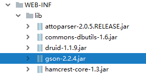
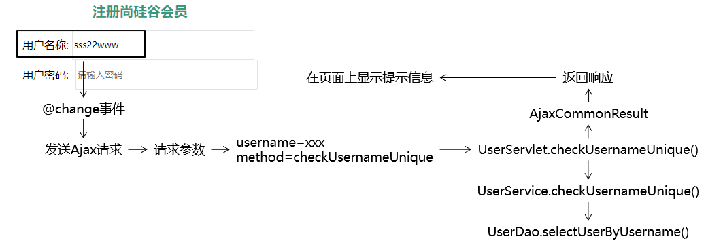

[TOC]

# 第一节 注册页面用户名唯一性检查优化

## 1、准备工作

- 创建module
- 迁移代码


## 2、加入Ajax开发环境

### ①前端所需axios库


### ②后端所需Gson库




## 3、封装AjaxCommonsResult

### ①模型的作用

在整个项目中，凡是涉及到给Ajax请求返回响应，我们都封装到AjaxCommonsResult类型中。


### ②模型的代码

```java
public class AjaxCommonResult<T> {

    public static final String SUCCESS = "SUCCESS";
    public static final String FAILED = "FAILED";

    private String result;
    private String message;
    private T data;
```


各个属性的含义：

| 属性名  | 含义                                                        |
| ------- | ----------------------------------------------------------- |
| SUCCESS | 代表服务器端处理请求成功                                    |
| FAILED  | 代表服务器端处理请求失败                                    |
| result  | 服务器端处理请求的结果，取值在SUCCESS和FAILED二者中选择一个 |
| message | 失败消息                                                    |
| data    | 针对查询操作返回的数据                                      |


### ③模型的好处

- 作为整个团队开发过程中，前后端交互时使用的统一的数据格式
- 有利于团队成员之间的协助，提高开发效率


## 4、功能实现

### ①定位功能的位置

在用户输入用户名之后，立即检查这个用户名是否可用。


### ②思路

#### [1]给用户名输入框绑定的事件类型

结论：不能在针对username设定的watch中发送Ajax请求。

原因：服务器端响应的速度跟不上用户输入的速度，而且服务器端异步返回响应数据，无法保证和用户输入的顺序完全一致。此时有下面几点问题：

- 给服务器增加不必要的压力
- 用户输入的数据在输入过程中是不断发生变化的
- 响应数据和输入顺序不对应，会发生错乱

解决办法：绑定的事件类型使用『值改变』事件。


#### [2]流程图



### ③代码实现

#### [0]在当前页面引入axios库文件

```html
<script src="static/script/axios.js" type="text/javascript" charset="utf-8"></script>
```


#### [1]给用户名输入框绑定值改变事件

```html
<input v-model:value="username" @change="usernameUniqueCheck" type="text" name="username" placeholder="请输入用户名" />
```


#### [2]JavaScript代码

```javascript
var registerApp = new Vue({
	"el":"#registerForm",
	"data":{
		"username":"[[${param.username}]]",
		"password":"",
		"passwordConfirm":"",
		"email":"[[${param.email}]]",
		"code":"",
		"usernameCheckMessage":""
	},
	"watch":{……},
	"methods":{
		……,
		……,
		"usernameUniqueCheck":function () {

			// 获取用户在文本框中输入的数据
			var username = this.username;

			// 发送Ajax请求执行检查
			axios({
				"method":"post",
				"url":"UserServlet",
				"params":{
					"method":"checkUsernameUnique",
					"username":username
				}
			}).then(function (response) {

				// 1.从响应数据中获取请求处理结果
				var result = response.data.result;

				// 2.判断result的值
				if (result == "SUCCESS") {

					// 3.用户名可用
					// 注意：现在我们在then()的回调函数中，this已经不再指向Vue对象了
					// 所以，我们通过Vue对象的变量名来访问Vue对象
					registerApp.usernameCheckMessage = "用户名可用";

				} else {

					// 4.用户名不可用
					registerApp.usernameCheckMessage = response.data.message;

				}

			}).catch(function (error) {
				console.log(error);
			});

		}
	}
});
```


#### [3]UserServlet

```java
protected void checkUsernameUnique(HttpServletRequest request, HttpServletResponse response) throws ServletException, IOException {

    AjaxCommonResult<String> ajaxResult = null;

    // 1.从请求参数中获取用户名
    String username = request.getParameter("username");

    try {
        // 2.调用Service方法检查用户名是否被占用
        userService.checkUsernameUnique(username);

        // 3.按照检测成功的结果创建AjaxCommonResult对象
        ajaxResult = new AjaxCommonResult<>(AjaxCommonResult.SUCCESS, null, null);
    } catch (Exception e) {
        e.printStackTrace();

        // 4.按照检测失败的结果创建AjaxCommonResult对象
        ajaxResult = new AjaxCommonResult<>(AjaxCommonResult.FAILED, e.getMessage(), null);
    }

    // 5.根据ajaxResult对象返回响应数据
    // ①创建Gson对象
    Gson gson = new Gson();

    // ②执行JSON数据转换
    String json = gson.toJson(ajaxResult);

    // ③设置响应体内容类型
    response.setContentType("application/json;charset=UTF-8");
    response.getWriter().write(json);

}
```


#### [4]UserService

```java
@Override
public void checkUsernameUnique(String username) {

    User user = userDao.selectUserByName(username);

    if (user != null) {
        throw new RuntimeException("用户名已经被占用");
    }

}
```


[回目录](index.html) [下一节](verse02.html)