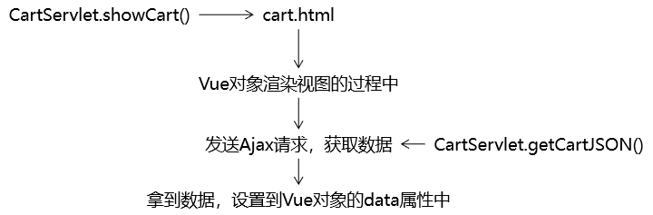
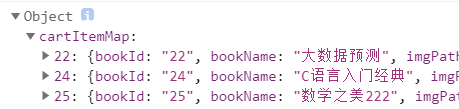

[TOC]

# 第三节 显示购物车数据

## 1、思路




## 2、代码实现

### ①CartServlet增加getCartJSON()方法

#### [1]Cart模型的局限性



目前的Cart对象转换为JSON后，没有totalCount、totalAmount这样的属性，Map结构也不如LIst遍历方便。


#### [2]调整方式

把前端页面需要的属性，存入Map中即可。


#### [3]方法代码

```java
protected void getCartJSON(HttpServletRequest request, HttpServletResponse response) throws ServletException, IOException {

    AjaxCommonResult<Map<String, Object>> result = null;

    // 1.获取Session对象
    HttpSession session = request.getSession();

    // 2.尝试获取购物车对象
    Cart cart = (Cart) session.getAttribute("cart");

    // 3.检查cart对象是否为空
    if (cart == null) {
        result = new AjaxCommonResult<>(AjaxCommonResult.FAILED, null, null);
    } else {

        Map<String, Object> cartJSONMap = new HashMap<>();
        cartJSONMap.put("totalCount", cart.getTotalCount());
        cartJSONMap.put("totalAmount", cart.getTotalAmount());
        cartJSONMap.put("cartItemList", cart.getCartItemMap().values());

        result = new AjaxCommonResult<Map<String, Object>>(AjaxCommonResult.SUCCESS, null, cartJSONMap);
    }

    // 4.将AjaxCommonResult对象转换为JSON作为响应返回
    Gson gson = new Gson();
    String json = gson.toJson(result);
    response.setContentType("application/json;charset=UTF-8");
    response.getWriter().write(json);

}
```


### ②前端代码

#### [1]去除Thymeleaf痕迹

将cart.html页面中，由Thymeleaf渲染数据的部分去掉。


#### [2]使用Vue对象初步接管页面渲染

```javascript
    new Vue({
        "el":"#appCart",
        "data":{
            "cart":"empty"
        },
```

HTML标签：

```html
<tbody v-if="cart == 'empty'">
    <tr>
        <td colspan="6">购物车还是空空的，赶紧去添加吧！</td>
    </tr>
</tbody>
```


#### [3]在mounted生命周期环境发Ajax请求

记得加入axios库：

```html
<script src="static/script/axios.js" type="text/javascript" charset="utf-8"></script>
```


```javascript
var cartApp = new Vue({
    "el":"#appCart",
    "data":{
        "cart":"empty"
    },
    "mounted":function () {
        axios({
            "method":"post",
            "url":"protected/CartServlet",
            "params":{
                "method":"getCartJSON"
            }
        }).then(function (response) {

            // 1.从响应数据中获取请求处理结果
            var result = response.data.result;

            // 2.检查结果是成功还是失败
            if (result == "SUCCESS") {

                // 3.获取购物车数据并赋值给Vue对象
                cartApp.cart = response.data.data;

                console.log(cartApp.cart);
            }

        }).catch(function (error) {
            console.log(error);
        });
    },
    ……
```


#### [4]完成Vue页面渲染

```html
<div id="appCart" class="w">
    <table>
        <thead>
        <tr>
            <th>图片</th>
            <th>商品名称</th>
            <th>数量</th>
            <th>单价</th>
            <th>金额</th>
            <th>操作</th>
        </tr>
        </thead>
        <tbody v-if="cart == 'empty'">
            <tr>
                <td colspan="6">购物车还是空空的，赶紧去添加吧！</td>
            </tr>
        </tbody>
        <tbody v-if="cart != 'empty'">
        <tr v-for="cartItem in cart.cartItemList">
            <td>
                
            </td>
            <td>{{cartItem.bookName}}</td>
            <td>
                <input type="hidden" name="bookId" :value="cartItem.bookId" />
                <span @click="itemDecrease" class="count">-</span>
                <input @change="itemCountChange" class="count-num" type="text" :value="cartItem.count"/>
                <span @click="itemIncrease" class="count">+</span>
            </td>
            <td>{{cartItem.price}}</td>
            <td>{{cartItem.amount}}</td>
            <td><a @click="removeConfirm" href="protected/CartServlet">删除</a></td>
        </tr>
        </tbody>
    </table>
    <div class="footer">
        <div class="footer-left">
            <a @click="clearCart" href="protected/CartServlet?method=clearCart" class="clear-cart">清空购物车</a>
            <a href="index.html">继续购物</a>
        </div>
        <div class="footer-right">
            <div>共<span>{{cart.totalCount}}</span>件商品</div>
            <div class="total-price">总金额{{cart.totalAmount}}元</div>
            <a class="pay" href="protected/OrderClientServlet?method=checkout">去结账</a>
        </div>
    </div>
</div>
```


[上一节](verse02.html) [回目录](index.html)