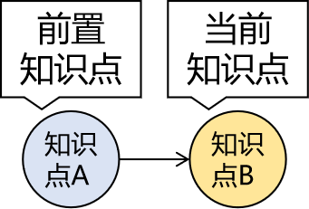
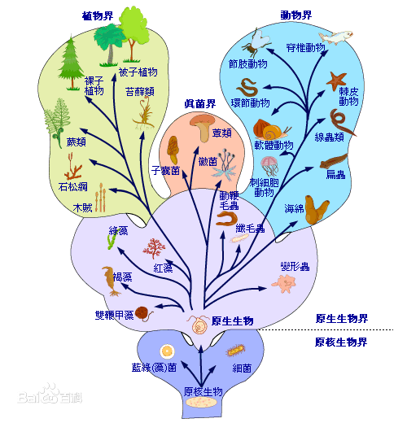

[TOC]

# 第四节 拜托了大脑

## 0、学习中的痛点问题

- 为什么明明很努力了，但就是没效果？
- 学完记不住怎么办？
- 每天上课老师讲的代码我也都敲（抄）了，但是感觉什么都没学会怎么办？
- 为什么学着学着会感觉跟不上了？
- 学的东西太多感觉非常混乱怎么办？

## 1、人和人的差异是『系统』的差异

### ①起点、路径、目标

为什么同样是毕业5年，你和你的同学差距特别大？起点、路径、目标这三个东西哪个对人影响最大？

- 目标：有的人目标是1亿，有的人目标是够吃饭就行。目标不同活法肯定不同。
- 路径：有的人根本不知道路在哪，有的人靠两条腿狂奔，有的人开汽车，有的人坐飞机，有的人坐火箭。
- 起点：最不重要的就是起点。对那些靠两条腿跑的人来说，10公里是非常遥远的距离，但是对开汽车的人来说很近。

如果一个问题的解决办法已经有别人反复验证过可行、有效的路径存在，那这种问题就非常容易解决。但即使这样不同的人应对同样问题时效果也完全不同。从深圳到北京，徒步、开车、高铁、飞机就是效率完全不同的解决方案。

在路上使用的交通工具不同就是人和人之间系统的不同，而系统其实就是一个人的认知水平、思维方式、学习和工作的方法。

### ②思维跃迁

世界本身是极其复杂的，即使是细分之后的领域仍然非常复杂，比如一颗小小的芯片背后就是一个非常庞大、复杂的体系：科学、技术、设计、制造、供应链、操作系统、市场等等。面对这么复杂的世界，简单的思维方式是没法理解和应对的。而比我们成功的人一定是从更底层把握了复杂世界中简单规律的人。

#### [1]穿透现象看到本质

实现同一个功能，代码可以有很多种不同的写法，我们要做的并不是把某一种代码背下来，而是直击本质，把握规律，以不变应万变。

#### [2]宏观视野

将来大家走上工作岗位，参与开发都是非常庞大的系统，此时要求大家能够把视角拔高，从最高处俯瞰整个项目的架构。而在具体的开发过程中对于微观的代码编写和故障调试又要求能够做到细致认真，对程序员来说这两种看似矛盾的能力必须同时具备。

#### [3]目标导向

任何项目、任何技术都是为了解决实际问题而生的，所以我们不论是在技术学习过程中还是在项目开发过程中都要锻炼自己理解需求的能力和根据需求设定目标的能力。有了明确的目标下一步才能一步一步分析出实现目标的思路，然后根据思路中的各个环节编写代码，最终把需求落地实现。

#### [4]抽象空间

一个人每天按时上课，按时自习，从不违纪，身体确实在教室，但是灵魂早已不知到哪里游荡，他算努力吗？

一个人把老师的代码抄了一遍又一遍，把课件背了一回又一回，他算努力吗？

一个人顶着狂风烈日面试了一家又一家公司，屡战屡败，屡败屡战，他算努力吗？

另一个人看着好像也没怎么努力，该打球打球，该拍拖拍拖，面试没几家就拿到N个不错的offer，老师劝他不着急入职，再多面几家肯定有更好的，他说现在这个不错了，懒的面了。你好像确实没法说他『努力』，但是你不得不承认至少单纯在『参加培训找工作』这一件事上他很『成功』。

所以老师不必费力向你证明前面那三个人并没有『真正努力』，而只是『用战术上的勤奋掩盖战略上的懒惰』——老师希望你注意到：即使是『真正的努力』仍然只是『手段』而不是『目的』，我们真正的目的是『成功』。不管过程中再怎么努力，最后达不成目的不还是白搭？当然，如果因此你得出一个结论就是那我不用努力了我也没有办法，毕竟谁都没法叫醒一个装睡的人不是？

那怎么做算是『战略正确』呢？

进军抽象空间，到抽象空间里占领一个又一个知识高地。

学习的真正过程发生在人的意识中，而意识是看不见、摸不着的。所以当一个同学『人在教室、神游天外』时，老师明知道他没在学习可是还真不好说啥，因为他确实没有违反纪律。纪律只能在物质世界设置规则，而没法限制你的想法。

但所谓知识其实就是人类认识世界过程中总结、提炼的结晶，全部都是抽象的概念，同样看不见、摸不着。我们上课的过程就是老师把他自己的意识空间用声音和图像投影到教室里，然后再投影到你的意识空间——毕竟老师没法双掌贴着你的后背把毕生功力传给你。

大家需要接收到声音和图像的信号，然后理解它们的含义，再重新凝练成一个一个的概念结晶，最后还要分门别类、井然有序的保存起来以备将来使用。

所以学习真要比的话应该比的就是在意识空间中知识晶体的数量和秩序。

很多人为什么学习起来非常吃力？就是因为他完全没有办法进入抽象空间，完全没法理解任何抽象的东西。这里我们举个例子：

具象：3×2=6，2×3=6，4×7=28，7×4=28，…… 

抽象：乘法交换律

用具象的算式描述这个规律可以写出无限多个，可是用抽象的规律短短五个字就概括了。这就是掌握规律的力量，这就是为什么培根说『知识就是力量』。好在老师会用举例、类比、画图等等手段把抽象的东西尽量具象化，但是谁也代替不了你自己的理解、提炼和总结。不过好消息是现在你知道怎么努力了。

所以各位朝气蓬勃的少男少女们，充分调动起你活跃的大脑，一起来提炼闪闪发光的知识晶体吧！

## 2、『学习能力』就是一个系统

### ①敞开心扉

你真的对技术感兴趣吗？

小明拿瓶子去接水，咕咚咕咚一通灌。完事儿一看，瓶子里一滴水都没有。

为啥？瓶塞没有拔出来。

像不像你叫嚷着学Java，但其实真正的内心对Java没有任何兴趣，只是因为听说它很赚钱才学。你『真正喜欢』的是『钱』而不是『Java』。

而真正学的时候内心是『抗拒』的，你觉得这东西和你一点关系都没有。禁闭的心扉如同没有拔掉木塞的瓶子。这样谁都帮不了你，不管听了多少课都学不到东西的。

正确的状态是：对『Java本身』贼啦好奇，『挖空心思』想闹明白到底是咋回事，谁不让我学我跟谁急。

学会以后干活，不给钱也干，谁不让我干我跟谁急，然后肯定会干得特别好，『意外』赚了很多钱。

任何成功都来自于『内心深处强烈的渴求』。而程序员的成功秘诀是『敲代码本身即是最大幸福和最高奖赏』。

很多同学总是问学完Java用不用再学学大数据呀？Java干3年以后转型什么呀？

其实Java也好，大数据也好，都是『路径』，不是『目标』。你的『好奇心』决定了你在这条路上能够走多远。而培训完的起薪都只是『起点』，前面说过了，三者中『起点』是最不重要的。

在以后的学习中我们任何技术点都会通过提出问题的方式来引入，大家要留意这个环节，在揭示答案之前用这个问题问问自己，看看这个问题是否能在你的心里引起共鸣，激发你的好奇心，这是我们迈向成功的第一步。

### ②大脑的工作机制

#### [1]大脑的结构

- 最内层：爬行动物脑，只在乎吃饭和制造下一代，再复杂点的事情就理解不了了。
- 中间层：哺乳动物脑，感情中枢，很多哺乳动物都进化出了这一层大脑，所以你会感觉到你家狗狗对你非常有感情——相信我，那是真感情。
- 最外层：大脑皮层，人的理性思维在这里生成，语言、视觉、听觉、逻辑思维、空间想象力等等都在大脑皮层这里有专门的负责区域。其中学Java的时候要用到的理性思维是大脑皮层中的『前额叶』这个部分。可以说迄今为止人类文明所造就的所有辉煌成果都是建立在前额叶的基础上。

#### [2]死记硬背？

不会吧，不会吧？现在还有同学想靠死记硬背来学Java？请马上停止！

相比较『记忆』来说，大脑更擅长『思考』。前面说过思考是由前额叶来负责的，下面说说记忆：

- 临时记忆：海马体。比如别人和你说忙完给他打个电话，你当时答应了但是一转眼就忘了。信息刚刚进入大脑的时候其实是在海马体临时存储的。
- 长期记忆：写入大脑皮层。这可不容易，死记硬背就是通过大量的重复把信息强行写入大脑皮层。就好比你非要靠脑子记住一个手机号，大致就是这个办法。但遗憾的是一个孤立的信息即使通过大量重复强行写入到大脑皮层也不会存在太久。小学同学朝夕相处，但是分开20年还是会忘记很多人的名字。

这就是为什么总有同学很困扰：学完了记不住呀！对于这个问题我的回应如下：

- 你想记住啥？

  你想记住代码怎么写吗？需求会变，代码永远要跟着变。

  你想记住老师说的每一句话吗？老师一天能说一万句话。

  想记住这些这不是痴心妄想吗？

- 你该记住啥？

  具象：3×2=6，2×3=6，4×7=28，7×4=28，……

  抽象：乘法交换律

  你该记住的是从现象中提取出来的规律而不是现象。甚至这么说也不准确。因为这个规律你理解了自然就记住了，不需要背。

- 知识的网络

  任何孤立的信息都很容易忘，但是点和点之间组成一个彼此联系的网络就很不容易忘记了。

- 细节记不住咋办？

  即使理解并且记住了要点，但是知识点相关的细节还是记不住怎么办？比如大段的配置，代码调用的API方法，特定场景需要传递的参数等等。好办，『好记性不如烂笔头』，这些东西记到笔记里永久保存。

#### [3]外接硬盘

通过前面的分析我们看到，大脑是一个有CPU（前额叶）有内存（海马体）的电脑，但是没有硬盘来做永久存储。所以我们需要给大脑连接一个能够永久存储信息的外部设备：笔记。由此我们就得出了大脑要扮演的第一个角色：搜索引擎。

首先，学习的过程就是建设索引库的过程：

然后在解决实际问题时需要运用学过的知识就到索引库中去检索：

#### [4]快思维和慢思维

大脑的第二个角色是：司令部。而你是司令。对，你没看错，其实『你不是你的大脑，你的大脑也不是你』。就像手、脚、胯骨轴是你的一部分一样，大脑同样只是你的一部分。但是大脑对人来说太重要了，人的很多无意识行为都是大脑来协调和指挥的。比如：人走路时的身体平衡，身体各个系统和脏器的正常工作，应激反应等等都是大脑来指挥的，而这些事情你完全不知道是怎么做的，也无法干涉。司令部协助司令指挥部队，司令把握总体的战略方向。

而司令部这个角色和学习有关系的部分就是大脑的快思维和慢思维。

小孩子没法一边穿衣服、系扣子一边走路。因为它穿衣服、系扣子需要慢慢做，一边做一边想。所以事情不熟练、需要慢慢思考的时候，大脑就需要以慢思维的模式工作——这个过程是需要『你』参与的。

大人穿衣服、系扣子都很熟练了，不需要想，所以可以一边走路，一边穿衣服。这个过程就不需要『你』参与了，大脑调用现成的『路径』在快思维的工作模式下完成动作。

这是因为『慢思维』非常消耗能量，而『快思维』能耗非常低，大脑会优先选择能耗低的路径执行动作，节约能量。这就是为什么人会有『习惯』，而习惯一旦养成很难改变。本质原因就是大脑的这种『路径依赖』的机制。

### ③知识的知识：元知识

#### [1]知识点

比如：『黄赤交角导致地球上四季更迭』这就是一个知识点。

#### [2]前置知识

想理解『黄赤交角导致地球上四季更迭』这个知识点的前提是知道『赤道』、『黄道』、『地球自转』、『地球公转』等等概念，还必须具备一定的『立体几何』的基础。这就说明知识的大厦是一砖一瓦建成的，没有1楼别想上2楼。

如果想理解B的前提是知道A，那么A就是B的前置知识点。

#### [3]知识链

把所有前置知识连起来就形成了一条知识的链条。虽然我们学习的时候不需要把这个链条画出来，但是它可以帮助你理解你为什么会跟不上：在知识的链条中前置知识点缺失太多了。不知道『赤道』、『黄道』、『地球自转』、『地球公转』等等概念也不理解两个平面之间的夹角是怎么回事的时候听别人给你讲地球上为什么会有春夏秋冬那就是听天书，完全不明白什么意思。

#### [4]知识树

为什么老师讲课的课件总是划分成章节，章节里面还有一、二、三、……1、2、3、……①、②、③、……这样的小点？就是因为知识点根据彼此之间的归类和相关性可以『纵向抽取』，从而整理成一个树形结构，这样也是为了大家更好理解。

但是老师讲课的时候还是要从这根葡萄梗上把葡萄一颗一颗摘下来给你。

而你拿到葡萄以后就乱放了，散落一地的葡萄非常不好拿，到用的时候各种颜色的葡萄混杂的胡乱堆放在一起，根本找不到你要的。

所以大家听完课还是要在自己的精神世界里把葡萄往葡萄梗上一颗一颗装回去。用专业术语来说就是把节点按照树形结构重新组装起来。

#### [5]知识网络

哲学知识点：矛盾是对立统一，矛盾中对立的双方都不能脱离对方而单独存在。

化学知识点：在碱溶液中会有极少量的H+离子，在酸溶液中会有极少量的OH-离子。

横向来看，知识点之间很容易找到相通或类似的情况。有些知识点之间的横向对比能够彼此印证，帮助我们理解；而有些看起来相似但实质不同的知识点却会干扰我们的判断和使用。

所以知识点融会贯通之后必然会打破彼此的界限连成网络，这个网络越发达你的视野越开阔，网络中的具体知识点掌握越牢固。

#### [6]知识体系

在生物学中把生物划分为了界、门、纲、目、科、属、种，这有什么好处呢？不仅让已知的生物更易于研究和学习，将来发现新物种就直接按照这个划分方法纳入体系就好了。

有了知识体系之后，你的学习会非常快速，因为新的知识点会快速被已有的知识体系接纳，旧的知识会帮助你理解新的知识。

| &nbsp;       | MySQL                                                        | Redis           |
| ------------ | ------------------------------------------------------------ | --------------- |
| 数据库连接   | Connection                                                   | Jedis           |
| 数据库连接池 | Druid                                                        | JedisPool       |
| 连接信息     | 主协议:子协议://主机地址:端口号/数据库名称 用户名 密码 数据库驱动 | 主机地址:端口号 |

当你不断的感受到旧知识点在帮助你理解新知识点，你的知识体系就在不断扩大；知识系统不断扩大之后，旧知识点对新知识点的帮助能力就更大，形成一个『增强回路』，让你的学习越来越快，形成一条指数曲线。

### ④卖油翁的微笑

> 陈康肃公善射，当世无双 ，公亦以此自矜。尝射于家圃，有卖油翁释担而立，睨之久而不去。见其发矢十中八九，但微颔之。
> 康肃问曰：“汝亦知射乎？吾射不亦精乎？”。翁曰：“无他， 但手熟尔。”康肃忿然曰：“尔安敢轻吾射！”翁曰：“以我酌油知之。”乃取一葫芦置于地，以钱覆其口，徐以杓酌油沥之，自钱孔入，而钱不湿。因曰：“我亦无他，惟手熟尔。”康肃笑而遣之。

编程本质上是一个技能，而任何技能都需要通过大量的重复练习才能够熟练掌握。李小龙说：『我不怕会一万种招式的人，我怕把一种招式练一万次的人』。神枪手是用一匣一匣的子弹喂出来的，优秀的程序员就是用一堆又一堆的bug给练出来的。所以学编程肯定要多敲多练。

但是我说的是『敲』不是『抄』！很多同学照着老师的代码敲自己的代码，看着是敲了一遍，其实只是抄了一遍。抄完发现没有什么效果。关上电脑什么都不记得。这其实是正常的认知规律的体现。

在『抄』的时候大脑其实不需要多想什么，因为它只需要考虑A处是什么单词，再到B处敲同样的单词就行了，这是一件很简单的事情，大脑调用5%就足够了——这调用深度远远不够。而且你不觉得非常枯燥无聊吗？

真正的学习状态是什么？向知识点提问、打草稿、分析思路、画流程图、和别人讨论、敲代码验证、分析结果为什么和老师不一样、把验证结果写到笔记里……

你看看这是不是热火朝天？这么整的话大脑的利用率可是有95%啊！而且兴趣盎然啊有木有？这么学习既高效又开心，谁不让我学我和谁急！

这时大脑扮演了第三个角色：教练。

### ⑤输出倒逼输入

你有没有发现看老师讲课的视频特别容易睡着？这不是老师讲得不好，也不是你不爱学习，而是单纯的看视频只是被动接受，大脑还是没有充分调动起来。大脑进入闲置状态自然会昏昏欲睡。

而当你和别人讨论问题，把你的观点讲出来，就会越聊越兴奋甚至争得脸红脖子粗有木有？

甚至是在和别人表达自己观点的时候会发现自己以前理解的某个知识点其实完全不是那么回事，开始以为自己懂了但是要说的时候才发现自己根本没有懂，理解的不透彻。

其实在大脑里很多角落都在黑暗中，当我们想拿出来的时候才会用手电筒照过去，把那个地方照亮，照亮以后才能看清楚那里到底放着什么。

所以一切形式的『输出』都会非常有效的提高学习效率。那么输出的形式包括哪些呢？

- 做笔记：自己亲手做，不是抄别人的。
- 敲代码：不是抄啊！
- 和别人讨论：有问有答的那种
- 调bug：bug虐我千百遍，我待bug如初恋
- 发博客：积累多了对职业发展很有帮助的哟

### ⑥总结

说了这么多，我们具体在学习的时候应该怎么学呢？

- 第一步：提出问题，激发好奇。
- 第二步：思考分析，理解原理。
- 第三步：敲代码、调bug练习，验证原理，修正理解。
- 第四步：做笔记，既是备忘，又是建设自己的索引库和知识体系。
- 第五步：遇到相似知识点就详细辨析比对，直到充分区别不会混淆。
- 第六步：回归到真实场景，在项目中运用，彻底掌握这个技术，让所学技术真正落地。

所以『学习』两个字中，『学』指的是理解原理，建立知识体系，而『习』则是练习技能，引申到各种形式的输出都算『习』。而只有拿学过、练过的东西真正的解决了现实生活中真正的实际问题才算是『会』。而任何形式的市场都只会为能够真正解决问题的人付『钱』。

[上一节](verse03.html) [回目录](index.html)