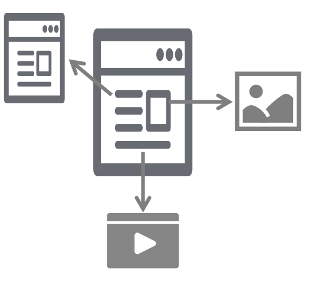
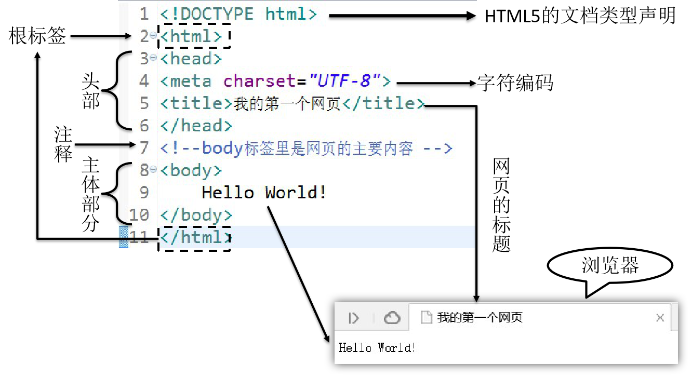

[TOC]

# 第二节 HTML简介

## 1、名词解释

HTML是<span style="color:blue;font-weight:bold;">H</span>yper <span style="color:blue;font-weight:bold;">T</span>ext <span style="color:blue;font-weight:bold;">M</span>arkup <span style="color:blue;font-weight:bold;">L</span>anguage的缩写。意思是<span style="color:blue;font-weight:bold;">『超文本标记语言』</span>。


## 2、超文本

HTML文件本质上是文本文件，而普通的文本文件只能显示字符。但是HTML技术则通过HTML标签把其他网页、图片、音频、视频等各种多媒体资源引入到当前网页中，让网页有了非常丰富的呈现方式，这就是超文本的含义——本身是文本，但是呈现出来的最终效果超越了文本。




## 3、标记语言

说HTML是一种『标记语言』是因为它不是向Java这样的『编程语言』，因为它是由一系列『标签』组成的，没有常量、变量、流程控制、异常处理、IO等等这些功能。HTML很简单，每个标签都有它固定的含义和确定的页面显示效果。


标签是通过一组尖括号+标签名的方式来定义的：

```html
<p>HTML is a very popular fore-end technology.</p>
```

这个例子中使用了一个p标签来定义一个段落，&lt;p&gt;叫<span style="color:blue;font-weight:bold;">『开始标签』</span>，&lt;/p&gt;叫<span style="color:blue;font-weight:bold;">『结束标签』</span>。开始标签和结束标签一起构成了一个完整的标签。开始标签和结束标签之间的部分叫<span style="color:blue;font-weight:bold;">『文本标签体』</span>，也简称<span style="color:blue;font-weight:bold;">『标签体』</span>。


有的时候标签里还带有<span style="color:blue;font-weight:bold;">『属性』</span>：

```html
<a href="http://www.xxx.com">show detail</a>
```


href="http://www.xxx.com"就是属性，href是<span style="color:blue;font-weight:bold;">『属性名』</span>，"http://www.xxx.com"是<span style="color:blue;font-weight:bold;">『属性值』</span>。

还有一种标签是<span style="color:blue;font-weight:bold;">『单标签』</span>：

```html
<input type="text" name="username" />
```


## 4、HelloWorld




## 5、HTML文件结构

### ①文档类型声明

HTML文件中第一行的内容，用来告诉浏览器当前HTML文档的基本信息，其中最重要的就是当前HTML文档遵循的语法标准。这里我们只需要知道HTML有4和5这两个大的版本，HTML4版本的文档类型声明是：

```html
<!DOCTYPE HTML PUBLIC "-//W3C//DTD HTML 4.01 Transitional//EN"
"http://www.w3.org/TR/html4/loose.dtd">
```


HTML5版本的文档类型声明是：

```html
<!DOCTYPE html>
```


现在主流的技术选型都是使用HTML5，之前的版本基本不用了。

历史上HTML的各个版本：

| 版本名称 | 年份 |
| -------- | ---- |
| HTML     | 1991 |
| HTML+    | 1993 |
| HTML2.0  | 1995 |
| HTML3.2  | 1997 |
| HTML4.01 | 1999 |
| XHTML1.0 | 2000 |
| HTML5    | 2012 |
| XHTML5   | 2013 |


### ②根标签

html标签是整个文档的根标签，所有其他标签都必须放在html标签里面。上面的文档类型不能当做普通标签看待。

> 所谓『根』其实是『树根』的意思。在一个树形结构中，根节点只能有一个。


### ③头部

head标签用于定义文档的头部，其他头部元素都放在head标签里。头部元素包括title标签、script标签、style标签、link标签、meta标签等等。


### ④主体

body标签定义网页的主体内容，在浏览器窗口内显示的内容都定义到body标签内。


### ⑤注释

HTML注释的写法是：

```html
<!-- 注释内容 -->
```

注释的内容不会显示到浏览器窗口内，是开发人员用来对代码内容进行解释说明。


## 6、HTML语法规则

- 根标签有且只能有一个
- 无论是双标签还是单标签都必须正确关闭
- 标签可以嵌套但不能交叉嵌套
- 注释不能嵌套
- 属性必须有值，值必须加引号，单引号或双引号均可
- 标签名不区分大小写但建议使用小写


[上一节](verse01.html) [回目录](index.html) [下一节](verse03.html)