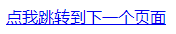
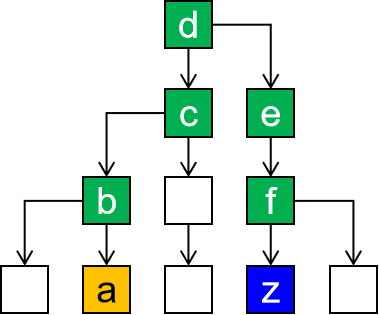

[TOC]

# 第三节  使用HTML展示文章

以文章的组织形式展示数据是HTML最基本的功能了，网页上显示的文章在没有做任何CSS样式设定的情况下如下图所示：


本节我们要学习的HTML标签如下表：

| 标签名称 | 功能                   |
| -------- | ---------------------- |
| h1~h6    | 1级标题~6级标题        |
| p        | 段落                   |
| a        | 超链接                 |
| ul/li    | 无序列表               |
| img      | 图片                   |
| div      | 定义一个前后有换行的块 |
| span     | 定义一个前后无换行的块 |


为了方便编写代码，我们在IDEA中创建一个静态Web工程来操作：


## 1、标题标签

### ①代码

```html
<!DOCTYPE html>
<html lang="en">
<head>
    <meta charset="UTF-8">
    <title>Title</title>
</head>
<body>

    <h1>这是一级标题</h1>
    <h2>这是二级标题</h2>
    <h3>这是三级标题</h3>
    <h4>这是四级标题</h4>
    <h5>这是五级标题</h5>
    <h6>这是六级标题</h6>

</body>
</html>
```


### ②页面显示效果


<span style="color:blue;font-weight:bold;">注意</span>：标题标签前后有换行。


## 2、段落标签

### ①代码

```html
<p>There is clearly a need for CSS to be taken seriously by graphic artists. The Zen Garden aims to excite, inspire, and encourage participation. To begin, view some of the existing designs in the list. Clicking on any one will load the style sheet into this very page. The code remains the same, the only thing that has changed is the external .css file. Yes, really.</p>
```


### ②页面显示效果


<span style="color:blue;font-weight:bold;">注意</span>：段落标签前后有换行。


## 3、超链接

### ①代码

```html
<a href="page02-anchor-target.html">点我跳转到下一个页面</a>
```


### ②页面显示效果



点击后跳转到href属性指定的页面


## 4、路径

在我们整个Web开发技术体系中，『路径』是一个贯穿始终的重要概念。凡是需要获取另外一个资源的时候都需要用到路径。要想理解路径这个概念，我们首先要认识一个概念：『文件系统』。


### ①文件系统

我们写代码的时候通常都是在Windows系统来操作，而一个项目开发完成后想要让所有人都能够访问到就必须『部署』到服务器上，也叫『发布』。而服务器通常是Linux系统。

Windows系统和Linux系统的文件系统有很大差别，为了让我们编写的代码不会因为从Windows系统部署到了Linux系统而出现故障，实际开发时不允许使用<span style="color:blue;font-weight:bold;">物理路径</span>。

> 物理路径举例：
>
> D:\aaa\pro01-HTML\page01-article-tag.html
>
> D:\aaa\pro01-HTML\page02-anchor-target.html

幸运的是不管是Windows系统还是Linux系统环境下，目录结构都是<span style="color:blue;font-weight:bold;">树形结构</span>，编写路径的规则是一样的。


所以我们<span style="color:blue;font-weight:bold;">以项目的树形目录结构为依据</span>来编写路径就不用担心操作系统平台发生变化之后路径错误的问题了。有了这个大前提，我们具体编写路径时有两种具体写法：

- 相对路径
- 绝对路径（建议使用）


### ②相对路径

<span style="color:blue;font-weight:bold;">相对路径都是以<span style="color:red;font-weight:bold;">『当前位置』</span>为基准</span>来编写的。假设我们现在正在浏览a页面，想在a页面内通过超链接跳转到z页面。


那么按照相对路径的规则，我们现在所在的位置是a.html所在的b目录：


z.html并不在b目录下，所以我们要从b目录出发，向上走，进入b的父目录——c目录：


c目录还是不行，继续向上走，进入c的父目录——d目录：


在从d目录向下经过两级子目录——e目录、f目录才能找到z.html：



所以整个路径的写法是：

```html
<a href="../../e/f/z.html">To z.html</a>
```

可以看到使用相对路径有可能会很繁琐，而且在后面我们结合了在服务器上运行的Java程序后，相对路径的基准是有可能发生变化的，所以<span style="color:blue;font-weight:bold;">不建议使用相对路径</span>。


### ③绝对路径

#### [1]通过IDEA服务器打开HTML文件

测试绝对路径的前提是通过IDEA的内置服务器访问我们编写的HTML页面——这样访问地址的组成结构才能和我们以后在服务器上运行的Java程序一致。


#### [2]服务器访问地址的组成


#### [3]绝对路径的写法

绝对路径要求必须是以<span style="color:blue;font-weight:bold;">『正斜线』</span>开头。这个开头的正斜线在整个服务器访问地址中对应的位置如下图所示：


这里标注出的这个位置代表的是<span style="color:blue;font-weight:bold;">『服务器根目录』</span>，从这里开始我们就是在服务器的内部查找一个具体的Web应用。

所以我们编写绝对路径时就从这个位置开始，<span style="color:blue;font-weight:bold;">按照目录结构找到目标文件</span>即可。拿前面相对路径中的例子来说，我们想在a.html页面中通过超链接访问z.html。此时路径从正斜线开始，和a.html自身所在位置没有任何关系：


```html
<a href="/d/e/f/z.html">To z.html</a>
```


#### [4]具体例子

编写超链接访问下面的页面：


```html
<a href="/aaa/pro01-HTML/animal/cat/miao.html">Cat Page</a>
```


#### [5]小结

为了和我们后面学习的内容和正确的编码方式保持一致，建议大家从现在开始就使用绝对路径。


## 5、换行

### ①代码

```html
We would like to see as much CSS1 as possible. CSS2 should be limited to widely-supported elements only. The css Zen Garden is about functional, practical CSS and not the latest bleeding-edge tricks viewable by 2% of the browsing public. <br/>The only real requirement we have is that your CSS validates.
```


### ②页面显示效果


## 6、无序列表

### ①代码

```html
    <ul>
        <li>Apple</li>
        <li>Banana</li>
        <li>Grape</li>
    </ul>
```


### ②页面显示效果


## 7、图片

### ①准备图片文件


### ②代码

src属性用来指定图片文件的路径，这里同样按我们前面说的使用<span style="color:blue;font-weight:bold;">『绝对路径』</span>。

```html

```


### ③页面显示效果


## 8、块

<span style="color:blue;font-weight:bold;">『块』</span>并不是为了显示文章内容的，而是为了方便结合CSS对页面进行布局。块有两种，div是前后有换行的块，span是前后没有换行的块。

把下面代码粘贴到HTML文件中查看他们的区别：

```html
<div style="border: 1px solid black;width: 100px;height: 100px;">This is a div block</div>
<div style="border: 1px solid black;width: 100px;height: 100px;">This is a div block</div>

<span style="border: 1px solid black;width: 100px;height: 100px;">This is a span block</span>
<span style="border: 1px solid black;width: 100px;height: 100px;">This is a span block</span>
```

页面显示效果为：


## 9、HTML实体

在HTML文件中，&lt;、&gt;等等这样的符号已经被赋予了特定含义，不会作为符号本身显示到页面上，此时如果我们想使用符号本身怎么办呢？那就是使用HTML实体来转义。


资料来源：[W3School](https://www.w3school.com.cn/html/html_entities.asp)


[上一节](verse02.html) [回目录](index.html) [下一节](verse04.html)