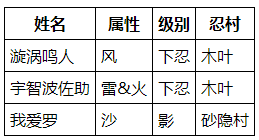
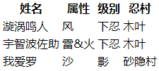
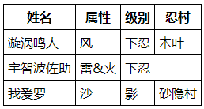
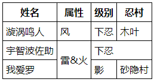

[TOC]

# 第四节 使用HTML表格展示数据

## 1、页面显示效果




## 2、HTML代码

```html
<!-- 使用table标签定义表格 -->
<table>
    <!-- 使用tr标签定义表格的行 -->
    <tr>
        <!-- 使用th标签定义表头，表头有字体加粗效果 -->
        <th>姓名</th>
        <th>属性</th>
        <th>级别</th>
        <th>忍村</th>
    </tr>
    <tr>
        <!-- 使用td标签定义单元格 -->
        <td>漩涡鸣人</td>
        <td>风</td>
        <td>下忍</td>
        <td>木叶</td>
    </tr>
    <tr>
        <td>宇智波佐助</td>
        <td>雷&火</td>
        <td>下忍</td>
        <td>木叶</td>
    </tr>
    <tr>
        <td>我爱罗</td>
        <td>沙</td>
        <td>影</td>
        <td>砂隐村</td>
    </tr>
</table>
```


如果只有上面的代码，页面显示效果是：




没有表格边框。想要显示好看的表格边框可以把下面的style标签代码复制粘贴到head标签里：

```html
    <style type="text/css">
        table,th,td {
            border-collapse: collapse;
            border: 1px solid black;
            padding: 5px;
        }
    </style>
```


CSS还没讲，不必在意语法细节，整体照搬即可。


## 3、合并单元格

### ①横向合并

使用colspan属性将两个横向相邻的单元格跨列合并：

```html
        <tr>
            <td>宇智波佐助</td>
            <td>雷&火</td>
            <td colspan="2">下忍</td>
        </tr>
```



<span style="color:blue;font-weight:bold;">注意</span>：<span style="color:blue;font-weight:bold;">『被合并』</span>的单元格要删掉。


### ②纵向合并

使用rowspan属性将两个纵向相邻的单元格跨行合并：

```html
        <tr>
            <td>宇智波佐助</td>
            <td rowspan="2">雷&火</td>
            <td colspan="2">下忍</td>
        </tr>
        <tr>
            <td>我爱罗</td>
            <td>影</td>
            <td>砂隐村</td>
        </tr>
```




<span style="color:blue;font-weight:bold;">注意</span>：<span style="color:blue;font-weight:bold;">『被合并』</span>的单元格要删掉。


[上一节](verse03.html) [回目录](index.html) [下一节](verse05.html)