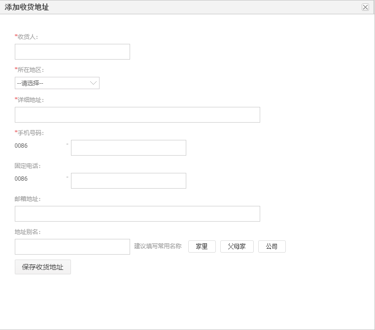
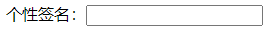
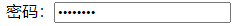
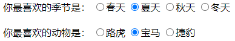
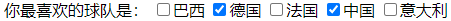
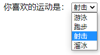
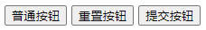
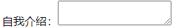

[TOC]

# 第五节 使用HTML表单收集数据

## 1、什么是表单

在项目开发过程中，凡是需要用户填写的信息都需要用到表单。




## 2、form标签

在HTML中我们使用form标签来定义一个表单。而对于form标签来说有两个最重要的属性：action和method。

```html
<form action="/aaa/pro01-HTML/page05-form-target.html" method="post">
    
</form>
```


### ①action属性

用户在表单里填写的信息需要发送到服务器端，对于Java项目来说就是交给Java代码来处理。那么在页面上我们就必须正确填写服务器端的能够接收表单数据的地址。

这个地址要写在form标签的action属性中。但是现在暂时我们还没有服务器端环境，所以先借用一个HTML页面来当作服务器端地址使用。


### ②method属性

『method』这个单词的意思是『方式、方法』，在form标签中method属性用来定义提交表单的<span style="color:blue;font-weight:bold;">『请求方式』</span>。method属性只有两个可选值：get或post，没有极特殊情况的话使用post即可。

> 什么是<span style="color:blue;font-weight:bold;">『请求方式』</span>？
>
> 浏览器和服务器之间在互相通信时有大量的<span style="color:blue;font-weight:bold;">『数据』</span>需要传输。但是不论是浏览器还是服务器都有很多不同厂商提供的不同产品。
>
> 常见的浏览器有：
>
> - Chrome
> - Firefox
> - Safari
> - Opera
> - Edge
>
> 常见的Java服务器有：
>
> - Tomcat
> - Weblogic
> - WebSphere
> - Glassfish
> - Jetty
>
> 这么多不同厂商各自开发的应用程序怎么能保证它们彼此之间传输的<span style="color:blue;font-weight:bold;">『数据』</span>能够被对方正确理解呢？
>
> 很简单，我们给这些数据设定<span style="color:blue;font-weight:bold;">『格式』</span>，发送端按照格式发送数据，接收端按照格式解析数据，这样就能够实现数据的<span style="color:blue;font-weight:bold;">『跨平台传输』</span>了。
>
> 而这里定义的<span style="color:blue;font-weight:bold;">『数据格式』</span>就是应用程序之间的<span style="color:blue;font-weight:bold;">『通信协议』</span>。
>
> 在JavaSE阶段的网络编程章节我们接触过TCP/IP、UDP这样的协议，而我们现在使用的<span style="color:blue;font-weight:bold;">『HTTP协议』</span>的底层就是TCP/IP协议。
>
> HTTP1.1中共定义了八种请求方式：
>
> - GET
> - POST
> - PUT
> - DELETE
> - HEAD
> - CONNECT
> - OPTIONS
> - TRACE
> 
> 但是在HTML标签中，点击超链接是GET方式的请求，提交一个表单可以通过form标签的method属性指定GET或POST请求，其他请求方式无法通过HTML标签实现。除了GET、POST之外的其他请求方式暂时我们不需要涉及（到我们学习SpringMVC时会用到PUT和DELETE）。至于<span style="color:blue;font-weight:bold;">GET请求和POST请求的区别</span>我们会在讲HTTP协议的时候详细介绍，现在大家可以从表面现象来观察一下。


## 3、name和value

在用户使用一个软件系统时，需要一次性提交很多数据是非常正常的现象。我们肯定不能要求用户一个数据一个数据的提交，而肯定是所有数据填好后一起提交。那就带来一个问题，服务器怎么从众多数据中识别出来收货人、所在地区、详细地址、手机号码……？


很简单，<span style="color:blue;font-weight:bold;">给每个数据都起一个『名字』</span>，发送数据时用<span style="color:blue;font-weight:bold;">『名字』</span>携带对应的数据，接收数据时通过<span style="color:blue;font-weight:bold;">『名字』</span>获取对应的数据。


在各个具体的表单标签中，我们通过<span style="color:blue;font-weight:bold;">『name属性』</span>来给数据起<span style="color:blue;font-weight:bold;">『名字』</span>，通过<span style="color:blue;font-weight:bold;">『value属性』</span>来保存要发送给服务器的<span style="color:blue;font-weight:bold;">『值』</span>。


但是名字和值之间既有可能是<span style="color:blue;font-weight:bold;">『一个名字对应一个值』</span>，也有可能是<span style="color:blue;font-weight:bold;">『一个名字对应多个值』</span>。


这么看来这样的关系很像我们Java中的Map，而事实上在服务器端就是使用Map类型来接收请求参数的。具体的是类型是：<span style="color:blue;font-weight:bold;">Map<String,String[]></span>。

name属性就是Map的键，value属性就是Map的值。


有了上面介绍的基础知识，下面我们就可以来看具体的表单标签了。


## 4、单行文本框

### ①代码

```html
个性签名：<input type="text" name="signal"/><br/>
```


### ②显示效果



## 5、密码框

### ①代码

```html
密码：<input type="password" name="secret"/><br/>
```


### ②显示效果




## 6、单选框

### ①代码

```html
你最喜欢的季节是：
<input type="radio" name="season" value="spring" />春天
<input type="radio" name="season" value="summer" checked="checked" />夏天
<input type="radio" name="season" value="autumn" />秋天
<input type="radio" name="season" value="winter" />冬天

<br/><br/>

你最喜欢的动物是：
<input type="radio" name="animal" value="tiger" />路虎
<input type="radio" name="animal" value="horse" checked="checked" />宝马
<input type="radio" name="animal" value="cheetah" />捷豹
```


### ②效果




### ③说明

- name属性相同的radio为一组，组内互斥
- 当用户选择了一个radio并提交表单，这个radio的name属性和value属性组成一个键值对发送给服务器
- 设置checked="checked"属性设置默认被选中的radio


## 7、多选框

### ①代码

```html
你最喜欢的球队是：
<input type="checkbox" name="team" value="Brazil"/>巴西
<input type="checkbox" name="team" value="German" checked="checked"/>德国
<input type="checkbox" name="team" value="France"/>法国
<input type="checkbox" name="team" value="China" checked="checked"/>中国
<input type="checkbox" name="team" value="Italian"/>意大利
```


### ②效果




## 8、下拉列表

### ①代码

```html
你喜欢的运动是：
<select name="interesting">
    <option value="swimming">游泳</option>
    <option value="running">跑步</option>
    <option value="shooting" selected="selected">射击</option>
    <option value="skating">溜冰</option>
</select>
```


### ②效果




### ③说明

- 下拉列表用到了两种标签，其中select标签用来定义下拉列表，而option标签设置列表项。
- name属性在select标签中设置。
- value属性在option标签中设置。
- option标签的标签体是显示出来给用户看的，提交到服务器的是value属性的值。
- 通过在option标签中设置selected="selected"属性实现默认选中的效果。


## 9、按钮

### ①代码

```html
<button type="button">普通按钮</button>
<button type="reset">重置按钮</button>
<button type="submit">提交按钮</button>
```


### ②效果




### ③说明

| 类型     | 功能                                             |
| -------- | ------------------------------------------------ |
| 普通按钮 | 点击后无效果，需要通过JavaScript绑定单击响应函数 |
| 重置按钮 | 点击后将表单内的所有表单项都恢复为默认值         |
| 提交按钮 | 点击后提交表单                                   |


## 10、表单隐藏域

### ①代码

```html
<input type="hidden" name="userId" value="2233"/>
```


### ②说明

通过表单隐藏域设置的表单项不会显示到页面上，用户看不到。但是提交表单时会一起被提交。用来设置一些需要和表单一起提交但是不希望用户看到的数据，例如：用户id等等。


## 11、多行文本框

### ①代码

```html
自我介绍：<textarea name="desc"></textarea>
```


### ②效果




### ③说明

textarea没有value属性，如果要设置默认值需要写在开始和结束标签之间。


[上一节](verse04.html) [回目录](index.html) [下一节](verse06.html)