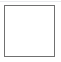
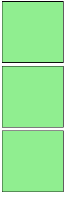
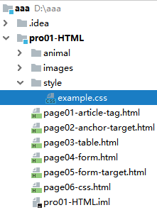
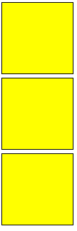
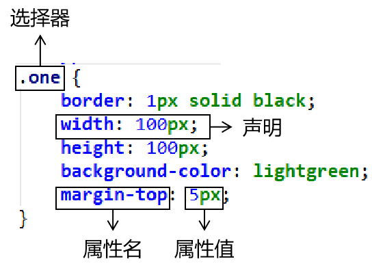
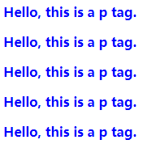
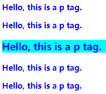

[TOC]

# 第六节 CSS的简单应用

## 1、CSS效果示例

<a href="demo/sample00.html" target="_blank">未使用CSS样式</a>

<a href="demo/sample01.html" target="_blank">使用第一套CSS样式</a>

<a href="demo/sample02.html" target="_blank">使用第二套CSS样式</a>

<a href="demo/sample03.html" target="_blank">使用第三套CSS样式</a>

<a href="demo/sample04.html" target="_blank">使用第四套CSS样式</a>


## 2、设置CSS样式的三种方式

### ①在HTML标签内设置

仅对当前标签有效

```html
<div style="border: 1px solid black;width: 100px; height: 100px;">&nbsp;</div>
```




### ②在head标签内设置

对当前页面有效

```html
<head>
    <meta charset="UTF-8">
    <title>Title</title>
    <style type="text/css">
        .one {
            border: 1px solid black;
            width: 100px;
            height: 100px;
            background-color: lightgreen;
            margin-top: 5px;
        }
    </style>
</head>
<body>

    <div style="border: 1px solid black;width: 100px; height: 100px;">&nbsp;</div>

    <div class="one">&nbsp;</div>
    <div class="one">&nbsp;</div>
    <div class="one">&nbsp;</div>

</body>
```




### ③引入外部CSS样式文件

#### [1]创建CSS文件




#### [2]编辑CSS文件

```css
.two {
    border: 1px solid black;
    width: 100px;
    height: 100px;
    background-color: yellow;
    margin-top: 5px;
}
```


#### [3]引入外部CSS文件

在需要使用这个CSS文件的HTML页面的head标签内加入：

```html
<link rel="stylesheet" type="text/css" href="/aaa/pro01-HTML/style/example.css" />
```

于是下面HTML代码的显示效果是：

```html
    <div class="two">&nbsp;</div>
    <div class="two">&nbsp;</div>
    <div class="two">&nbsp;</div>
```




## 3、CSS代码语法

- CSS样式由选择器和声明组成，而声明又由属性和值组成。
- 属性和值之间用冒号隔开。
- 多条声明之间用分号隔开。
- 使用/* ... */声明注释。




## 4、CSS选择器

### ①标签选择器

HTML代码：

```css
<p>Hello, this is a p tag.</p>
<p>Hello, this is a p tag.</p>
<p>Hello, this is a p tag.</p>
<p>Hello, this is a p tag.</p>
<p>Hello, this is a p tag.</p>
```

CSS代码：

```css
        p {
            color: blue;
            font-weight: bold;
        }
```




### ②id选择器

HTML代码：

```html
    <p>Hello, this is a p tag.</p>
    <p>Hello, this is a p tag.</p>
    <p id="special">Hello, this is a p tag.</p>
    <p>Hello, this is a p tag.</p>
    <p>Hello, this is a p tag.</p>
```

CSS代码：

```css
        #special {
            font-size: 20px;
            background-color: aqua;
        }
```




### ③类选择器

HTML代码：

```html
    <div class="one">&nbsp;</div>
    <div class="one">&nbsp;</div>
    <div class="one">&nbsp;</div>
```

CSS代码：

```css
        .one {
            border: 1px solid black;
            width: 100px;
            height: 100px;
            background-color: lightgreen;
            margin-top: 5px;
        }
```


[上一节](verse05.html) [回目录](index.html)