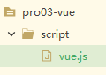
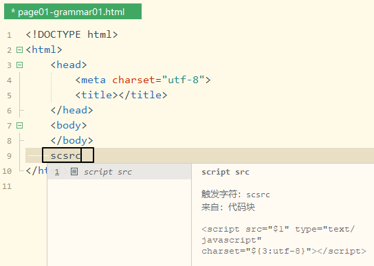

[TOC]


# 第二节 准备Vue.js环境

## 1、开发中的最佳实践

『最佳实践』是实际开发中，针对特定问题提炼出来的最好的解决方案。把『最佳实践』抽取出来，封装到各自编程语言的程序包中，就是框架的基础。

- Java语言的程序包：jar包
- JavaScript语言的程序包：外部js文件

对于Java程序来说，框架=jar包+配置文件。对于Vue来说，导入<span style="color:blue;font-weight:bold;">Vue的外部js文件</span>就能够使用Vue框架了。


## 2、Vue框架的js文件获取

官网提供的下载地址：https://cdn.jsdelivr.net/npm/vue/dist/vue.js


## 3、本地创建vue.js文件

第一步：在HBuilderX中创建工程

第二步：在工程目录下创建script目录用来存放vue.js文件

第三步：创建空vue.js文件



第四步：将官网提供的vue.js文件的内容复制粘贴到本地vue.js文件中


## 4、创建HTML文档并引入vue.js



```html
<!DOCTYPE html>
<html>
	<head>
		<meta charset="utf-8">
		<title></title>
	</head>
	<body>
	</body>
	<script src="/pro03-vue/script/vue.js" type="text/javascript" charset="utf-8"></script>
	<script type="text/javascript">
		
	</script>
</html>
```


[上一节](verse01.html) [回目录](index.html) [下一节](verse03.html)