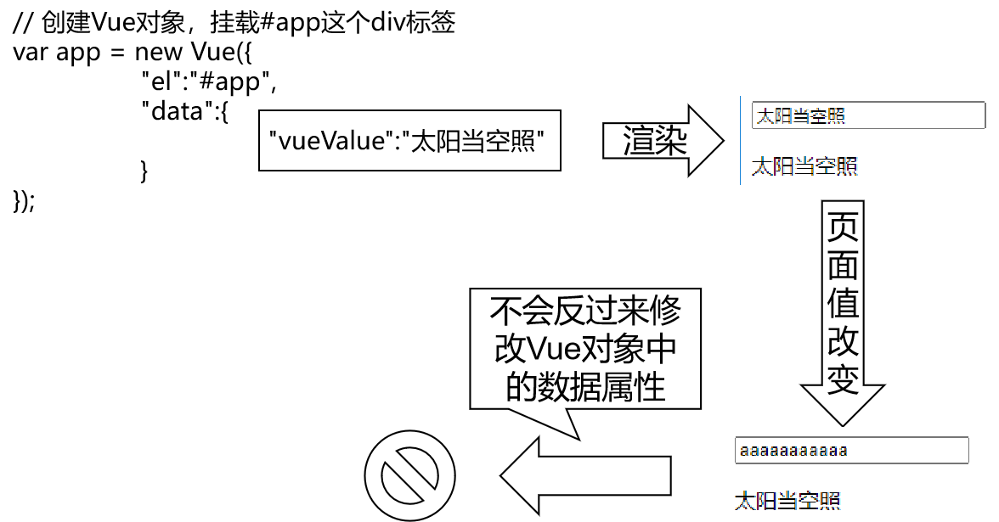

[TOC]


# 第五节 Vue.js基本语法：双向数据绑定

## 1、提出问题



而使用了双向绑定后，就可以实现：页面上数据被修改后，Vue对象中的数据属性也跟着被修改。


## 2、demo

### ①HTML代码

```html
<div id="app">
	<!-- v-bind:属性名 效果是从Vue对象渲染到页面 -->
	<!-- v-model:属性名 效果不仅是从Vue对象渲染到页面，而且能够在页面上数据修改后反向修改Vue对象中的数据属性 -->
	<input type="text" v-model:value="vueValue" />
	
	<p>{{vueValue}}</p>
</div>
```


### ②Vue代码

```javascript
// 创建Vue对象，挂载#app这个div标签
var app = new Vue({
	"el":"#app",
	"data":{
		"vueValue":"太阳当空照"
	}
});
```


### ③页面效果

p标签内的数据能够和文本框中的数据实现同步修改：


## 3、去除前后空格

### ①:value可以省略

```html
<input type="text" v-model="vueValue" />
```


### ②.trim修饰符

实际开发中，要考虑到用户在输入数据时，有可能会包含前后空格。而这些前后的空格对我们程序运行来说都是干扰因素，要去掉。在v-model后面加上.trim修饰符即可实现。

```html
<input type="text" v-model.trim="vueValue" />
```

Vue会帮助我们在文本框失去焦点时自动去除前后空格。


[上一节](verse04.html) [回目录](index.html) [下一节](verse06.html)