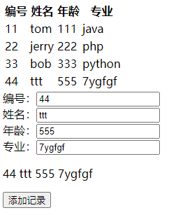
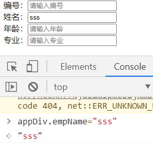
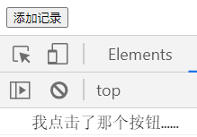
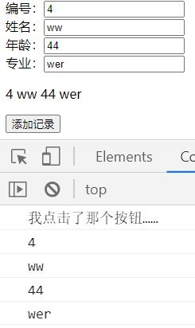
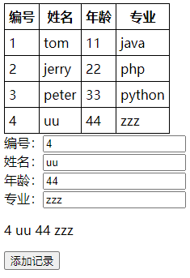

[TOC]


# 第十一节 练习

## 1、功能效果演示




## 2、任务拆解

- 第一步：显示表格
- 第二步：显示四个文本框
- 第三步：创建一个p标签用来显示用户在文本框中实时输入的内容
- 第四步：点击添加记录按钮实现记录的添加


## 3、第一步：显示表格

### ①HTML标签

```html
<table id="appTable">
	<tr>
		<th>编号</th>
		<th>姓名</th>
		<th>年龄</th>
		<th>专业</th>
	</tr>
	<tr v-for="employee in employeeList">
		<td>{{employee.empId}}</td>
		<td>{{employee.empName}}</td>
		<td>{{employee.empAge}}</td>
		<td>{{employee.empSubject}}</td>
	</tr>
</table>
```


### ②Vue代码

```javascript
var appTable = new Vue({
	"el": "#appTable",
	"data": {
		"employeeList": [{
				"empId": 1,
				"empName": "tom",
				"empAge": 11,
				"empSubject": "java"
			},
			{
				"empId": 2,
				"empName": "jerry",
				"empAge": 22,
				"empSubject": "php"
			},
			{
				"empId": 3,
				"empName": "peter",
				"empAge": 33,
				"empSubject": "python"
			}
		]
	}
});
```


## 4、第二步：显示四个文本框

### ①HTML标签

```html
<!-- 四个文本框、显示收集到的文本框数据的p标签、按钮这三个部分需要共享数据，所以要放在同一个app中 -->
<div id="appDiv">
	
	<!-- 第一部分：四个文本框 -->
	编号：<input type="text" v-model="empId" /><br/>
	姓名：<input type="text" v-model="empName" /><br/>
	年龄：<input type="text" v-model="empAge" /><br/>
	专业：<input type="text" v-model="empSubject" /><br/>
	
	<!-- 第二部分：显示收集到的文本框数据的p标签 -->
	
	<!-- 第三部分：按钮 -->
	
</div>
```


### ②Vue代码

```javascript
var appDiv = new Vue({
	"el":"#appDiv",
	"data":{
		// 初始值设置空字符串即可
		"empId":"",
		"empName":"",
		"empAge":"",
		"empSubject":""
	}
});
```

测试是否正确的方式是：在控制台尝试修改Vue对象的数据属性值：




## 5、第三步：创建一个p标签

HTML标签：

```html
<!-- 四个文本框、显示收集到的文本框数据的p标签、按钮这三个部分需要共享数据，所以要放在同一个app中 -->
<div id="appDiv">
	
	<!-- 第一部分：四个文本框 -->
	编号：<input type="text" v-model="empId" placeholder="请输入编号" /><br/>
	姓名：<input type="text" v-model="empName" placeholder="请输入姓名" /><br/>
	年龄：<input type="text" v-model="empAge" placeholder="请输入年龄" /><br/>
	专业：<input type="text" v-model="empSubject" placeholder="请输入专业" /><br/>
	
	<!-- 第二部分：显示收集到的文本框数据的p标签 -->
	<p>{{empId}} {{empName}} {{empAge}} {{empSubject}}</p>
	
	<!-- 第三部分：按钮 -->
	
</div>
```


## 6、第四步：点击添加记录按钮

### ①第一小步：给按钮设置事件驱动

#### [1]HTML标签

```html
<!-- 四个文本框、显示收集到的文本框数据的p标签、按钮这三个部分需要共享数据，所以要放在同一个app中 -->
<div id="appDiv">
	
	<!-- 第一部分：四个文本框 -->
	编号：<input type="text" v-model="empId" placeholder="请输入编号" /><br/>
	姓名：<input type="text" v-model="empName" placeholder="请输入姓名" /><br/>
	年龄：<input type="text" v-model="empAge" placeholder="请输入年龄" /><br/>
	专业：<input type="text" v-model="empSubject" placeholder="请输入专业" /><br/>
	
	<!-- 第二部分：显示收集到的文本框数据的p标签 -->
	<p>{{empId}} {{empName}} {{empAge}} {{empSubject}}</p>
	
	<!-- 第三部分：按钮 -->
	<button type="button" v-on:click="addRecord">添加记录</button>
	
</div>
```


#### [2]Vue代码

```javascript
var appDiv = new Vue({
	"el":"#appDiv",
	"data":{
		// 初始值设置空字符串即可
		"empId":"",
		"empName":"",
		"empAge":"",
		"empSubject":""
	},
	"methods":{
		"addRecord":function(){
			console.log("我点击了那个按钮……");
		}
	}
});
```




### ②第二小步：打印一下文本框输入的数据

```javascript
var appDiv = new Vue({
	"el":"#appDiv",
	"data":{
		// 初始值设置空字符串即可
		"empId":"",
		"empName":"",
		"empAge":"",
		"empSubject":""
	},
	"methods":{
		"addRecord":function(){
			console.log("我点击了那个按钮……");
			console.log(this.empId);
			console.log(this.empName);
			console.log(this.empAge);
			console.log(this.empSubject);
		}
	}
});
```




### ③第三小步：将收集到的数据添加到表格中

```javascript
"addRecord":function(){
	
	// 确认单击事件是否绑定成功
	console.log("我点击了那个按钮……");
	
	// 确认是否能够正确收集到文本框数据
	console.log(this.empId);
	console.log(this.empName);
	console.log(this.empAge);
	console.log(this.empSubject);
	
	// 将收集到的文本框数据封装为一个对象
	var employee = {
		"empId":this.empId,
		"empName":this.empName,
		"empAge":this.empAge,
		"empSubject":this.empSubject
	};
	
	// 将上面的对象压入表格数据的employeeList数组
	appTable.employeeList.push(employee);
}

```




[上一节](verse10.html) [回目录](index.html) [下一节](verse12.html)