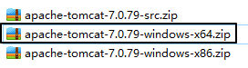
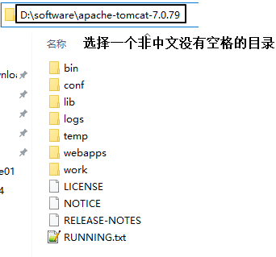
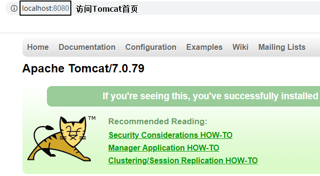
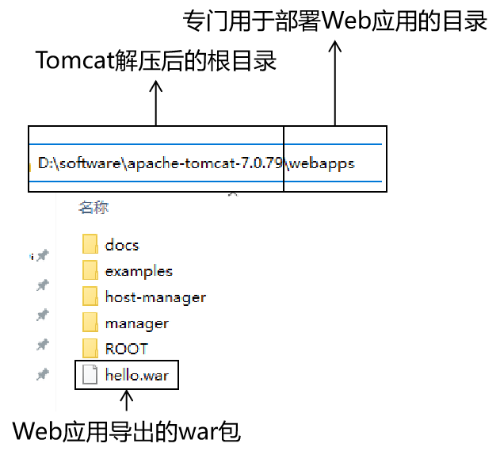
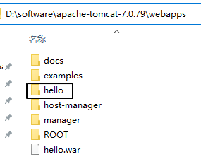
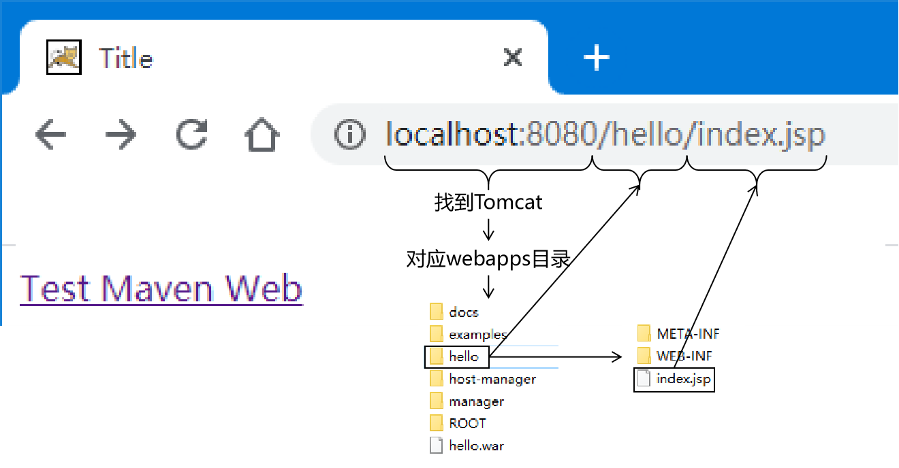
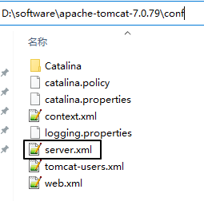

# 第二节 Tomcat的部署和启动

## 1、Tomcat扮演的角色

### ①对外：Web服务器


### ②对内：Servlet容器


## 2、部署

### ①前提

Tomcat本身是一个Java程序，所以当前系统中必须正确配置了JAVA_HOME环境变量。我们可以通过下面的命令检测：

> C:\Users\Administrator><span style="color:blue;font-weight:bold;">java -version</span>
> java version "1.8.0_141"
> Java(TM) SE Runtime Environment (build 1.8.0_141-b15)
> Java HotSpot(TM) 64-Bit Server VM (build 25.141-b15, mixed mode)
>
> C:\Users\Administrator><span style="color:blue;font-weight:bold;">echo %JAVA_HOME%</span>
> D:\software\Java
>
> C:\Users\Administrator><span style="color:blue;font-weight:bold;">echo %PATH%</span>
> D:\software\xftp\;C:\WINDOWS\system32;C:\WINDOWS;C:\WINDOWS\System32\Wbem;C:\WINDOWS\System32\WindowsPowerShell\v1.0\;D:\software\Java\bin;D:\software\apache-maven-3.5.4\bin;C:\Users\Administrator\AppData\Local\Microsoft\WindowsApps;

### ②解压

将Tomcat压缩包解压到一个<span style="color:blue;font-weight:bold;">非中文无空格</span>的目录下。





### ③Tomcat目录结构


### ④启动Tomcat并访问首页

启动Tomcat：运行Tomcat解压后根目录下\bin\startup.bat即可，例如：

> D:\software\apache-tomcat-7.0.79\bin\startup.bat



如果需要停止Tomcat，则运行shutdown.bat程序，例如：

> D:\software\apache-tomcat-7.0.79\bin\shutdown.bat

小提示：将来我们在IDEA中启动Tomcat，如果IDEA卡死强关，Tomcat不会正常退出。下次再启动Tomcat会因为残留进程仍然占用8080端口，导致新的进程无法启动。此时可以使用shutdown.bat结束残留进程。

### ⑤部署一个war包并启动Tomcat



在Tomcat启动过程中，会打印启动日志，其中我们能看到hello.war被部署的日志信息：

> 信息: Deployment of web application archive D:\software\apache-tomcat-7.0.79\webapps\hello.war has finished in 1,150 ms

此时，我们回到webapps目录，能看到hello.war被解压了：



### ⑥访问刚才部署的Web应用



### ⑦关于Tomcat端口号



配置文件节选：

```xml
……
<!-- 第22行 -->
<Server port="8005" shutdown="SHUTDOWN">
……
<!-- 第71行 -->
<Connector port="8080" protocol="HTTP/1.1"
		   connectionTimeout="20000"
		   redirectPort="8443" />
……
<!-- 第93行 -->
<Connector port="8009" protocol="AJP/1.3" redirectPort="8443" />
```

三个位置共定义了3个端口号，Tomcat启动后，这个三个端口号都会被占用。

[上一节](verse01.html) [回目录](index.html) [下一节](verse03.html)