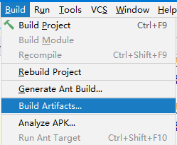

# 第五节 在IDEA中重新部署运行

## 1、为什么需要重新部署？

对于已经运行过的Web项目，如果我们增加了目录和文件，那么部署目录有可能不会自动同步过来，从而造成实际运行的效果和我们期望的不同。

如下图中，我们在工程目录已经新增了images目录和两个图片：

但是在部署目录并没有出现：

哪怕我们执行了重新部署也没有起作用。

## 2、如何重新部署？

### ①清理部署目录

### ②构建

### ③效果

[上一节](verse04.html) [回目录](index.html) [下一节](verse06.html)