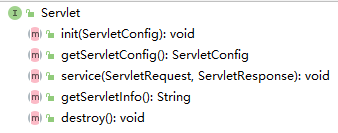
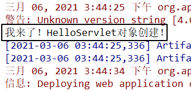
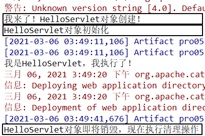

[TOC]

# 第三节 Servlet 生命周期

## 1、从Servlet接口说起



## 2、Servlet创建对象的时机

### ①验证方式

在HelloServlet的构造器中执行控制台打印

```java
public HelloServlet(){
    System.out.println("我来了！HelloServlet对象创建！");
}
```

### ②打印结果

> 我来了！HelloServlet对象创建！
> 我是HelloServlet，我执行了！
> 我是HelloServlet，我执行了！
> 我是HelloServlet，我执行了！
> 我是HelloServlet，我执行了！
> 我是HelloServlet，我执行了！
> 我是HelloServlet，我执行了！

### ③结论

- 默认情况下：Servlet在<span style="color:blue;font-weight:bold;">第一次接收到请求</span>的时候才创建对象
- 创建对象后，所有的URL地址匹配的请求都由这同一个对象来处理
- Tomcat中，每一个请求会被分配一个线程来处理，所以可以说：Servlet是<span style="color:blue;font-weight:bold;">单实例，多线程</span>方式运行的。
- 既然Servlet是多线程方式运行，所以有线程安全方面的可能性，所以不能在处理请求的方法中修改公共属性。

### ④修改Servlet创建对象的时机

修改web.xml中Servlet的配置：

```xml
<!-- 配置Servlet本身 -->
<servlet>
    <!-- 全类名太长，给Servlet设置一个简短名称 -->
    <servlet-name>HelloServlet</servlet-name>

    <!-- 配置Servlet的全类名 -->
    <servlet-class>com.atguigu.servlet.HelloServlet</servlet-class>

    <!-- 配置Servlet启动顺序 -->
    <load-on-startup>1</load-on-startup>
</servlet>
```

效果：Web应用启动的时候创建Servlet对象



友情提示：将来配置SpringMVC的时候会看到这样的配置。

## 3、其他环节



## 4、Servlet容器

### ①容器

在开发使用的各种技术中，经常会有很多对象会放在容器中。

### ②容器提供的功能

容器会管理内部对象的整个生命周期。对象在容器中才能够正常的工作，得到来自容器的全方位的支持。

- 创建对象
- 初始化
- 工作
- 清理

### ③容器本身也是对象

- 特点1：往往是非常大的对象
- 特点2：通常的单例的

### ④典型Servlet容器产品举例

- Tomcat
- jetty
- jboss
- Weblogic
- WebSphere
- glassfish

## 5、总结

| 名称       | 时机                                                         | 次数 |
| ---------- | ------------------------------------------------------------ | ---- |
| 创建对象   | 默认情况：接收到第一次请求<br />修改启动顺序后：Web应用启动过程中 | 一次 |
| 初始化操作 | 创建对象之后                                                 | 一次 |
| 处理请求   | 接收到请求                                                   | 多次 |
| 销毁操作   | Web应用卸载之前                                              | 一次 |

> 小提示：
>
> 我们学习任何一章的知识，通常都包括两类：
>
> - 现在用得上的——优先级高
> - 以后才用的——优先级低
> 
> 生命周期部分就属于以后才用的知识。

[上一节](verse02.html) [回目录](index.html) [下一节](verse04.html)