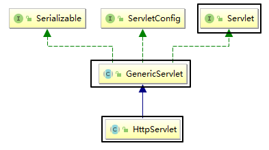

[TOC]

# 第六节 Servlet 继承关系[了解]

## 1、提出问题

- 为什么IDEA创建Servlet之后不再实现Servlet接口而是继承HttpServlet类？
- Servlet接口和HttpServlet类有什么关系？
- doXxx()方法和service()方法有什么关系？

## 2、类型关系

## 3、方法关系

[上一节](verse05.html) [回目录](index.html) [下一节](verse07.html)