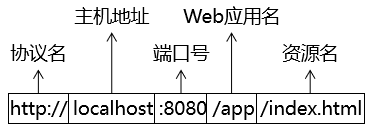
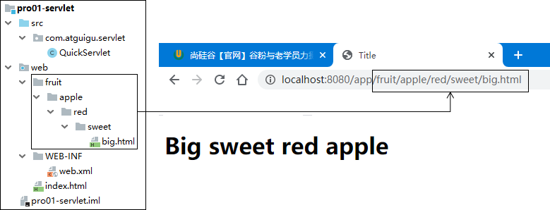
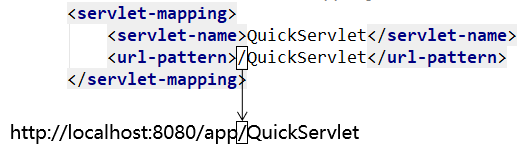
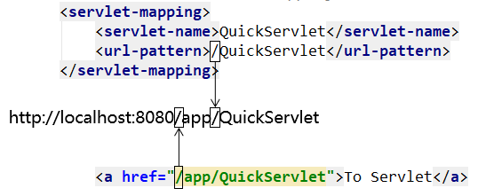
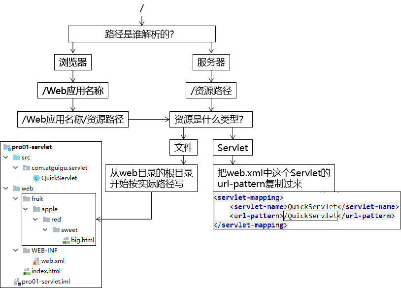

[TOC]

# 第七节 动态Web工程内编写路径

## 1、为什么要写路径？


- 整个系统要根据功能拆分成许许多多<span style="color:blue;font-weight:bold;">独立</span>的<span style="color:blue;font-weight:bold;">资源</span>
- 资源之间既要完成自身的功能又要和其他资源<span style="color:blue;font-weight:bold;">配合</span>
- 写路径就是为了从一个资源<span style="color:blue;font-weight:bold;">跳转</span>到下一个资源

## 2、为什么写路径这事有点复杂？

### ①先开发再部署


- <span style="color:blue;font-weight:bold;">工程目录</span>：我们写代码的地方，但是在服务器上运行的不是这个。
- <span style="color:blue;font-weight:bold;">部署目录</span>：经过Java源文件<span style="color:blue;font-weight:bold;">编译</span>和<span style="color:blue;font-weight:bold;">目录重组</span>后，IDEA就替我们准备好了可以在服务器上运行的部署目录。
- <span style="color:blue;font-weight:bold;">区别</span>：因为从工程目录到部署目录经过了<span style="color:blue;font-weight:bold;">目录重组</span>，所以它们的目录结构是<span style="color:blue;font-weight:bold;">不同</span>的。
- <span style="color:blue;font-weight:bold;">基准</span>：用户通过浏览器访问服务器，而服务器上运行的是部署目录，所以写路径的时候<span style="color:blue;font-weight:bold;">参考部署目录</span>而不是工程目录。
- <span style="color:blue;font-weight:bold;">对应关系</span>：<span style="color:blue;font-weight:bold;">工程目录下的web目录对应部署目录的根目录</span>，同时部署目录的根目录也是路径中的<span style="color:blue;font-weight:bold;">Web应用根目录</span>。


### ②路径的各个组成部分

从最前面一直到Web应用名称这里都是固定写法，到资源名这里要看具体是什么资源。



#### [1]具体文件

我们写代码的时候都是在工程目录下操作，所以参照工程目录来说最方便。按照工程目录的目录结构来说，从web目录开始按照实际目录结构写就好了（不包括web目录本身）。



#### [2]Servlet

访问Servlet的路径是我们在web.xml中配置的，大家可能注意到了，url-pattern里面的路径我们也是<span style="color:blue;font-weight:bold;">斜杠开头</span>的，但是这个开头的斜杠代表<span style="color:blue;font-weight:bold;">Web应用根目录</span>。



同样是开头的斜杠，超链接路径中的开头斜杠代表服务器根目录，Servlet地址开头的斜杠，代表Web应用根目录，怎么记呢？请看下面的准则：

## 3、准则

> 用通俗的大白话来解释：一个路径由谁来解析，其实就是这个路径是谁来用。

| 路径类型           | 解析方式                  |
| ------------------ | ------------------------- |
| 由浏览器解析的路径 | 开头斜杠代表服务器根目录  |
| 由服务器解析的路径 | 开头斜杠代表Web应用根目录 |



那么具体来说，哪些路径是浏览器解析的，哪些路径是服务器解析的呢？

- 浏览器解析的路径举例：
  - 所有HTML标签中的路径
  - 重定向过程中指定的路径
- 服务器解析的路径举例：
  - 所有web.xml中配置的路径
  - 请求转发过程中指定的路径

## 4、写路径的步骤



## 5、动态获取上下文路径

### ①上下文路径的概念

上下文路径（context path）=/Web应用名称

### ②动态获取

由于项目部署的时候，上下文路径是可以变化的，所以写死有可能发生错误。此时我们通过request对象动态获取上下文路径就不用担心这个问题了。调用下面这个方法，每一次获取的都是当前环境下实际的上下文路径的值。

```java
request.getContextPath()
```

> 如果本节让你感觉很复杂，建议你放慢节奏，尝试下面的步骤：
>
> - 第一步：先弄清楚每个『名词概念』，清楚的知道我们提到的每一个名词指的是什么。
> - 第二步：弄清楚底层运行原理，其实就是工程目录和部署目录的区别。
> - 第三步：按照我们介绍的步骤一步一步慢慢写，写一步想一想，弄清楚各个部分的对应关系。

[上一节](verse06.html) [回目录](index.html) [下一节](verse08.html)