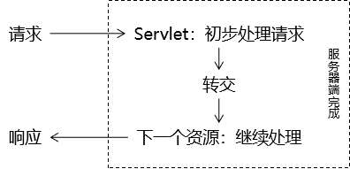
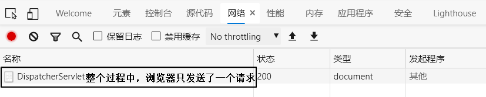
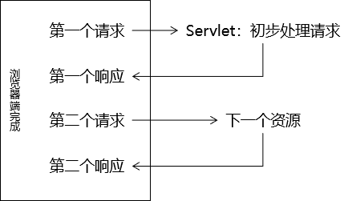
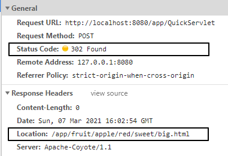

[TOC]

# 第八节 请求转发和重定向

## 1、接力

发一个请求给Servlet，接力棒就传递到了Servlet手中。而绝大部分情况下，Servlet不能独自完成一切，需要把接力棒继续传递下去，此时我们就需要请求的<span style="color:blue;font-weight:bold;">『转发』</span>或<span style="color:blue;font-weight:bold;">『重定向』</span>。

## 2、转发

本质：<span style="color:blue;font-weight:bold;">转交</span>

完整定义：在请求的处理过程中，Servlet完成了自己的任务，需要把请求<span style="color:blue;font-weight:bold;">转交给下一个资源</span>继续处理。



代码：

```java
request.getRequestDispatcher("/fruit/apple/red/sweet/big.html").forward(request, response);
```

类比：

| 代码                             | 类比           |
| -------------------------------- | -------------- |
| request                          | 小货车         |
| getRequestDispatcher("转发地址") | 告诉司机要去哪 |
| forward(request, response)       | 出发           |

关键：由于转发操作的核心部分是<span style="color:blue;font-weight:bold;">在服务器端完成</span>的，所以浏览器感知不到，整个过程中浏览器<span style="color:blue;font-weight:bold;">只发送一次请求</span>。



## 3、重定向

本质：<span style="color:blue;font-weight:bold;">一种特殊的响应</span>

完整定义：在请求的处理过程中，Servlet完成了自己的任务，然后以一个<span style="color:blue;font-weight:bold;">响应</span>的方式告诉浏览器：“要完成这个任务还需要你另外<span style="color:blue;font-weight:bold;">再访问下一个资源</span>”。



代码：

```java
response.sendRedirect("/app/fruit/apple/red/sweet/big.html");
```



关键：由于重定向操作的核心部分是<span style="color:blue;font-weight:bold;">在浏览器端完成</span>的，所以整个过程中浏览器<span style="color:blue;font-weight:bold;">共发送两次请求</span>。

## 4、对比

| 转发                                                       | 重定向                                                     |
| ---------------------------------------------------------- | ---------------------------------------------------------- |
| <span style="color:blue;font-weight:bold;">一次请求</span> | <span style="color:blue;font-weight:bold;">两次请求</span> |
| 浏览器地址栏显示的是第一个资源的地址                       | 浏览器地址栏显示的是第二个资源的地址                       |
| 全程使用的是同一个request对象                              | 全程使用的是不同的request对象                              |
| 在服务器端完成                                             | 在浏览器端完成                                             |
| 目标资源地址由服务器解析                                   | 目标资源地址由浏览器解析                                   |
| 目标资源可以在WEB-INF目录下                                | 目标资源不能在WEB-INF目录下                                |
| 目标资源仅限于本应用内部                                   | 目标资源可以是外部资源                                     |

## 5、转发和重定向的应用场景

可以简单的判断：能用转发的先用转发，如果转发不行，再使用重定向。

- 需要通过同一个request对象把数据携带到目标资源：只能用转发
- 如果希望前往下一个资源之后，浏览器刷新访问的是第二个资源：只能用重定向

[上一节](verse07.html) [回目录](index.html) [下一节](verse09.html)

