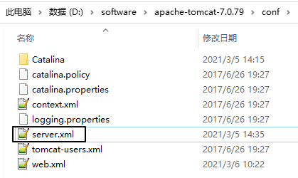

[TOC]

# 第十节 请求响应设置字符集

## 1、请求

### ①GET请求

#### [1]设置之前

发送请求参数：

```html
<a href="/orange/CharacterServlet?username=汤姆">测试请求字符集设置：GET请求</a>
```

接收到的数据：

> username = ?±¤?§?

#### [2]设置方式



在server.xml第71行的Connector标签中增加URIEncoding属性：

```xml
<Connector port="8080" protocol="HTTP/1.1"
		   connectionTimeout="20000"
		   redirectPort="8443" 
		   URIEncoding="UTF-8"
		   />
```

重启Tomcat实例即可。再重新测试的结果是：

> username = 汤姆

### ②POST请求

#### [1]设置之前

发送请求参数：

```html
<!-- 测试请求字符集设置：POST请求 -->
<form action="/orange/CharacterServlet" method="post">

    用户名：<input type="text" name="username" /><br/>

    <button type="submit">保存</button>

</form>
```

接收到的数据：

> username = ?????????

#### [2]设置方式

```java
// 使用request对象设置字符集
request.setCharacterEncoding("UTF-8");

// 获取请求参数
String username = request.getParameter("username");

System.out.println("username = " + username);
```

接收到的数据：

> username = 林志玲

#### [3]需要注意的问题

不能在设置字符集之前获取请求参数！下面是错误的<span style="color:blue;font-weight:bold;">示范</span>：

```java
// 获取请求参数（先获取请求参数会导致设置字符集失效）
String username = request.getParameter("username");

// 使用request对象设置字符集
request.setCharacterEncoding("UTF-8");

System.out.println("username = " + username);
```


## 2、响应

### ①设置之前

服务器端代码：

```java
PrintWriter writer = response.getWriter();

writer.write("志玲姐姐你好！");
```

浏览器显示：

> ???????

### ②设置方式一

编码字符集和解码字符集一致

```java
// 设置服务器端的编码字符集
response.setCharacterEncoding("UTF-8");

PrintWriter writer = response.getWriter();

writer.write("<!DOCTYPE html>                  ");
writer.write("<html>                           ");
writer.write("<head>                           ");
writer.write("<!-- 设置浏览器端的解码字符集 -->");
writer.write("    <meta charset='UTF-8'>       ");
writer.write("    <title>Title</title>         ");
writer.write("</head>                          ");
writer.write("<body>                           ");
writer.write("<p>志玲姐姐你好！</p>            ");
writer.write("</body>                          ");
writer.write("</html>                          ");
```


### ③设置方式二

```java
response.setContentType("text/html;charset=UTF-8");
```


### ④需要注意的问题

response.getWriter()不能出现在设置字符集操作的前面（两种方式都不行）。


[上一节](verse09.html) [回目录](index.html)