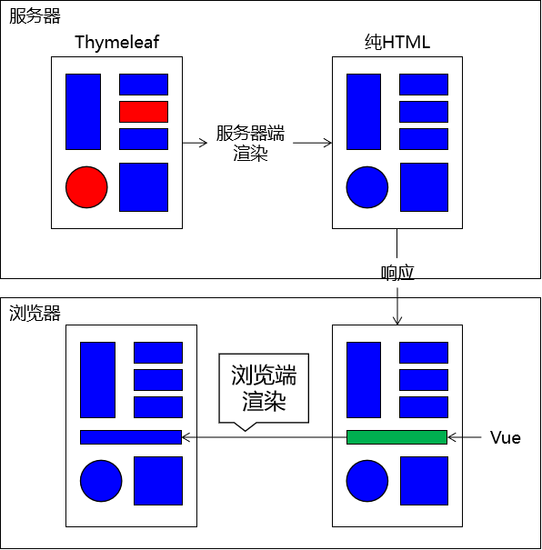

[TOC]

# 第一节 MVC

## 1、提出问题

我们对HTML的新的期待：既能够正常显示页面，又能在页面中包含动态数据部分。而动态数据单靠HTML本身是无法做到的，所以此时我们需要引入服务器端动态视图模板技术。

## 2、从三层结构到MVC

### ①MVC概念

M：Model模型

V：View视图

C：Controller控制器

MVC是在表述层开发中运用的一种设计理念。主张把封装数据的『模型』、显示用户界面的『视图』、协调调度的『控制器』分开。

好处：

- 进一步实现各个组件之间的解耦
- 让各个组件可以单独维护
- 将视图分离出来以后，我们后端工程师和前端工程师的对接更方便

### ②MVC和三层架构之间关系

## 3、前后端工程师对接方式

- 服务器端渲染：前端工程师把前端页面一整套做好交给后端工程师
- 前后端分离：开会商量JSON格式，然后分头开发。在后端程序尚不可用时，前端工程师会使用Mock.js生成假数据使用，在后端程序可用后再连接实际后端程序获取真实数据。

[查看详细内容](http://heavy_code_industry.gitee.io/code_heavy_industry/pro000-dev-story/chapter05/content.html)

[回目录](index.html) [下一节](verse02.html)