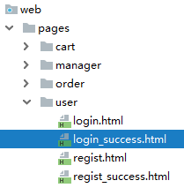

[TOC]

# 第二节 Thymeleaf简介

## 1、Thymeleaf的同行

JSP、Freemarker、Velocity等等，它们有一个共同的名字：<span style="color:blue;font-weight:bold;">服务器端模板技术</span>。

## 2、Thymeleaf官方文档中的介绍

[官网地址](https://www.thymeleaf.org/)

[官方文档](Thymeleaf-3.0.11.pdf)

> Thymeleaf is a modern server-side Java template engine for both web and standalone environments, capable of processing HTML, XML, JavaScript, CSS and even plain text. The main goal of Thymeleaf is to provide an elegant and highly-maintainable way of creating templates. To achieve this, it builds on the concept of Natural Templates to inject its logic into template files in a way that doesn’t affect the template from being used as a design prototype. This improves communication of design and bridges the gap between design and development teams. Thymeleaf has also been designed from the beginning with Web Standards in mind – especially HTML5 – allowing you to create fully validating templates if that is a need for you.

## 3、Thymeleaf优势

- SpringBoot官方推荐使用的视图模板技术，和SpringBoot完美整合。

- 不经过服务器运算仍然可以直接查看原始值，对前端工程师更友好。

```html
<!DOCTYPE html>
<html lang="en" xmlns:th="http://www.thymeleaf.org">
<head>
    <meta charset="UTF-8">
    <title>Title</title>
</head>
<body>

    <p th:text="${hello}">Original Value</p>

</body>
</html>
```

## 4、物理视图和逻辑视图

### ①物理视图

在Servlet中，将请求转发到一个HTML页面文件时，使用的完整的转发路径就是<span style="color:blue;font-weight:bold;">物理视图</span>。

> /pages/user/login_success.html

如果我们把所有的HTML页面都放在某个统一的目录下，那么转发地址就会呈现出明显的规律：

> /pages/user/login.html
> /pages/user/login_success.html
> /pages/user/regist.html
> /pages/user/regist_success.html
>
> ……

路径的开头都是：/pages/user/

路径的结尾都是：.html

所以，路径开头的部分我们称之为<span style="color:blue;font-weight:bold;">视图前缀</span>，路径结尾的部分我们称之为<span style="color:blue;font-weight:bold;">视图后缀</span>。

### ②逻辑视图

物理视图=视图前缀+逻辑视图+视图后缀

上面的例子中：

| 视图前缀     | 逻辑视图      | 视图后缀 | 物理视图                       |
| ------------ | ------------- | -------- | ------------------------------ |
| /pages/user/ | login         | .html    | /pages/user/login.html         |
| /pages/user/ | login_success | .html    | /pages/user/login_success.html |


[上一节](verse01.html) [回目录](index.html) [下一节](verse03.html)