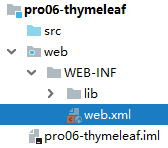
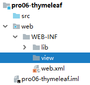

[TOC]

# 第三节 在服务器端引入Thymeleaf环境

## 1、加入jar包


## 2、配置上下文参数





物理视图=视图前缀+逻辑视图+视图后缀

```xml
<!-- 在上下文参数中配置视图前缀和视图后缀 -->
<context-param>
    <param-name>view-prefix</param-name>
    <param-value>/WEB-INF/view/</param-value>
</context-param>
<context-param>
    <param-name>view-suffix</param-name>
    <param-value>.html</param-value>
</context-param>
```

说明：param-value中设置的前缀、后缀的值不是必须叫这个名字，可以根据实际情况和需求进行修改。

> 为什么要放在WEB-INF目录下？
>
> 原因：WEB-INF目录不允许浏览器直接访问，所以我们的视图模板文件放在这个目录下，是一种保护。以免外界可以随意访问视图模板文件。
>
> 访问WEB-INF目录下的页面，都必须通过Servlet转发过来，简单说就是：不经过Servlet访问不了。
>
> 这样就方便我们在Servlet中检查当前用户是否有权限访问。
>
> 那放在WEB-INF目录下之后，重定向进不去怎么办？
>
> 重定向到Servlet，再通过Servlet转发到WEB-INF下。

## 3、创建Servlet基类

这个类大家直接<span style="color:blue;font-weight:bold;">复制粘贴</span>即可，将来使用框架后，这些代码都将被取代。

```java
import org.thymeleaf.TemplateEngine;
import org.thymeleaf.context.WebContext;
import org.thymeleaf.templatemode.TemplateMode;
import org.thymeleaf.templateresolver.ServletContextTemplateResolver;

import javax.servlet.ServletContext;
import javax.servlet.ServletException;
import javax.servlet.http.HttpServlet;
import javax.servlet.http.HttpServletRequest;
import javax.servlet.http.HttpServletResponse;
import java.io.IOException;

public class ViewBaseServlet extends HttpServlet {

    private TemplateEngine templateEngine;

    @Override
    public void init() throws ServletException {

        // 1.获取ServletContext对象
        ServletContext servletContext = this.getServletContext();

        // 2.创建Thymeleaf解析器对象
        ServletContextTemplateResolver templateResolver = new ServletContextTemplateResolver(servletContext);

        // 3.给解析器对象设置参数
        // ①HTML是默认模式，明确设置是为了代码更容易理解
        templateResolver.setTemplateMode(TemplateMode.HTML);

        // ②设置前缀
        String viewPrefix = servletContext.getInitParameter("view-prefix");

        templateResolver.setPrefix(viewPrefix);

        // ③设置后缀
        String viewSuffix = servletContext.getInitParameter("view-suffix");

        templateResolver.setSuffix(viewSuffix);

        // ④设置缓存过期时间（毫秒）
        templateResolver.setCacheTTLMs(60000L);

        // ⑤设置是否缓存
        templateResolver.setCacheable(true);

        // ⑥设置服务器端编码方式
        templateResolver.setCharacterEncoding("utf-8");

        // 4.创建模板引擎对象
        templateEngine = new TemplateEngine();

        // 5.给模板引擎对象设置模板解析器
        templateEngine.setTemplateResolver(templateResolver);

    }

    protected void processTemplate(String templateName, HttpServletRequest req, HttpServletResponse resp) throws IOException {
        // 1.设置响应体内容类型和字符集
        resp.setContentType("text/html;charset=UTF-8");

        // 2.创建WebContext对象
        WebContext webContext = new WebContext(req, resp, getServletContext());

        // 3.处理模板数据
        templateEngine.process(templateName, webContext, resp.getWriter());
    }
}
```

## 4、HelloWorld

### ①创建index.html


### ②在index.html编写超链接

```html
<a href="/view/TestThymeleafServlet">初步测试Thymeleaf</a>
```

### ③创建Servlet


```xml
<servlet>
    <servlet-name>TestThymeleafServlet</servlet-name>
    <servlet-class>com.atguigu.thymeleaf.servlet.TestThymeleafServlet</servlet-class>
</servlet>
<servlet-mapping>
    <servlet-name>TestThymeleafServlet</servlet-name>
    <url-pattern>/TestThymeleafServlet</url-pattern>
</servlet-mapping>
```

### ④修改Servlet继承的父类


### ⑤在doGet()方法中跳转到Thymeleaf页面

```java
protected void doGet(HttpServletRequest request, HttpServletResponse response) throws ServletException, IOException {
    
    // 1.声明当前请求要前往的视图名称
    String viewName = "target";
    
    // 2.调用ViewBaseServlet父类中的解析视图模板的方法
    super.processTemplate(viewName, request, response);
    
}
```

### ⑥Thymeleaf页面

```html
<!DOCTYPE html>

<!-- 在html标签内加入Thymeleaf名称空间的声明 -->
<html lang="en" xmlns:th="http://www.thymeleaf.org">
<head>
    <meta charset="UTF-8">
    <title>Title</title>
</head>
<body>

    <!-- 在p标签的基础上，使用Thymeleaf的表达式，解析了一个URL地址 -->
    <p th:text="@{'/aaa/bbb/ccc'}">Thymeleaf将在这里显示一个解析出来的URL地址</p>

</body>
</html>
```


[上一节](verse02.html) [回目录](index.html) [下一节](verse04.html)