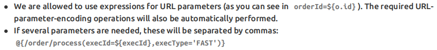

[TOC]

# 第五节 基本语法：表达式语法

## 1、修改标签文本值

代码示例：

```html
<p th:text="标签体新值">标签体原始值</p>
```

### ①th:text作用

- 不经过服务器解析，直接用浏览器打开HTML文件，看到的是『标签体原始值』
- 经过服务器解析，Thymeleaf引擎根据th:text属性指定的『标签体新值』去<span style="color:blue;font-weight:bold;">替换</span>『标签体原始值』

### ②字面量

『字面量』是一个经常会遇到的概念，我们可以对照『变量』来理解它的含义。

```java
// a是变量，100是字面量
int a = 100;
System.out.println("a = " + a);
```

- 变量：变量名字符串本身不是它的值，它指向的才是它的值
- 字面量：它就是字面上的含义，我们从『字面』上看到的直接就是它的值

现在我们在th:text属性中使用的就是『字面量』，它<span style="color:blue;font-weight:bold;">不指代任何其他值</span>。

## 2、修改指定属性值

代码示例：

```html
<input type="text" name="username" th:value="文本框新值" value="文本框旧值" />
```

语法：任何HTML标签原有的属性，前面加上『th:』就都可以通过Thymeleaf来设定新值。

## 3、解析URL地址

### ①基本语法

代码示例：

```html
<p th:text="@{/aaa/bbb/ccc}">标签体原始值</p>
```

经过解析后得到：

> /view/aaa/bbb/ccc

所以@{}的作用是<span style="color:blue;font-weight:bold;">在字符串前附加『上下文路径』</span>

>  这个语法的好处是：实际开发过程中，项目在不同环境部署时，Web应用的名字有可能发生变化。所以上下文路径不能写死。而通过@{}动态获取上下文路径后，不管怎么变都不怕啦！

### ②首页使用URL地址解析


如果我们直接访问index.html本身，那么index.html是不需要通过Servlet，当然也不经过模板引擎，所以index.html上的Thymeleaf的任何表达式都不会被解析。

解决办法：通过Servlet访问index.html，这样就可以让模板引擎渲染页面了：


> 进一步的好处：
>
> 通过上面的例子我们看到，所有和业务功能相关的请求都能够确保它们通过Servlet来处理，这样就方便我们统一对这些请求进行特定规则的限定。

### ③给URL地址后面附加请求参数

参照官方文档说明：



## 4、直接执行表达式

Servlet代码：

```java
request.setAttribute("reqAttrName", "<span>hello-value</span>");
```

页面代码：

```html
<p>有转义效果：[[${reqAttrName}]]</p>
<p>无转义效果：[(${reqAttrName})]</p>
```

执行效果：

```html
    <p>有转义效果：&lt;span&gt;hello-value&lt;/span&gt;</p>
    <p>无转义效果：<span>hello-value</span></p>
```


[上一节](verse04.html) [回目录](index.html) [下一节](verse06.html)