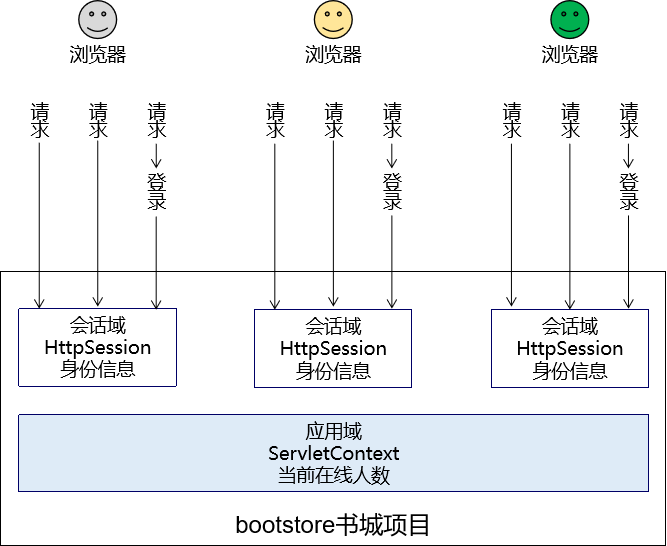

[TOC]

# 第六节 基本语法：访问域对象

## 1、域对象

### ①请求域

在请求转发的场景下，我们可以借助HttpServletRequest对象内部给我们提供的存储空间，帮助我们携带数据，把数据发送给转发的目标资源。

请求域：HttpServletRequest对象内部给我们提供的存储空间


### ②会话域


### ③应用域



> PS：在我们使用的视图是JSP的时候，域对象有4个
>
> - pageContext
> - request：请求域
> - session：会话域
> - application：应用域
>
> 所以在JSP的使用背景下，我们可以说域对象有4个，现在使用Thymeleaf了，没有pageContext。

## 2、在Servlet中将数据存入属性域

### ①操作请求域

Servlet中代码：

```java
String requestAttrName = "helloRequestAttr";
String requestAttrValue = "helloRequestAttr-VALUE";

request.setAttribute(requestAttrName, requestAttrValue);
```

Thymeleaf表达式：

```html
<p th:text="${helloRequestAttr}">request field value</p>
```

### ②操作会话域

Servlet中代码：

```java
// ①通过request对象获取session对象
HttpSession session = request.getSession();

// ②存入数据
session.setAttribute("helloSessionAttr", "helloSessionAttr-VALUE");
```

Thymeleaf表达式：

```html
<p th:text="${session.helloSessionAttr}">这里显示会话域数据</p>
```

### ③操作应用域

Servlet中代码：

```java
// ①通过调用父类的方法获取ServletContext对象
ServletContext servletContext = getServletContext();

// ②存入数据
servletContext.setAttribute("helloAppAttr", "helloAppAttr-VALUE");
```

Thymeleaf表达式：

```html
<p th:text="${application.helloAppAttr}">这里显示应用域数据</p>
```


[上一节](verse05.html) [回目录](index.html) [下一节](verse07.html)