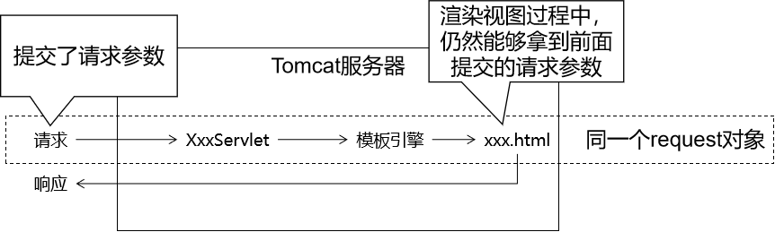

[TOC]

# 第七节 基本语法：获取请求参数

具体来说，我们这里探讨的是在页面上（模板页面）获取请求参数。底层机制是：



## 1、一个名字一个值

页面代码：

```html
<p th:text="${param.username}">这里替换为请求参数的值</p>
```

页面显示效果：


## 2、一个名字多个值

页面代码：

```html
<p th:text="${param.team}">这里替换为请求参数的值</p>
```

页面显示效果：


如果想要精确获取某一个值，可以使用数组下标。页面代码：

```html
<p th:text="${param.team[0]}">这里替换为请求参数的值</p>
<p th:text="${param.team[1]}">这里替换为请求参数的值</p>
```

页面显示效果：


[上一节](verse06.html) [回目录](index.html) [下一节](verse08.html)