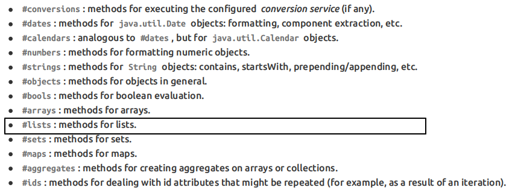

[TOC]

# 第八节 基本语法：内置对象

## 1、概念

所谓内置对象其实就是在表达式中<span style="color:blue;font-weight:bold;">可以直接使用</span>的对象。

## 2、基本内置对象


用法举例：

```html
<h3>表达式的基本内置对象</h3>
<p th:text="${#request.getClass().getName()}">这里显示#request对象的全类名</p>
<p th:text="${#request.getContextPath()}">调用#request对象的getContextPath()方法</p>
<p th:text="${#request.getAttribute('helloRequestAttr')}">调用#request对象的getAttribute()方法，读取属性域</p>
```

基本思路：

- 如果不清楚这个对象有哪些方法可以使用，那么就通过getClass().getName()获取全类名，再回到Java环境查看这个对象有哪些方法
- 内置对象的方法可以直接调用
- 调用方法时需要传参的也可以直接传入参数

## 3、公共内置对象



Servlet中将List集合数据存入请求域：

```java
request.setAttribute("aNotEmptyList", Arrays.asList("aaa","bbb","ccc"));
request.setAttribute("anEmptyList", new ArrayList<>());
```

页面代码：

```html
<p>#list对象isEmpty方法判断集合整体是否为空aNotEmptyList：<span th:text="${#lists.isEmpty(aNotEmptyList)}">测试#lists</span></p>
<p>#list对象isEmpty方法判断集合整体是否为空anEmptyList：<span th:text="${#lists.isEmpty(anEmptyList)}">测试#lists</span></p>
```

公共内置对象对应的源码位置：


[上一节](verse07.html) [回目录](index.html) [下一节](verse09.html)