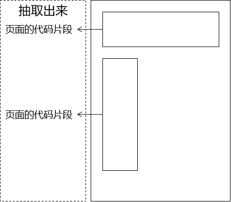

[TOC]

# 第十一节 基本语法：包含其他模板文件

## 1、应用场景

抽取各个页面的公共部分：



## 2、创建页面的代码片段

使用th:fragment来给这个片段命名：

```html
<div th:fragment="header">
    <p>被抽取出来的头部内容</p>
</div>
```

## 3、包含到有需要的页面

| 语法       | 效果                                                     |
| ---------- | -------------------------------------------------------- |
| th:insert  | 把目标的代码片段整个插入到当前标签内部                   |
| th:replace | 用目标的代码替换当前标签                                 |
| th:include | 把目标的代码片段去除最外层标签，然后再插入到当前标签内部 |

页面代码举例：

```html
<!-- 代码片段所在页面的逻辑视图 :: 代码片段的名称 -->
<div id="badBoy" th:insert="segment :: header">
    div标签的原始内容
</div>

<div id="worseBoy" th:replace="segment :: header">
    div标签的原始内容
</div>

<div id="worstBoy" th:include="segment :: header">
    div标签的原始内容
</div>
```


[上一节](verse10.html) [回目录](index.html) [下一节](verse12.html)