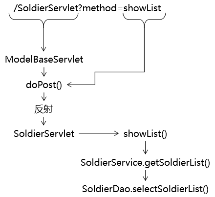
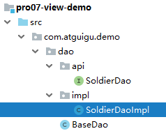
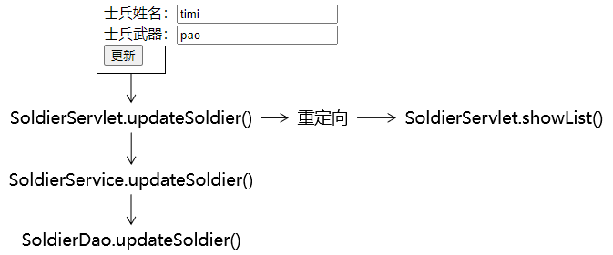

[TOC]

# 加餐 最凝练的CRUD

## 1、建模

### ①物理建模

```sql
CREATE DATABASE `view-demo`CHARACTER SET utf8;
USE `view-demo`;
CREATE TABLE t_soldier(
    soldier_id INT PRIMARY KEY AUTO_INCREMENT,
    soldier_name CHAR(100),
    soldier_weapon CHAR(100)
);
```

### ②逻辑建模

```java
public class Soldier {
    
    private Integer soldierId;
    private String soldierName;
    private String soldierWeapon;
```

## 2、总体架构


## 3、搭建持久化层所需环境

### ①导入jar包

> commons-dbutils-1.6.jar
> druid-1.1.9.jar
> hamcrest-core-1.3.jar
> junit-4.12.jar
> mysql-connector-java-5.1.37-bin.jar

### ②创建jdbc.properties

维护基本连接信息

```properties
driverClassName=com.mysql.jdbc.Driver
url=jdbc:mysql://192.168.198.100:3306/view-demo
username=root
password=atguigu
initialSize=10
maxActive=20
maxWait=10000
```

### ③创建JDBCUtils工具类

```java
import com.alibaba.druid.pool.DruidDataSourceFactory;

import javax.sql.DataSource;
import java.io.InputStream;
import java.sql.Connection;
import java.sql.SQLException;
import java.util.Properties;

public class JDBCUtil {

    // 将数据源对象设置为静态属性，保证大对象的单一实例
    private static DataSource dataSource;

    static {

        // 1.创建一个用于存储外部属性文件信息的Properties对象
        Properties properties = new Properties();

        // 2.使用当前类的类加载器加载外部属性文件：jdbc.properties
        InputStream inputStream = JDBCUtil.class.getClassLoader().getResourceAsStream("jdbc.properties");

        try {

            // 3.将外部属性文件jdbc.properties中的数据加载到properties对象中
            properties.load(inputStream);

            // 4.创建数据源对象
            dataSource = DruidDataSourceFactory.createDataSource(properties);

        } catch (Exception e) {
            e.printStackTrace();
        }

    }

    /**
     * 从数据源中获取数据库连接
     * @return 数据库连接对象
     */
    public static Connection getConnection() {

        Connection connection = null;

        try {
            connection = dataSource.getConnection();
        } catch (SQLException e) {
            e.printStackTrace();

            throw new RuntimeException(e);
        }

        return connection;

    }

    /**
     * 释放数据库连接
     * @param connection 要执行释放操作的连接对象
     */
    public static void releaseConnection(Connection connection) {

        if (connection != null) {

            try {
                connection.close();
            } catch (SQLException e) {
                e.printStackTrace();

                throw new RuntimeException(e);
            }

        }

    }
    
}
```

测试能否正常连接数据库：

```java
public class DemoTest {

    @Test
    public void testConnection() {
        Connection connection = JDBCUtil.getConnection();
        System.out.println("connection = " + connection);
    }

}
```

### ④BaseDao

```java
public class BaseDao<T> {

    private QueryRunner queryRunner = new QueryRunner();

    /**
     * 通用的增删改方法
     * @param sql
     * @param param
     * @return
     */
    public int update(String sql, Object ... param) {

        Connection connection = JDBCUtil.getConnection();

        int count = 0;
        try {
            count = queryRunner.update(connection, sql, param);
        } catch (SQLException e) {
            e.printStackTrace();

            throw new RuntimeException(e);

        } finally {
            
            // 关闭数据库连接
            JDBCUtil.releaseConnection(connection);
            
        }

        return count;
    }

    /**
     * 查询单个对象的通用方法
     * @param clazz
     * @param sql
     * @param param
     * @return
     */
    public T getBean(Class<T> clazz, String sql, Object ... param) {

        Connection connection = JDBCUtil.getConnection();

        T bean = null;
        try {
            bean = queryRunner.query(connection, sql, new BeanHandler<>(clazz), param);
        } catch (SQLException e) {
            e.printStackTrace();
            throw new RuntimeException(e);
        } finally {
            
            // 关闭数据库连接
            JDBCUtil.releaseConnection(connection);
            
        }

        return bean;
    }

    /**
     * 查询集合对象的通用方法
     * @param clazz
     * @param sql
     * @param param
     * @return
     */
    public List<T> getBeanList(Class<T> clazz, String sql, Object ... param) {

        Connection connection = JDBCUtil.getConnection();

        List<T> beanList = null;

        try {
            beanList = queryRunner.query(connection, sql, new BeanListHandler<>(clazz), param);
        } catch (SQLException e) {
            e.printStackTrace();
            throw new RuntimeException(e);
        } finally {
            
            // 关闭数据库连接
            JDBCUtil.releaseConnection(connection);
            
        }

        return beanList;
    }
}
```

## 4、搭建表述层所需环境

本质上就是Thymeleaf所需要的环境

### ①导入jar包

> attoparser-2.0.5.RELEASE.jar
> javassist-3.20.0-GA.jar
> log4j-1.2.15.jar
> ognl-3.1.26.jar
> slf4j-api-1.7.25.jar
> slf4j-log4j12-1.7.25.jar
> thymeleaf-3.0.12.RELEASE.jar
> unbescape-1.1.6.RELEASE.jar

### ②创建ViewBaseServlet

```java
import org.thymeleaf.TemplateEngine;
import org.thymeleaf.context.WebContext;
import org.thymeleaf.templatemode.TemplateMode;
import org.thymeleaf.templateresolver.ServletContextTemplateResolver;

import javax.servlet.ServletContext;
import javax.servlet.ServletException;
import javax.servlet.http.HttpServlet;
import javax.servlet.http.HttpServletRequest;
import javax.servlet.http.HttpServletResponse;
import java.io.IOException;

public class ViewBaseServlet extends HttpServlet {

    private TemplateEngine templateEngine;

    @Override
    public void init() throws ServletException {

        // 1.获取ServletContext对象
        ServletContext servletContext = this.getServletContext();

        // 2.创建Thymeleaf解析器对象
        ServletContextTemplateResolver templateResolver = new ServletContextTemplateResolver(servletContext);

        // 3.给解析器对象设置参数
        // ①HTML是默认模式，明确设置是为了代码更容易理解
        templateResolver.setTemplateMode(TemplateMode.HTML);

        // ②设置前缀
        String viewPrefix = servletContext.getInitParameter("view-prefix");

        templateResolver.setPrefix(viewPrefix);

        // ③设置后缀
        String viewSuffix = servletContext.getInitParameter("view-suffix");

        templateResolver.setSuffix(viewSuffix);

        // ④设置缓存过期时间（毫秒）
        templateResolver.setCacheTTLMs(60000L);

        // ⑤设置是否缓存
        templateResolver.setCacheable(true);

        // ⑥设置服务器端编码方式
        templateResolver.setCharacterEncoding("utf-8");

        // 4.创建模板引擎对象
        templateEngine = new TemplateEngine();

        // 5.给模板引擎对象设置模板解析器
        templateEngine.setTemplateResolver(templateResolver);

    }

    protected void processTemplate(String templateName, HttpServletRequest req, HttpServletResponse resp) throws IOException {
        // 1.设置响应体内容类型和字符集
        resp.setContentType("text/html;charset=UTF-8");

        // 2.创建WebContext对象
        WebContext webContext = new WebContext(req, resp, getServletContext());

        // 3.处理模板数据
        templateEngine.process(templateName, webContext, resp.getWriter());
    }
}
```

### ③配置web.xml

```xml
<!-- 在上下文参数中配置视图前缀和视图后缀 -->
<context-param>
    <param-name>view-prefix</param-name>
    <param-value>/WEB-INF/view/</param-value>
</context-param>
<context-param>
    <param-name>view-suffix</param-name>
    <param-value>.html</param-value>
</context-param>
```

### ④创建view目录


## 5、功能清单

- 显示首页：浏览器通过index.html访问首页Servlet，然后再解析对应的模板视图
- 显示列表：在首页点击超链接，跳转到目标页面把所有士兵的信息列表显示出来
- 删除信息：在列表上点击删除超链接，执行信息的删除操作
- 新增信息：
  - 在列表页面点击超链接跳转到新增士兵信息的表单页面
  - 在新增信息的表单页面点击提交按钮执行保存
- 更新信息：
  - 在列表上点击更新超链接，跳转到更新士兵信息的表单页面：表单回显
  - 在更新信息的表单页面点击提交按钮执行更新

## 6、显示首页

### ①目标

浏览器访问index.html，通过首页Servlet，渲染视图，显示首页。

### ②思路


### ③代码

#### [1]创建PortalServlet

```xml
<servlet>
    <servlet-name>PortalServlet</servlet-name>
    <servlet-class>com.atguigu.demo.servlet.PortalServlet</servlet-class>
</servlet>
<servlet-mapping>
    <servlet-name>PortalServlet</servlet-name>
    <url-pattern>/index.html</url-pattern>
</servlet-mapping>
```

Servlet代码：

```java
public class PortalServlet extends ViewBaseServlet {

    @Override
    protected void doGet(HttpServletRequest request, HttpServletResponse response) throws ServletException, IOException {

        String viewName = "portal";

        super.processTemplate(viewName, request, response);

    }

    @Override
    protected void doPost(HttpServletRequest request, HttpServletResponse response) throws ServletException, IOException {
    }
}
```

#### [2]创建portal.html


```html
<!DOCTYPE html>
<html lang="en" xmlns:th="http://www.thymeleaf.org">
<head>
    <meta charset="UTF-8">
    <title>士兵信息管理系统</title>
</head>
<body>

    <a th:href="@{/SoldierServlet?method=showList}">显示士兵信息列表</a>

</body>
</html>
```

## 7、显示列表

### ①目标

在目标页面显示所有士兵信息，士兵信息是从数据库查询出来的

### ②思路



### ③代码

#### [1]ModelBaseServlet

创建这个基类的原因是：我们希望每一个模块能够对应同一个Servlet，这个模块所需要调用的所有方法都集中在同一个Servlet中。如果没有这个ModelBaseServlet基类，我们doGet()、doPost()方法可以用来处理请求，这样一来，每一个方法都需要专门创建一个Servlet（就好比咱们之前的LoginServlet、RegisterServlet其实都应该合并为UserServlet）。

```java
public class ModelBaseServlet extends ViewBaseServlet {

    protected void doGet(HttpServletRequest request, HttpServletResponse response) throws ServletException, IOException {

        // 在doGet()方法中调用doPost()方法，这样就可以在doPost()方法中集中处理所有请求
        doPost(request, response);
    }

    protected void doPost(HttpServletRequest request, HttpServletResponse response) throws ServletException, IOException {

        // 1.从请求参数中获取method对应的数据
        String method = request.getParameter("method");

        // 2.通过反射调用method对应的方法
        // ①获取Class对象
        Class<? extends ModelBaseServlet> clazz = this.getClass();

        try {
            // ②获取method对应的Method对象
            Method methodObject = clazz.getDeclaredMethod(method, HttpServletRequest.class, HttpServletResponse.class);
            
            // ③打开访问权限
            methodObject.setAccessible(true);
            
            // ④通过Method对象调用目标方法
            methodObject.invoke(this, request, response);
        } catch (Exception e) {
            e.printStackTrace();
            
            throw new RuntimeException(e);
        }
    }

}
```

#### [2]SoldierDao.selectSoldierList()




接口方法：

```java
public interface SoldierDao {

    List<Soldier> selectSoldierList();

}
```

实现类方法：

```java
public class SoldierDaoImpl extends BaseDao<Soldier> implements SoldierDao {
    @Override
    public List<Soldier> selectSoldierList() {
        
        String sql = "select soldier_id soldierId,soldier_name soldierName,soldier_weapon soldierWeapon from t_soldier";
        
        return getBeanList(Soldier.class, sql);
    }
}
```

#### [3]SoldierService.getSoldierList()


接口方法：

```java
public interface SoldierService {

    List<Soldier> getSoldierList();

}
```

实现类方法：

```java
public class SoldierServiceImpl implements SoldierService {

    private SoldierDao soldierDao = new SoldierDaoImpl();

    @Override
    public List<Soldier> getSoldierList() {

        List<Soldier> soldierList = soldierDao.selectSoldierList();

        return soldierList;
    }
}
```

#### [4]SoldierServlet.showList()

```java
protected void showList(HttpServletRequest request, HttpServletResponse response) throws ServletException, IOException {

    // 1.调用Service方法获取集合数据
    List<Soldier> soldierList = soldierService.getSoldierList();

    // 2.将集合数据存入请求域
    request.setAttribute("soldierList", soldierList);

    // 3.渲染视图（在渲染的过程中，已经包含了转发）
    processTemplate("list", request, response);
}
```

## 8、删除功能

### ①目标

点击页面上的超链接，把数据库表中的记录删除。

### ②思路

#### [1]先不考虑后续


#### [2]加上后续返回响应页面


### ③代码

#### [1]完成删除超链接


```html
<a th:href="@{/SoldierServlet(soldierId=${soldier.soldierId},method='remove')}">删除</a>
```

关于@{地址}附加请求参数的语法格式：

- 只有一个请求参数：@{地址(请求参数名=普通字符串)}或@{地址(请求参数名=${需要解析的表达式})}
- 多个请求参数：@{地址(名=值,名=值)}

官方文档中的说明如下：


#### [2]Servlet方法

```java
protected void remove(HttpServletRequest request, HttpServletResponse response) throws ServletException, IOException {

    // 1.从请求参数中获取士兵信息的id值
    String soldierId = request.getParameter("soldierId");

    // 2.调用Service方法执行删除操作
    soldierService.remove(soldierId);

    // 3.后续……
    // 方案一：还是直接前往list.html，需要重新查询soldierList数据，代码重复
    // 1.调用Service方法获取集合数据
    // List<Soldier> soldierList = soldierService.getSoldierList();

    // 2.将集合数据存入请求域
    // request.setAttribute("soldierList", soldierList);

    // processTemplate("list", request, response);

    // 方案二：直接调用隔壁的showList()
    // 也能实现需求，但是总感觉这样调用方法破坏了程序的结构
    // showList(request, response);

    // 方案三：通过请求转发的方式间接调用showList()方法
    // request.getRequestDispatcher("/SoldierServlet?method=showList").forward(request, response);

    // 方案四：通过请求重定向的方式间接调用showList()方法
    response.sendRedirect(request.getContextPath() + "/SoldierServlet?method=showList");
}
```

#### [3]Service方法

```java
    @Override
    public void remove(String soldierId) {
        soldierDao.delete(soldierId);
    }
```

#### [4]Dao方法

```java
    @Override
    public void delete(String soldierId) {
        String sql = "delete from t_soldier where soldier_id=?";

        update(sql, soldierId);
    }
```

## 9、前往新增信息的表单页面

### ①创建超链接

```html
<a th:href="@{/SoldierServlet?method=toAddPage}">前往新增页面</a>
```

### ②Servlet

```java
protected void toAddPage(HttpServletRequest request, HttpServletResponse response) throws ServletException, IOException {
    processTemplate("add-page", request, response);
}
```

### ③创建表单页面


```html
<form th:action="@{/SoldierServlet}" method="post">

    <input type="hidden" name="method" value="saveSoldier" />

    士兵姓名：<input type="text" name="soldierName" /><br/>
    士兵武器：<input type="text" name="soldierWeapon" /><br/>

    <button type="submit">保存</button>

</form>
```

## 10、执行保存

### ①目标

提交表单后，将表单数据封装为Soldier对象，然后将Soldier对象保存到数据库。

### ②思路


### ③代码

#### [1]Servlet方法

```java
protected void saveSoldier(HttpServletRequest request, HttpServletResponse response) throws ServletException, IOException {
    
    // 1.获取请求参数
    String soldierName = request.getParameter("soldierName");
    String soldierWeapon = request.getParameter("soldierWeapon");
    
    // 2.创建Soldier对象
    Soldier soldier = new Soldier(null, soldierName, soldierWeapon);

    // 3.调用Service方法
    soldierService.saveSoldier(soldier);

    // 4.重定向请求
    response.sendRedirect(request.getContextPath() + "/SoldierServlet?method=showList");
}
```

#### [2]Service方法

```java
    @Override
    public void saveSoldier(Soldier soldier) {

        soldierDao.insertSoldier(soldier);

    }
```

#### [3]Dao方法

```java
    @Override
    public void insertSoldier(Soldier soldier) {

        String sql = "insert into t_soldier(soldier_name,soldier_weapon) values(?,?)";

        update(sql, soldier.getSoldierName(), soldier.getSoldierWeapon());
    }
```

## 11、前往修改信息的表单页面


### ①创建超链接

```html
<a th:href="@{/SoldierServlet(soldierId=${soldier.soldierId},method=toEditPage)}">编辑</a>
```

### ②Servlet方法

```java
protected void toEditPage(HttpServletRequest request, HttpServletResponse response) throws ServletException, IOException {

    // 1.从请求参数获取soldierId
    String soldierId = request.getParameter("soldierId");

    // 2.根据soldierId查询Soldier对象
    Soldier soldier = soldierService.getSoldierById(soldierId);

    // 3.将Soldier对象存入请求域
    request.setAttribute("soldier", soldier);

    // 4.前往更新的表单页面
    processTemplate("edit-page", request, response);

}
```

### ③Service方法

```java
    @Override
    public Soldier getSoldierById(String soldierId) {
        return soldierDao.selectSoldierByPrimaryKey(soldierId);
    }
```

### ④Dao方法

```java
@Override
public Soldier selectSoldierByPrimaryKey(String soldierId) {
    String sql = "select soldier_id soldierId,soldier_name soldierName,soldier_weapon soldierWeapon from t_soldier where soldier_id=?";

    return getBean(Soldier.class, sql, soldierId);
}
```

### ⑤表单页面

```html
<form th:action="@{/SoldierServlet}" method="post">

    <input type="hidden" name="method" value="updateSoldier" />
    <input type="hidden" name="soldierId" th:value="${soldier.soldierId}" />

    士兵姓名：<input type="text" name="soldierName" th:value="${soldier.soldierName}" /><br/>
    士兵武器：<input type="text" name="soldierWeapon" th:value="${soldier.soldierWeapon}" /><br/>

    <button type="submit">更新</button>

</form>
```

## 12、执行更新



### ①Servlet方法

```java
protected void updateSoldier(HttpServletRequest request, HttpServletResponse response) throws ServletException, IOException {

    // 1.获取请求参数
    String soldierIdOrigin = request.getParameter("soldierId");
    Integer soldierId = Integer.parseInt(soldierIdOrigin);
    String soldierName = request.getParameter("soldierName");
    String soldierWeapon = request.getParameter("soldierWeapon");

    // 2.封装对象
    Soldier soldier = new Soldier(soldierId, soldierName, soldierWeapon);

    // 3.调用Service方法执行更新
    soldierService.updateSoldier(soldier);

    // 4.重定向请求
    response.sendRedirect(request.getContextPath() + "/SoldierServlet?method=showList");
}
```

### ②Service方法

```java
    @Override
    public void updateSoldier(Soldier soldier) {

        soldierDao.updateSoldier(soldier);

    }
```

### ③Dao方法

```java
@Override
public void updateSoldier(Soldier soldier) {
    String sql = "update t_soldier set soldier_name=?,soldier_weapon=? where soldier_id=?";
    update(sql, soldier.getSoldierName(), soldier.getSoldierWeapon(), soldier.getSoldierId());
}
```

## 13、请求字符集设置

- 设置请求体字符集需要调用request.setCharacterEncoding("UTF-8");
- request.setCharacterEncoding("UTF-8");要求在所有request.getParameter()前面
- 在执行子类Servlet方法时，其实都是先调用父类ModelBaseServlet的doPost()方法
- doPost()方法中包含获取method请求参数的操作
- 所以最前面的request.getParameter()在doPost()方法中
- 所以request.setCharacterEncoding("UTF-8");要放在doPost()方法的request.getParameter()前面

```java
protected void doPost(HttpServletRequest request, HttpServletResponse response) throws ServletException, IOException {

    // 0.在所有request.getParameter()前面设置解析请求体的字符集
    request.setCharacterEncoding("UTF-8");

    // 1.从请求参数中获取method对应的数据
    String method = request.getParameter("method");
    
    // ……
```


[上一节](verse11.html) [回目录](index.html)