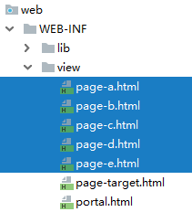
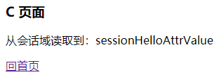

[TOC]

# 第一节 提出问题与解决方案核心代码

## 1、提出问题


保持用户登录状态，背后的底层逻辑是：服务器在接收到用户请求的时候，有办法判断这个请求来自于之前的某一个用户。所以保持登录状态，本质上是保持<span style="color:blue;font-weight:bold;">『会话状态』</span>

## 2、解决方案

### ①结论

使用HttpSession对象，将数据存入<span style="color:blue;font-weight:bold;">会话域</span>就能保持会话状态。

```java
HttpSession session = request.getSession();
session.setAttribute("user", user);
```

### ②demo体验

#### [1]准备环境

参考[会话控制demo原始纯净版](pro08-cookie-and-session.zip)

#### [2]创建将数据存入会话域的Servlet

```java
public class HelloWorldServlet extends ModelBaseServlet {
    protected void setValue(HttpServletRequest request, HttpServletResponse response) throws ServletException, IOException {

        // 1.通过request对象获取session对象
        HttpSession session = request.getSession();

        // 2.设置数据名称和数据的值
        String attrName = "sessionHelloAttrName";
        String attrValue = "sessionHelloAttrValue";

        // 3.将数据存入会话域
        session.setAttribute(attrName, attrValue);

        // 4.渲染视图
        processTemplate("page-target", request, response);
    }
}
```

#### [3]在其他页面从会话域取出数据



```html
<div th:if="${#strings.isEmpty(session.sessionHelloAttrName)}">
    没有从会话域获取到数据
</div>
<div th:if="${not #strings.isEmpty(session.sessionHelloAttrName)}">
    <p>从会话域读取到：<span th:text="${session.sessionHelloAttrName}"></span></p>
</div>
```

#### [4]操作效果




[回目录](index.html) [下一节](verse02.html)