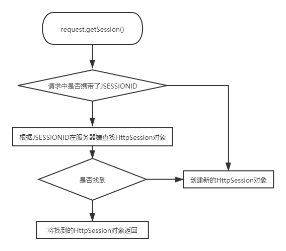

[TOC]

# 第三节 Session的工作机制

## 1、文字描述

前提：浏览器正常访问服务器

- 服务器端没调用request.getSession()方法：什么都不会发生
- 服务器端调用了request.getSession()方法
  - 服务器端检查当前请求中是否携带了JSESSIONID的Cookie
    - 有：根据JSESSIONID在服务器端查找对应的HttpSession对象
      - 能找到：将找到的HttpSession对象作为request.getSession()方法的返回值返回
      - 找不到：服务器端新建一个HttpSession对象作为request.getSession()方法的返回值返回
    - 无：服务器端新建一个HttpSession对象作为request.getSession()方法的返回值返回

## 2、流程图描述



## 3、代码验证

```java
// 1.调用request对象的方法尝试获取HttpSession对象
HttpSession session = request.getSession();

// 2.调用HttpSession对象的isNew()方法
boolean wetherNew = session.isNew();

// 3.打印HttpSession对象是否为新对象
System.out.println("wetherNew = " + (wetherNew?"HttpSession对象是新的":"HttpSession对象是旧的"));

// 4.调用HttpSession对象的getId()方法
String id = session.getId();

// 5.打印JSESSIONID的值
System.out.println("JSESSIONID = " + id);
```

## 4、时效性

### ①为什么Session要设置时限

用户量很大之后，Session对象相应的也要创建很多。如果一味创建不释放，那么服务器端的内存迟早要被耗尽。

### ②设置时限的难点

从服务器端的角度，很难精确得知类似浏览器关闭的动作。而且即使浏览器一直没有关闭，也不代表用户仍然在使用。

### ③服务器端给Session对象设置最大闲置时间

- 默认值：1800秒


最大闲置时间生效的机制如下：


### ④代码验证

```java
// ※测试时效性
// 获取默认的最大闲置时间
int maxInactiveIntervalSecond = session.getMaxInactiveInterval();
System.out.println("maxInactiveIntervalSecond = " + maxInactiveIntervalSecond);

// 设置默认的最大闲置时间
session.setMaxInactiveInterval(15);
```

### ⑤强制Session立即失效

```java
session.invalidate();
```


[上一节](verse02.html) [回目录](index.html)