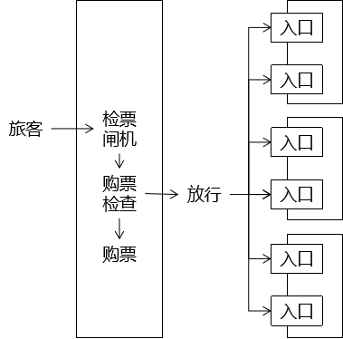

[TOC]

# 第一节 过滤器简介

## 1、通过类比了解过滤器作用

### ①坐地铁

### ②登录检查

## 2、过滤器的三要素

### ①拦截

过滤器之所以能够对请求进行预处理，关键是对请求进行拦截，把请求拦截下来才能够做后续的操作。而且对于一个具体的过滤器，它必须明确它要拦截的请求，而不是所有请求都拦截。

### ②过滤

根据业务功能实际的需求，看看在把请求拦截到之后，需要做什么检查或什么操作，写对应的代码即可。

### ③放行

过滤器完成自己的任务或者是检测到当前请求符合过滤规则，那么可以将请求放行。所谓放行，就是让请求继续去访问它原本要访问的资源。

> 友情提示：将来学习SpringMVC时，会学习SpringMVC中的『拦截器』，同样具备三要素。

[回目录](index.html) [下一节](verse02.html)