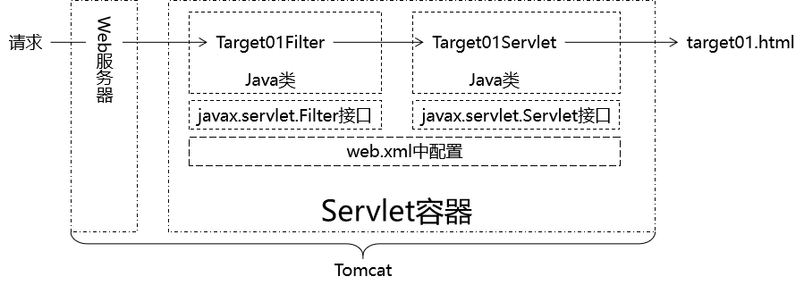

[TOC]

# 第二节 HelloWorld

## 1、思路



## 2、操作步骤

### ①准备工作

- 创建module
- 加入Thymeleaf环境
- 完成首页访问功能
- 创建Target01Servlet以及target01.html
- 创建SpecialServlet以及special.html

### ②创建Filter

#### [1]创建Target01Filter类

- 要点1：实现javax.servlet.Filter接口
- 要点2：在doFilter()方法中执行过滤
- 要点3：如果满足过滤条件使用 chain.doFilter(request, response);放行
- 要点4：如果不满足过滤条件转发或重定向请求
  - 附带问题：Thymeleaf模板渲染。这里我们选择的解决办法是跳转到一个Servlet，由Servlet负责执行模板渲染返回页面。

```java
public class Target01Filter implements Filter {
    @Override
    public void init(FilterConfig filterConfig) throws ServletException {

    }

    @Override
    public void doFilter(ServletRequest request, ServletResponse response, FilterChain chain) throws IOException, ServletException {

        // 1.打印一句话表明Filter执行了
        System.out.println("过滤器执行：Target01Filter");

        // 2.检查是否满足过滤条件
        // 人为设定一个过滤条件：请求参数message是否等于monster
        // 等于：放行
        // 不等于：将请求跳转到另外一个页面
        // ①获取请求参数
        String message = request.getParameter("message");

        // ②检查请求参数是否等于monster
        if ("monster".equals(message)) {

            // ③执行放行
            // FilterChain对象代表过滤器链
            // chain.doFilter(request, response)方法效果：将请求放行到下一个Filter，
            // 如果当前Filter已经是最后一个Filter了，那么就将请求放行到原本要访问的目标资源
            chain.doFilter(request, response);

        }else{

            // ④跳转页面
            request.getRequestDispatcher("/SpecialServlet?method=toSpecialPage").forward(request, response);

        }

    }

    @Override
    public void destroy() {

    }
}
```

#### [2]配置Target01Filter类

>  这一步也可以叫『注册』。

```xml
<!-- 配置Target01Filter -->
<filter>
    <!-- 配置Filter的友好名称 -->
    <filter-name>Target01Filter</filter-name>

    <!-- 配置Filter的全类名，便于Servlet容器创建Filter对象 -->
    <filter-class>com.atguigu.filter.filter.Target01Filter</filter-class>
</filter>

<!-- 配置Filter要拦截的目标资源 -->
<filter-mapping>
    <!-- 指定这个mapping对应的Filter名称 -->
    <filter-name>Target01Filter</filter-name>

    <!-- 通过请求地址模式来设置要拦截的资源 -->
    <url-pattern>/Target01Servlet</url-pattern>
</filter-mapping>
```


[上一节](verse01.html) [回目录](index.html) [下一节](verse03.html)