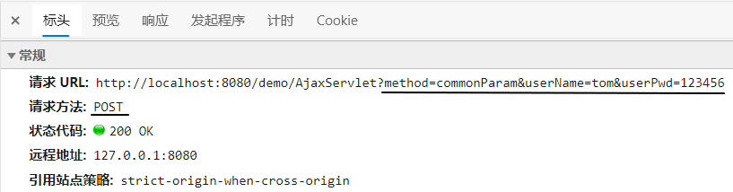
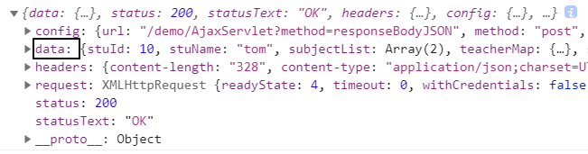

[TOC]

# 第二节 Axios基本用法

## 0、在前端页面引入开发环境

```html
<script type="text/javascript" src="/demo/static/vue.js"></script>
<script type="text/javascript" src="/demo/static/axios.min.js"></script>
```


## 1、发送普通请求参数

### ①前端代码

HTML标签：

```javascript
    <div id="app">
        <button @click="commonParam">普通请求参数</button>
    </div>
```

Vue+axios代码：

```javascript
new Vue({
    "el":"#app",
    "data":{},
    "methods":{
        "commonParam":function () {
            axios({
                "method":"post",
                "url":"/demo/AjaxServlet?method=commonParam",
                "params":{
                    "userName":"tom",
                    "userPwd":"123456"
                }
            }).then(function (response) {
                console.log(response);
            }).catch(function (error) {
                console.log(error);
            });
        }
    }
});
```

效果：所有请求参数都被放到URL地址后面了，哪怕我们现在用的是POST请求方式。



### ②后端代码

```java
public class AjaxServlet extends ModelBaseServlet {
    protected void commonParam(HttpServletRequest request, HttpServletResponse response) throws ServletException, IOException {

        String userName = request.getParameter("userName");
        String userPwd = request.getParameter("userPwd");

        System.out.println("userName = " + userName);
        System.out.println("userPwd = " + userPwd);

        response.setContentType("text/html;charset=UTF-8");
        response.getWriter().write("服务器端返回普通文本字符串作为响应");

    }
}
```

> P.S.：由于我们不需要Thymeleaf了，所以ModelBaseServlet可以跳过ViewBaseServlet直接继承HttpServlet。


### ③axios程序接收到的响应对象结构


| 属性名     | 作用                                             |
| ---------- | ------------------------------------------------ |
| config     | 调用axios(config对象)方法时传入的JSON对象        |
| data       | 服务器端返回的响应体数据                         |
| headers    | 响应消息头                                       |
| request    | 原生JavaScript执行Ajax操作时使用的XMLHttpRequest |
| status     | 响应状态码                                       |
| statusText | 响应状态码的说明文本                             |

### ④服务器端处理请求失败后

```javascript
catch(function (error) {     // catch()服务器端处理请求出错后，会调用

    console.log(error);         // error就是出错时服务器端返回的响应数据
    console.log(error.response);        // 在服务器端处理请求失败后，获取axios封装的JSON格式的响应数据对象
    console.log(error.response.status); // 在服务器端处理请求失败后，获取响应状态码
    console.log(error.response.statusText); // 在服务器端处理请求失败后，获取响应状态说明文本
    console.log(error.response.data);   // 在服务器端处理请求失败后，获取响应体数据

});
```

在给catch()函数传入的回调函数中，error对象封装了服务器端处理请求失败后相应的错误信息。其中，axios封装的响应数据对象，是error对象的response属性。response属性对象的结构如下图所示：


可以看到，response对象的结构还是和then()函数传入的回调函数中的response是一样的：


> 回调函数：开发人员声明，但是调用时交给系统来调用。像单击响应函数、then()、catch()里面传入的都是回调函数。回调函数是相对于普通函数来说的，普通函数就是开发人员自己声明，自己调用：
>
> ```javascript
> function sum(a, b) {
>     return a+b;
> }
> 
> var result = sum(3, 2);
> console.log("result="+result);
> ```

## 2、发送请求体JSON

### ①前端代码

HTML代码：

```html
<button @click="requestBodyJSON">请求体JSON</button>
```

Vue+axios代码：

```javascript
……
"methods":{
    "requestBodyJSON":function () {
        axios({
            "method":"post",
            "url":"/demo/AjaxServlet?method=requestBodyJSON",
            "data":{
                "stuId": 55,
                "stuName": "tom",
                "subjectList": [
                    {
                        "subjectName": "java",
                        "subjectScore": 50.55
                    },
                    {
                        "subjectName": "php",
                        "subjectScore": 30.26
                    }
                ],
                "teacherMap": {
                    "one": {
                        "teacherName":"tom",
                        "tearcherAge":23
                    },
                    "two": {
                        "teacherName":"jerry",
                        "tearcherAge":31
                    },
                },
                "school": {
                    "schoolId": 23,
                    "schoolName": "atguigu"
                }
            }
        }).then(function (response) {
            console.log(response);
        }).catch(function (error) {
            console.log(error);
        });
    }
}
……
```

效果：


> P.S.：Chrome浏览器中将『请求负载』显示为英文：『Request Payload』。

### ②后端代码

#### [1]加入Gson包

Gson是Google研发的一款非常优秀的<span style="color:blue;font-weight:bold;">JSON数据解析和生成工具</span>，它可以帮助我们将数据在JSON字符串和Java对象之间互相转换。


#### [2]Servlet代码

```java
protected void requestBodyJSON(HttpServletRequest request, HttpServletResponse response) throws ServletException, IOException {

    // 1.由于请求体数据有可能很大，所以Servlet标准在设计API的时候要求我们通过输入流来读取
    BufferedReader reader = request.getReader();

    // 2.创建StringBuilder对象来累加存储从请求体中读取到的每一行
    StringBuilder builder = new StringBuilder();

    // 3.声明临时变量
    String bufferStr = null;

    // 4.循环读取
    while((bufferStr = reader.readLine()) != null) {
        builder.append(bufferStr);
    }

    // 5.关闭流
    reader.close();

    // 6.累加的结果就是整个请求体
    String requestBody = builder.toString();

    // 7.创建Gson对象用于解析JSON字符串
    Gson gson = new Gson();

    // 8.将JSON字符串还原为Java对象
    Student student = gson.fromJson(requestBody, Student.class);
    System.out.println("student = " + student);

    System.out.println("requestBody = " + requestBody);

    response.setContentType("text/html;charset=UTF-8");
    response.getWriter().write("服务器端返回普通文本字符串作为响应");
}
```

> P.S.：看着很麻烦是吧？别担心，将来我们有了<span style="color:blue;font-weight:bold;">SpringMVC</span>之后，一个<span style="color:blue;font-weight:bold;">@RequestBody</span>注解就能够搞定，非常方便！

## 3、服务器端返回JSON数据

### ①前端代码

```javascript
axios({
    "method":"post",
    "url":"/demo/AjaxServlet?method=responseBodyJSON"
}).then(function (response) {
    console.log(response);
}).catch(function (error) {
    console.log(error);
});
```

then()中获取到的response在控制台打印效果如下：我们需要通过data属性获取响应体数据



### ②后端代码

#### [1]加入Gson包

仍然需要Gson支持，不用多说


#### [2]Servlet代码

```java
protected void responseBodyJSON(HttpServletRequest request, HttpServletResponse response) throws ServletException, IOException {

    // 1.准备数据对象
    Student student = new Student();
    student.setStuId(10);
    student.setStuName("tom");
    student.setSchool(new School(11,"atguigu"));
    student.setSubjectList(Arrays.asList(new Subject("java", 95.5), new Subject("php", 93.3)));

    Map<String, Teacher> teacherMap = new HashMap<>();
    teacherMap.put("t1", new Teacher("lili", 25));
    teacherMap.put("t2", new Teacher("mary", 26));
    teacherMap.put("t3", new Teacher("katty", 27));

    student.setTeacherMap(teacherMap);

    // 2.创建Gson对象
    Gson gson = new Gson();

    // 3.将Java对象转换为JSON对象
    String json = gson.toJson(student);

    // 4.设置响应体的内容类型
    response.setContentType("application/json;charset=UTF-8");
    response.getWriter().write(json);

}
```


[上一节](verse01.html) [回目录](index.html)