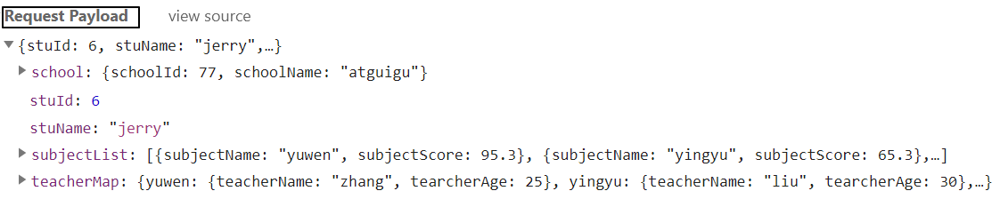

[TOC]

# HTTP协议笔记

## 1、HTTP基础概念

- HTTP：Hyper Text Transfer Protocol超文本传输协议
- 作用：定义请求报文和响应报文的数据格式

## 2、请求报文

### ①请求行

- [请求方式](note004-HTTP-method.html)
- 请求地址
- 协议版本

### ②请求消息头

作用：通过具体的参数对本次请求进行详细的说明

格式：键值对，键和值之间使用冒号隔开

相对比较重要的请求消息头：

| 名称           | 功能                                                         |
| -------------- | ------------------------------------------------------------ |
| Host           | 服务器的主机地址                                             |
| Accept         | 声明当前请求能够接受的『媒体类型』                           |
| Referer        | 当前请求来源页面的地址                                       |
| Content-Length | 请求体内容的长度                                             |
| Content-Type   | 请求体的[内容类型](note004-HTTP-MIME.html)，这一项的具体值是媒体类型中的某一种 |
| Cookie         | 浏览器访问服务器时携带的Cookie数据                           |

### ③请求体

作用：作为请求的主体，发送数据给服务器。具体来说其实就是POST请求方式下的请求参数。

格式：

#### [1]form data

含义：当前请求体是一个表单提交的请求参数。

查看源码后，发现格式如下：

> username=tom&password=123456

- 每一组请求参数是一个键值对
- 键和值中间是等号
- 键值对之间是&号

#### [2]Request Payload

含义：整个请求体以某种特定格式来组织数据，例如JSON格式。

## 3、响应报文

### ①响应状态行

> HTTP/1.1 200 OK

- HTTP协议版本
- [响应状态码](note004-HTTP-code.html)
- 响应状态的说明文字

### ②响应消息头

- 响应体的说明书。
- 服务器端对浏览器端设置数据，例如：服务器端返回Cookie信息。

| 名称           | 功能                                                         |
| -------------- | ------------------------------------------------------------ |
| Content-Type   | 响应体的[内容类型](note004-HTTP-MIME.html)                   |
| Content-Length | 响应体的内容长度                                             |
| Set-Cookie     | 服务器返回新的Cookie信息给浏览器                             |
| location       | 在重定向的情况下，告诉浏览器访问下一个资源的地址 |

### ③响应体

服务器返回的数据主体，有可能是各种数据类型。

- HTML页面
- 图片
- 视频
- 以下载形式返回的文件
- CSS文件
- JavaScript文件

[回到上一级目录](index.html)