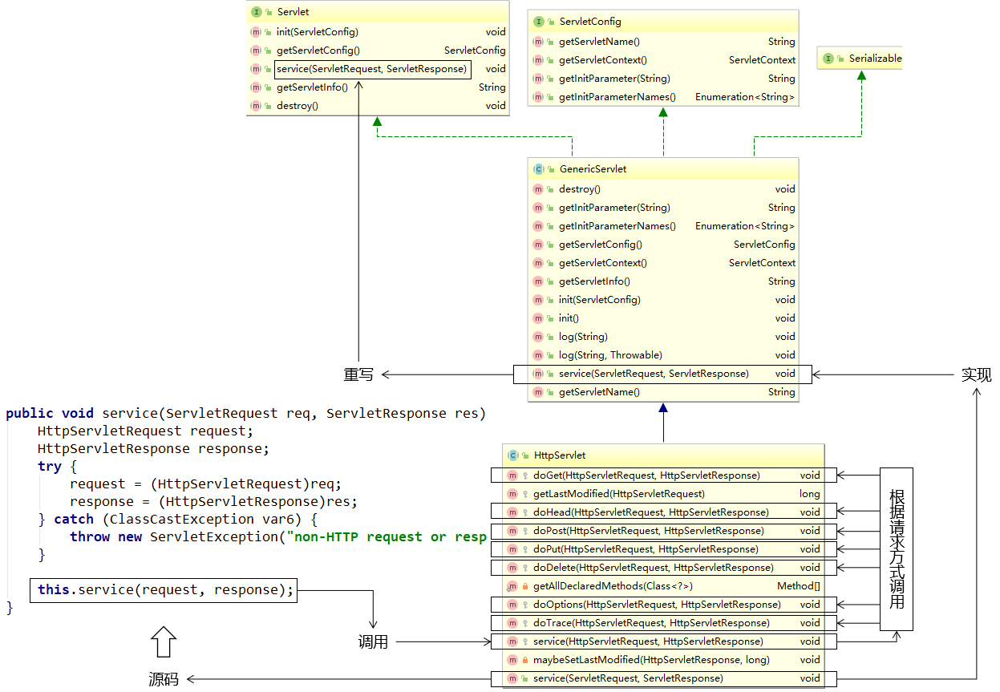
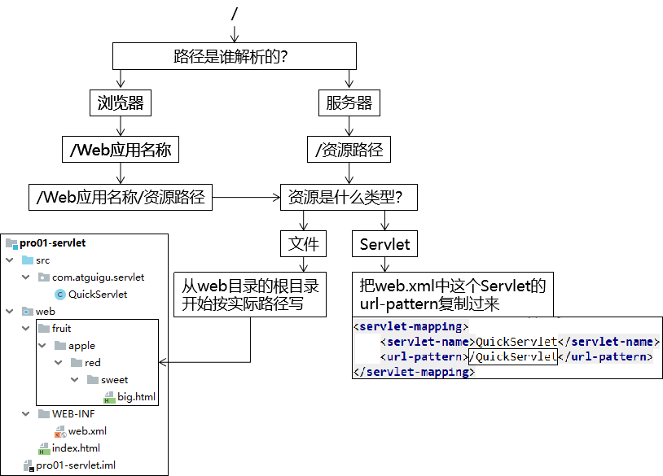

[TOC]

# Servlet笔记

## 1、理论部分

### ①Servlet在系统中扮演的角色

角色名称：<span style="color:blue;font-weight:bold;">控制器</span>

具体功能：总体的调度控制

- 接收请求
- 根据业务逻辑处理请求（调用Service方法）
- 分发页面（转发、重定向）
- 返回响应


### ②生命周期

| 生命周期环节 | 调用的方法                                                   | 时机                                                         | 次数 |
| ------------ | ------------------------------------------------------------ | ------------------------------------------------------------ | ---- |
| 创建对象     | 无参构造器                                                   | <span style="color:blue;font-weight:bold;">默认：第一次请求<br />修改：Web应用启动时</span> | 一次 |
| 初始化       | init(ServletConfig servletConfig)                            | 创建对象后                                                   | 一次 |
| 处理请求     | service(ServletRequest servletRequest, <br />ServletResponse servletResponse) | 接收到请求后                                                 | 多次 |
| 清理操作     | destroy()                                                    | Web应用卸载之前                                              | 一次 |


### ③Servlet容器

- 容器对象的功能：负责容器内对象的创建、初始化、工作、异常管理、清理、销毁等等各个方面。
- 容器对象的数量：通常是单例的。


### ④HttpServlet和Servlet继承关系



## 2、操作部分

### ①创建Servlet

#### [1]创建Servlet类

- 方式一：实现Servlet接口
- 方式二：<span style="color:blue;font-weight:bold;">继承HttpServlet</span>


#### [2]配置Servlet

```xml
    <!-- 配置Servlet本身 -->
    <servlet>
        <!-- 全类名太长，给Servlet设置一个简短名称 -->
        <servlet-name>HelloServlet</servlet-name>

        <!-- 配置Servlet的全类名 -->
        <servlet-class>com.atguigu.servlet.HelloServlet</servlet-class>

        <!-- 配置初始化参数 -->
        <init-param>
            <param-name>goodMan</param-name>
            <param-value>me</param-value>
        </init-param>

        <!-- 配置Servlet启动顺序 -->
        <load-on-startup>1</load-on-startup>
    </servlet>

    <!-- 将Servlet和访问地址关联起来 -->
    <servlet-mapping>
        <servlet-name>HelloServlet</servlet-name>
        <url-pattern>/helloServlet</url-pattern>
    </servlet-mapping>
```


### ②辅助Servlet工作的对象

#### [1]ServletConfig

主要功能：获取ServletContext对象

次要功能：获取Servlet初始化参数

```java
public interface ServletConfig {
    String getServletName();

    ServletContext getServletContext();

    String getInitParameter(String var1);

    Enumeration<String> getInitParameterNames();
}
```


#### [2]ServletContext

代表：整个Web应用。ServletContext对象的生命周期和整个Web应用的生命周期一致。

是否单例：是

典型的功能：

- 获取某个资源的真实路径：getRealPath()
- 获取整个Web应用级别的初始化参数：getInitParameter()
- 作为Web应用范围的域对象
  - 存入数据：setAttribute()
  - 取出数据：getAttribute()


##### (1)配置Web应用级别的初始化参数

```xml
    <!-- 配置Web应用的初始化参数 -->
    <context-param>
        <param-name>handsomeMan</param-name>
        <param-value>alsoMe</param-value>
    </context-param>
```

Web应用级别的初始化参数的作用举例：

- 在整个项目级别，设置一些全局范围内的参数
- 使用Spring框架时，配置Spring配置文件所在的位置


##### (2)获取参数

```java
String handsomeMan = servletContext.getInitParameter("handsomeMan");
System.out.println("handsomeMan = " + handsomeMan);
```


### ③使用IDEA创建Servlet


### ④路径




### ⑤请求

#### [1]获取请求参数

| 请求参数情况   | 调用方法                                 |
| -------------- | ---------------------------------------- |
| 一个名字一个值 | request.getParameter("请求参数名")       |
| 一个名字多个值 | request.getParameterValues("请求参数名") |


#### [2]请求转发

```java
request.getRequestDispatcher("转发的目标资源地址").forward(request, response);
```

这个地址是服务器解析的，所以开头的斜杠代表Web应用根目录


#### [3]设置字符集

- GET请求：在Tomcat的server.xml中配置URIEncoding="UTF-8"
- POST请求：<span style="color:blue;font-weight:bold;">在获取请求参数前</span>调用request.setCharacterEncoding("UTF-8")


### ⑥响应

#### [1]返回字符串形式的响应数据

```java
PrintWriter writer = response.getWriter();

writer.write("<!DOCTYPE html>                  ");
writer.write("<html>                           ");
writer.write("<head>                           ");
writer.write("<!-- 设置浏览器端的解码字符集 -->");
writer.write("    <meta charset='UTF-8'>       ");
writer.write("    <title>Title</title>         ");
writer.write("</head>                          ");
writer.write("<body>                           ");
writer.write("<p>志玲姐姐你好！</p>            ");
writer.write("</body>                          ");
writer.write("</html>                          ");
```


#### [2]请求重定向

```java
response.sendRedirect("重定向的目标资源的地址")
```

这个地址是浏览器解析的，所以开头的斜杠代表服务器根目录，所以开头的斜杠后面要写Web应用的名称


#### [3]设置字符集

- 设置方式一：response.setCharacterEncoding("UTF-8");
  - 含义：设置服务器端对响应体数据的编码字符集，所以还需要设置浏览器的解码字符集
- 设置方式二：response.setContentType("text/html;charset=UTF-8");
  - 含义：告诉浏览器本次响应体的内容类型，等于设置浏览器的解码字符集，那么服务器端自动使用这个字符集编码


### ⑦转发和重定向的对比

| 转发                                                       | 重定向                                                     |
| ---------------------------------------------------------- | ---------------------------------------------------------- |
| <span style="color:blue;font-weight:bold;">一次请求</span> | <span style="color:blue;font-weight:bold;">两次请求</span> |
| 浏览器地址栏显示的是第一个资源的地址                       | 浏览器地址栏显示的是第二个资源的地址                       |
| 全程使用的是同一个request对象                              | 全程使用的是不同的request对象                              |
| 在服务器端完成                                             | 在浏览器端完成                                             |
| 目标资源地址由服务器解析                                   | 目标资源地址由浏览器解析                                   |
| 目标资源可以在WEB-INF目录下                                | 目标资源不能在WEB-INF目录下                                |
| 目标资源仅限于本应用内部                                   | 目标资源可以是外部资源                                     |


[返回上一级](index.html)