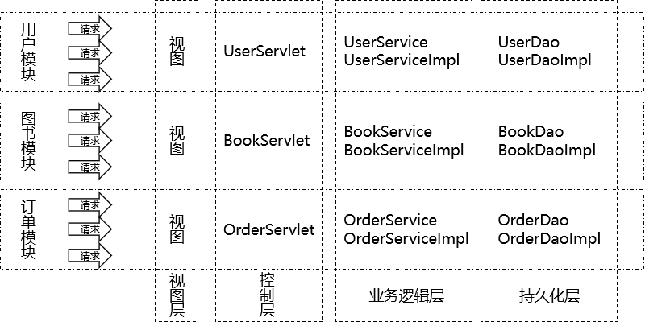

[TOC]

# Thymeleaf笔记

## 1、从三层架构到MVC

- MVC理念和三层架构并不矛盾，反而是三层架构的延伸
- MVC专指表述层的设计理念
- MVC理念的核心思想：解耦


## 2、从业务功能和三层架构角度看项目网格




## 3、Thymeleaf搭建环境

### ①导入jar包

> attoparser-2.0.5.RELEASE.jar
> javassist-3.20.0-GA.jar
> log4j-1.2.15.jar
> ognl-3.1.26.jar
> slf4j-api-1.7.25.jar
> slf4j-log4j12-1.7.25.jar
> thymeleaf-3.0.12.RELEASE.jar
> unbescape-1.1.6.RELEASE.jar


### ②配置web.xml

```xml
<!-- 在上下文参数中配置视图前缀和视图后缀 -->
<context-param>
    <param-name>view-prefix</param-name>
    <param-value>/WEB-INF/view/</param-value>
</context-param>
<context-param>
    <param-name>view-suffix</param-name>
    <param-value>.html</param-value>
</context-param>
```


### ③创建ViewBaseServlet

```java
import org.thymeleaf.TemplateEngine;
import org.thymeleaf.context.WebContext;
import org.thymeleaf.templatemode.TemplateMode;
import org.thymeleaf.templateresolver.ServletContextTemplateResolver;

import javax.servlet.ServletContext;
import javax.servlet.ServletException;
import javax.servlet.http.HttpServlet;
import javax.servlet.http.HttpServletRequest;
import javax.servlet.http.HttpServletResponse;
import java.io.IOException;

public class ViewBaseServlet extends HttpServlet {

    private TemplateEngine templateEngine;

    @Override
    public void init() throws ServletException {

        // 1.获取ServletContext对象
        ServletContext servletContext = this.getServletContext();

        // 2.创建Thymeleaf解析器对象
        ServletContextTemplateResolver templateResolver = new ServletContextTemplateResolver(servletContext);

        // 3.给解析器对象设置参数
        // ①HTML是默认模式，明确设置是为了代码更容易理解
        templateResolver.setTemplateMode(TemplateMode.HTML);

        // ②设置前缀
        String viewPrefix = servletContext.getInitParameter("view-prefix");

        templateResolver.setPrefix(viewPrefix);

        // ③设置后缀
        String viewSuffix = servletContext.getInitParameter("view-suffix");

        templateResolver.setSuffix(viewSuffix);

        // ④设置缓存过期时间（毫秒）
        templateResolver.setCacheTTLMs(60000L);

        // ⑤设置是否缓存
        templateResolver.setCacheable(true);

        // ⑥设置服务器端编码方式
        templateResolver.setCharacterEncoding("utf-8");

        // 4.创建模板引擎对象
        templateEngine = new TemplateEngine();

        // 5.给模板引擎对象设置模板解析器
        templateEngine.setTemplateResolver(templateResolver);

    }

    protected void processTemplate(String templateName, HttpServletRequest req, HttpServletResponse resp) throws IOException {
        // 1.设置响应体内容类型和字符集
        resp.setContentType("text/html;charset=UTF-8");

        // 2.创建WebContext对象
        WebContext webContext = new WebContext(req, resp, getServletContext());

        // 3.处理模板数据
        templateEngine.process(templateName, webContext, resp.getWriter());
    }
}
```


### ④ViewBaseServlet用法

- 具体模块下的Servlet继承ViewBaseServlet
- 想要<span style="color:blue;font-weight:bold;">转发</span>到某个视图时，调用父类的processTemplate()即可
- 按照习惯，我们通常会将模板视图文件放在WEB-INF目录下，这样就不能直接重定向到模板视图文件。此时我们需要重定向到一个Servlet，然后再通过这个Servlet转发到这个模板视图并渲染。
- 访问项目的首页时，也必须经过Servlet，执行processTemplate()方法，才能够正确解析首页页面上的Thymeleaf元素。


```xml
<servlet>
    <servlet-name>PortalServlet</servlet-name>
    <servlet-class>com.atguigu.demo.servlet.PortalServlet</servlet-class>
</servlet>
<servlet-mapping>
    <servlet-name>PortalServlet</servlet-name>
    <url-pattern>/index.html</url-pattern>
</servlet-mapping>
```


### ⑤创建ModelBaseServlet

这个类和Thymeleaf没有直接关系，我们使用这个基类，是为了避免每处理一个请求就创建一个Servlet。继承了ModelBaseServlet之后，就可以把同一个模块内处理各个请求的方法集中到同一个Servlet中。

```java
public class ModelBaseServlet extends ViewBaseServlet {

    protected void doGet(HttpServletRequest request, HttpServletResponse response) throws ServletException, IOException {

        // 在doGet()方法中调用doPost()方法，这样就可以在doPost()方法中集中处理所有请求
        doPost(request, response);
    }

    protected void doPost(HttpServletRequest request, HttpServletResponse response) throws ServletException, IOException {

        // 0.在所有request.getParameter()前面设置解析请求体的字符集
        request.setCharacterEncoding("UTF-8");

        // 1.从请求参数中获取method对应的数据
        String method = request.getParameter("method");

        // 2.通过反射调用method对应的方法
        // ①获取Class对象
        Class<? extends ModelBaseServlet> clazz = this.getClass();

        try {
            // ②获取method对应的Method对象
            Method methodObject = clazz.getDeclaredMethod(method, HttpServletRequest.class, HttpServletResponse.class);

            // ③打开访问权限
            methodObject.setAccessible(true);

            // ④通过Method对象调用目标方法
            methodObject.invoke(this, request, response);
        } catch (Exception e) {
            e.printStackTrace();

            throw new RuntimeException(e);
        }
    }

}
```


### ⑥各个Servlet之间的继承关系


## 4、Thymeleaf页面th名称空间


## 5、Thymeleaf语法

### ①th:xxx

| 属性名          | 作用                               |
| --------------- | ---------------------------------- |
| th:text         | 使用表达式设置文本标签体的数据     |
| th:属性名       | 使用表达式运算得到的值设置HTML属性 |
| th:if/th:unless | 分支判断                           |
| th:each         | 迭代                               |


### ②直接写表达式

- 有转义效果：[[${表达式}]]
- 无转义效果：[(${表达式})]


### ③表达式的类型

- @{}：给传入的字符串前面附加<span style="color:blue;font-weight:bold;">『上下文路径』</span>
- ${}：解析OGNL表达式


### ④OGNL表达式

OGNL：Objects-Graph Navigation Language对象图导航语言


#### [1]起点

| 表达式起点描述  | 作用                       | 参考                             |
| --------------- | -------------------------- | -------------------------------- |
| 请求域属性名    | 根据属性名从请求域取出数据 |                                  |
| session         | 访问session域              |                                  |
| application     | 访问application域          |                                  |
| param           | 读取请求参数               |                                  |
| #strings        | 执行字符串的相关处理       | org.thymeleaf.expression.Strings |
| #lists          | 执行集合相关的处理         | org.thymeleaf.expression.Lists   |
| #request        | 原生的request对象          |                                  |
| #response       | 原生的response对象         |                                  |
| #session        | 原生的session对象          |                                  |
| #servletContext | 原生的ServletContext对象   |                                  |


#### [2]访问具体属性语法

| 对象类型                                     | 访问方式                             |
| -------------------------------------------- | ------------------------------------ |
| 普通对象包含使用getXxx()、setXxx()定义的属性 | 对象.属性名                          |
| List集合                                     | [index]                              |
| 数组                                         | [下标]                               |
| Map集合                                      | map.key                              |
| 有方法的对象                                 | 对象.方法()<br />对象.方法(参数列表) |


### ⑤包含代码片段页面

#### [1]声明代码片段

```html
<!DOCTYPE html>
<html lang="en" xmlns:th="http://www.thymeleaf.org">
<head>
    <meta charset="UTF-8">
    <title>Title</title>
</head>
<body>

    <!-- 使用th:fragment属性给代码片段命名 -->
    <div th:fragment="navigator">
        <a href="BookManagerServlet?method=showBookList" class="order">图书管理</a>
        <a href="order_manager.html" class="destory">订单管理</a>
        <a href="index.html" class="gohome">返回商城</a>
    </div>

</body>
</html>
```


#### [2]引入代码片段

| 引入方式                                          | 作用                                     |
| ------------------------------------------------- | ---------------------------------------- |
| th:insert="segment/admin-navigator :: navigator"  | 把目标代码片段整体包含到当前标签内部     |
| th:include="segment/admin-navigator :: navigator" | 把目标代码片段内部的内容包含到当前标签内 |
| th:replace="segment/admin-navigator :: navigator" | 使用目标代码片段替换当前标签             |

segment/admin-navigator代表目标代码片段的逻辑视图。

navigator代表目标代码片段中使用th:fragment指定的名称。


## 6、视图名称

### ①物理视图

能够将请求转发到目标页面时使用的完整路径。

> /WEB-INF/view/hello.html


### ②逻辑视图

物理视图=前缀+逻辑视图+后缀


[回到上一级目录](index.html)