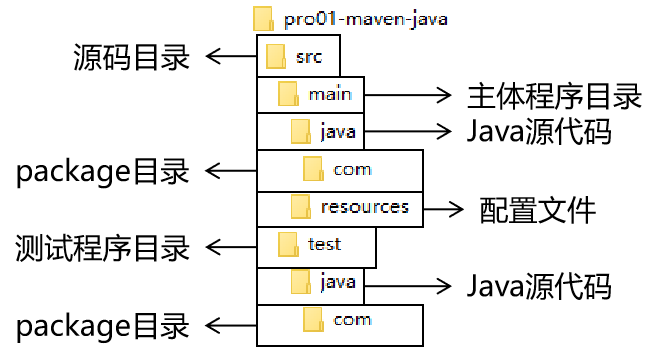

[TOC]

# 约定的目录结构

## 1、各个目录的作用

另外还有一个target目录专门存放构建操作输出的结果。

## 2、约定目录结构的意义

Maven为了让构建过程能够尽可能自动化完成，所以必须约定一个目录结构。例如：Maven执行编译操作，必须先去Java源程序目录读取Java源代码，然后执行编译，最后把编译结果存放在target目录。

## 3、约定大于配置

Maven对于目录结构这个问题，没有采用配置的方式，而是基于约定。这样会让我们在开发过程中非常方便。如果每次创建Maven工程后，还需要针对各个目录的位置进行详细的配置，那肯定非常麻烦。

目前开发领域的技术发展趋势就是：配置大于编码，约定大于配置。

[上一节](concept-pom.html) [回目录](index.html) [下一节](concept-coordinate.html)