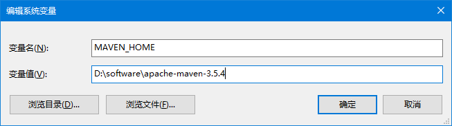
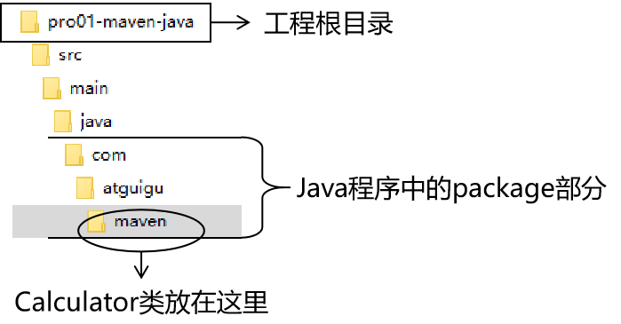
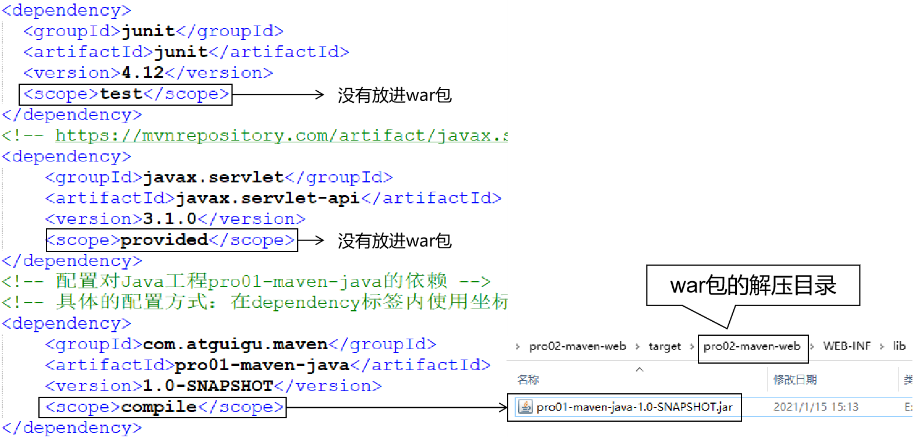
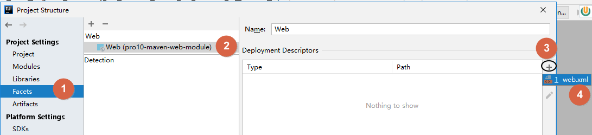
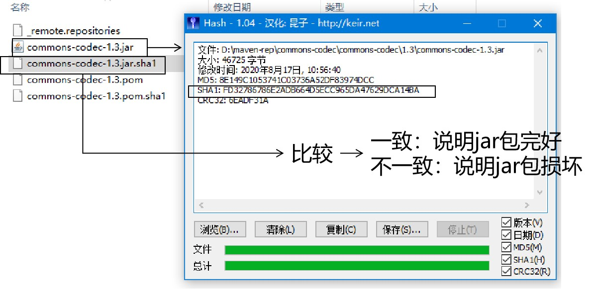

[TOC]

> 说明：
>
> 先把之前上课做的这个课件发布上来，有比没有强。
>
> 后面有时间再优化一下，把教程、笔记、脑图分开。
>
> 爱你们，比心！❤❤❤❤❤❤❤❤

# 一、Maven概述

## 1、为什么要学习Maven？

目前学习的技术，已经足够开发任何业务功能。


### ①项目从开发到部署

虽然IDEA这样的开发环境可以为我们的构建操作提供全方位、自动化的支持，但是整个项目开发流程中，很大一部分并没有IDEA的支持，此时需要类似Maven这样的专门的构建工具来辅助我们完成构建操作。


### ②开发和运行过程中项目中jar包的管理

#### [1]jar包的规模

随着我们使用越来越多的框架，或者框架封装程度越来越高，项目中使用的jar包也越来越多。项目中，一个模块里面用到上百个jar包是非常正常的。

#### [2]jar包的来源

- 这个jar包所属技术的官网。官网通常是英文界面，网站的结构又不尽相同，甚至找到下载链接还发现需要通过特殊的工具下载。
- 第三方网站提供下载。问题是不规范，在使用过程中会出现各种问题。
  - jar包的名称
  - jar包的版本
  - jar包内的具体细节
- jar包之间的依赖关系。框架中使用的jar包，不仅数量庞大，而且彼此之间存在错综复杂的依赖关系。依赖关系的复杂程度，已经上升到了完全不能靠人力手动解决的程度。
- jar包之间有可能产生冲突。进一步增加了我们在jar包使用过程中的难度。

## 2、什么是Maven？

Maven是Apache软件基金会组织维护的一款专门为Java项目提供<span style="color:blue;font-weight:bold;">构建</span>和<span style="color:blue;font-weight:bold;">依赖</span>管理支持的工具。


### ①构建

Java项目开发过程中，构建指的是使用“原材料”<span style="color:blue;font-weight:bold;">生产</span>“产品”的过程。

- 原材料

  - Java源代码

  - JSP文件

  - 图片

  - 配置文件

  - ###### ……

- 产品

  - 一个可以在服务器上运行的项目

构建过程包含的主要的环节：

- 清理：删除上一次构建的结果，为下一次构建做好准备
- 编译：Java源程序编译成*.class字节码文件
- 测试：运行提前准备好的测试程序
- 报告：针对刚才测试的结果生成一个全面的信息
- 打包
  - Java工程：jar包
  - Web工程：war包
- 安装：把一个Maven工程安装到Maven仓库
- 部署：将准备好的jar包或war包部署到服务器上运行

### ②依赖

如果A工程里面用到了B工程的类、接口、配置文件等等这样的资源，那么我们就可以说A依赖B。例如：

- commons-fileupload包依赖commons-io包
- spring-core包依赖commons-logging包

依赖管理中要解决的具体问题：

- jar包的下载：使用Maven之后，jar包会从规范的远程仓库下载到本地
- jar包之间的依赖：通过依赖的传递性自动完成
- jar包之间的冲突：通过对依赖的配置进行调整，让某些jar包不会被导入

## 3、Maven工作机制


# 二、Maven核心程序安装和配置

## 1、Maven核心程序解压

核心程序压缩包：apache-maven-3.5.4-bin.zip，解压到非中文、没有空格的目录。例如：


在解压目录中，我们需要着重关注Maven的核心配置文件：conf/settings.xml

## 2、核心配置文件

### ①指定本地仓库

本地仓库默认值：用户家目录/.m2/repository。由于本地仓库的默认位置是在用户的家目录下，而家目录往往是在C盘，也就是系统盘。将来Maven仓库中jar包越来越多，仓库体积越来越大，可能会拖慢C盘运行速度，影响系统性能。所以建议将Maven的本地仓库放在其他盘符下。配置方式如下：

```xml
<!-- localRepository
| The path to the local repository maven will use to store artifacts.
|
| Default: ${user.home}/.m2/repository
<localRepository>/path/to/local/repo</localRepository>
-->
<localRepository>D:\maven-rep1026</localRepository>
```

本地仓库这个目录，我们手动创建一个空的目录即可。

记住：一定要从注释中把localRepository标签拿出来。

注意：本地仓库本身也需要使用一个非中文、没有空格的目录。

### ②配置阿里云提供的镜像仓库

让Maven下载jar包的时候有更快的速度。配置的方式是：将下面mirror标签整体复制到mirrors标签的内部。

```xml
<mirrors>
	<mirror>
		<id>nexus-aliyun</id>
		<mirrorOf>central</mirrorOf>
		<name>Nexus aliyun</name>
		<url>http://maven.aliyun.com/nexus/content/groups/public</url>
	</mirror>
</mirrors>
```

### ③配置Maven工程的基础JDK版本

如果按照默认配置运行，Java工程使用的JDK版本是1.5。配置的方式是：将profile标签整个复制到profiles标签内。

```xml
<profiles>
	<profile>
	  <id>jdk-1.8</id>
	  <activation>
		<activeByDefault>true</activeByDefault>
		<jdk>1.8</jdk>
	  </activation>
	  <properties>
		<maven.compiler.source>1.8</maven.compiler.source>
		<maven.compiler.target>1.8</maven.compiler.target>
		<maven.compiler.compilerVersion>1.8</maven.compiler.compilerVersion>
	  </properties>
	</profile>
</profiles>
```

## 3、配置环境变量

### ①检查JAVA_HOME配置是否正确

Maven是一个用Java语言开发的程序，它必须基于JDK来运行，需要通过JAVA_HOME来找到JDK的安装位置。


可以使用下面的命令验证：

```bash
C:\Users\Administrator>echo %JAVA_HOME%
D:\software\Java

C:\Users\Administrator>java -version
java version "1.8.0_141"
Java(TM) SE Runtime Environment (build 1.8.0_141-b15)
Java HotSpot(TM) 64-Bit Server VM (build 25.141-b15, mixed mode)
```

### ②配置MAVEN_HOME



> 配置环境变量的规律：
>
> XXX_HOME指向的是bin目录的上一级
>
> PATH指向的是bin目录

### ③配置PATH


### ④验证

```bash
C:\Users\Administrator>mvn -v
Apache Maven 3.5.4 (1edded0938998edf8bf061f1ceb3cfdeccf443fe; 2018-06-18T02:33:14+08:00)
Maven home: D:\software\apache-maven-3.5.4\bin\..
Java version: 1.8.0_141, vendor: Oracle Corporation, runtime: D:\software\Java\jre
Default locale: zh_CN, platform encoding: GBK
OS name: "windows 10", version: "10.0", arch: "amd64", family: "windows"
```

# 三、Maven命令行操作

学习命令行操作作为将来在IDEA中使用图形化界面操作的过渡。使用命令行可以不受IDEA这样的环境的干扰，这样就有一个纯净的测试Maven功能的环境。我们的目标是通过命令学习Maven的功能和用法。

## 1、实验一：根据坐标创建Maven工程

### ①创建目录作为下面操作的工作空间

例如：D:\maven-workspace\space201026

### ②在工作空间目录下打开命令行窗口


### ③使用命令生成Maven工程

运行mvn archetype:generate命令

下面根据提示操作

> Choose a number or apply filter (format: [groupId:]artifactId, case sensitive contains): 7:【直接回车，使用默认值】
>
> 
>
> Define value for property 'groupId': com.atguigu.maven
>
> Define value for property 'artifactId': pro01-maven-java
>
> Define value for property 'version' 1.0-SNAPSHOT: :【直接回车，使用默认值】
>
> Define value for property 'package' com.atguigu.maven: :【直接回车，使用默认值】
>
> 
>
> Confirm properties configuration:
> groupId: com.atguigu.maven
> artifactId: pro01-maven-java
> version: 1.0-SNAPSHOT
> package: com.atguigu.maven
>  Y: :【直接回车，表示确认】

## 2、实验二：在Maven工程中编写代码

### ①主体程序

#### [1]自动生成的pom.xml解读

```xml
  <!-- 当前Maven工程的坐标 -->
  <groupId>com.atguigu.maven</groupId>
  <artifactId>pro01-maven-java</artifactId>
  <version>1.0-SNAPSHOT</version>
  
  <!-- 当前Maven工程的打包方式，可选值有下面三种： -->
  <!-- jar：表示这个工程是一个Java工程  -->
  <!-- war：表示这个工程是一个Web工程 -->
  <!-- pom：表示这个工程是“管理其他工程”的工程 -->
  <packaging>jar</packaging>

  <name>pro01-maven-java</name>
  <url>http://maven.apache.org</url>

  <properties>
	<!-- 工程构建过程中读取源码时使用的字符集 -->
    <project.build.sourceEncoding>UTF-8</project.build.sourceEncoding>
  </properties>

  <!-- 当前工程所依赖的jar包 -->
  <dependencies>
	<!-- 使用dependency配置一个具体的依赖 -->
    <dependency>
	
	  <!-- 在dependency标签内使用具体的坐标依赖我们需要的一个jar包 -->
      <groupId>junit</groupId>
      <artifactId>junit</artifactId>
      <version>4.12</version>
	  
	  <!-- scope标签配置依赖的范围 -->
      <scope>test</scope>
    </dependency>
  </dependencies>
```

#### [2]编写主体程序



主体程序指的是被测试的程序，同时也是将来在项目中真正要使用的程序。

```java
package com.atguigu.maven;

public class Calculator {
	
	public int sum(int i, int j){
		return i + j;
	}
	
}
```


### ②测试程序


```java
package com.atguigu.maven;

import org.junit.Test;
import com.atguigu.maven.Calculator;

// 静态导入的效果是将Assert类中的静态资源导入当前类
// 这样一来，在当前类中就可以直接使用Assert类中的静态资源，不需要写类名
import static org.junit.Assert.*;

public class CalculatorTest{
	
	@Test
	public void testSum(){
		
		// 1.创建Calculator对象
		Calculator calculator = new Calculator();
		
		// 2.调用Calculator对象的方法，获取到程序运行实际的结果
		int actualResult = calculator.sum(5, 3);
		
		// 3.声明一个变量，表示程序运行期待的结果
		int expectedResult = 8;
		
		// 4.使用断言来判断实际结果和期待结果是否一致
		// 如果一致：测试通过，不会抛出异常
		// 如果不一致：抛出异常，测试失败
		assertEquals(expectedResult, actualResult);
		
	}
	
}
```

## 3、实验三：执行Maven的构建命令

### ①要求

运行Maven中和构建操作相关的命令时，必须进入到pom.xml所在的目录。如果没有在pom.xml所在的目录运行Maven的构建命令，那么会看到下面的错误信息：

```java
The goal you specified requires a project to execute but there is no POM in this directory
```

> mvn -v这个命令和构建操作无关，在任何目录下执行都可以。

### ②清理操作

mvn clean

效果：删除target目录

### ③编译操作

主程序编译：mvn compile

测试程序编译：mvn test-compile

主体程序编译结果存放的目录：target/classes

测试程序编译结果存放的目录：target/test-classes

### ④测试操作

mvn test

测试的报告会存放在target/surefire-reports目录下

### ⑤打包操作

mvn package

打包的结果会存放在target目录下

### ⑥安装操作

mvn install

```log
[INFO] Installing D:\maven-workspace\space201026\pro01-maven-java\target\pro01-maven-java-1.0-SNAPSHOT.jar to D:\maven-rep1026\com\atguigu\maven\pro01-maven-java\1.0-SNAPSHOT\pro01-maven-java-1.0-SNAPSHOT.jar
[INFO] Installing D:\maven-workspace\space201026\pro01-maven-java\pom.xml to D:\maven-rep1026\com\atguigu\maven\pro01-maven-java\1.0-SNAPSHOT\pro01-maven-java-1.0-SNAPSHOT.pom
```

安装的效果是将本地构建过程中生成的jar包存入Maven本地仓库。这个jar包在Maven仓库中的路径是根据它的坐标生成的。

坐标信息如下：

```xml
  <groupId>com.atguigu.maven</groupId>
  <artifactId>pro01-maven-java</artifactId>
  <version>1.0-SNAPSHOT</version>
```

在Maven仓库中生成的路径如下：

```log
D:\maven-rep1026\com\atguigu\maven\pro01-maven-java\1.0-SNAPSHOT\pro01-maven-java-1.0-SNAPSHOT.jar
```

另外，安装操作还会将pom.xml文件转换为XXX.pom文件一起存入本地仓库。所以我们在Maven的本地仓库中想看一个jar包原始的pom.xml文件时，查看对应XXX.pom文件即可，它们是名字发生了改变，本质上是同一个文件。

> DOS命令
>
> dir查看当前目录下的内容
>
> cls清屏
>
> 

## 4、实验四：创建Maven版的Web工程

### ①说明

使用mvn archetype:generate命令生成Web工程时，需要使用一个专门的archetype。这个专门生成Web工程骨架的archetype可以参照官网看到它的用法：


### ②操作

注意：如果在上一个工程的目录下执行mvn archetype:generate命令，那么Maven会报错：不能在一个非pom的工程下再创建其他工程。所以不要再刚才创建的工程里再创建新的工程。

然后运行生成工程的命令：

```log
mvn archetype:generate -DarchetypeGroupId=org.apache.maven.archetypes -DarchetypeArtifactId=maven-archetype-webapp -DarchetypeVersion=1.4
```

下面的操作按照提示执行：

> Define value for property 'groupId': com.atguigu.maven
> Define value for property 'artifactId': pro02-maven-web
> Define value for property 'version' 1.0-SNAPSHOT: :【直接回车，使用默认值】
>
> Define value for property 'package' com.atguigu.maven: :【直接回车，使用默认值】
> Confirm properties configuration:
> groupId: com.atguigu.maven
> artifactId: pro02-maven-web
> version: 1.0-SNAPSHOT
> package: com.atguigu.maven
>  Y: :【直接回车，表示确认】

### ③生成的pom.xml

打包的方式是war包形式

```xml
<packaging>war</packaging>
```

### ④生成的Web工程的目录结构


webapp目录下有index.jsp

WEB-INF目录下有web.xml

### ⑤创建Servlet

#### [1]在main目录下创建java目录


#### [2]在java目录下创建Servlet类所在的包的目录


#### [3]在包下创建Servlet类

```java
package com.atguigu.maven;

import javax.servlet.http.HttpServlet;
import javax.servlet.http.HttpServletRequest;
import javax.servlet.http.HttpServletResponse;
import javax.servlet.ServletException;
import java.io.IOException;

public class HelloServlet extends HttpServlet{
	
	protected void doGet(HttpServletRequest request, HttpServletResponse response) throws ServletException, IOException {
		
		response.getWriter().write("hello maven web");
		
	}
	
}
```

#### [4]在web.xml中注册Servlet

```xml
  <servlet>
	<servlet-name>helloServlet</servlet-name>
	<servlet-class>com.atguigu.maven.HelloServlet</servlet-class>
  </servlet>
  <servlet-mapping>
	<servlet-name>helloServlet</servlet-name>
	<url-pattern>/helloServlet</url-pattern>
  </servlet-mapping>
```

### ⑥在index.jsp页面编写超链接

```html
<html>
<body>
<h2>Hello World!</h2>
<a href="helloServlet">Access Servlet</a>
</body>
</html>
```


### ⑦使用Maven对这个Web工程执行编译

执行mvn compile命令出错：

> 程序包javax.servlet.http不存在
>
> 程序包javax.servlet不存在
>
> 找不到符号
>
> 符号: 类 HttpServlet
>
> ……

上面的错误信息说明：我们的Web工程用到了HttpServlet这个类，而HttpServlet这个类属于servlet-api.jar这个jar包。此时我们说，Web工程需要依赖servlet-api.jar包。


### ⑧配置对servlet-api.jar包的依赖

对于不知道详细信息的依赖可以到https://mvnrepository.com/网站查询。使用关键词搜索，然后在搜索结果列表中选择适合的使用。


比如，我们找到的servlet-api的依赖信息：

```xml
<!-- https://mvnrepository.com/artifact/javax.servlet/javax.servlet-api -->
<dependency>
    <groupId>javax.servlet</groupId>
    <artifactId>javax.servlet-api</artifactId>
    <version>3.1.0</version>
    <scope>provided</scope>
</dependency>
```

这样就可以把上面的信息加入pom.xml。重新执行mvn compile命令。

### ⑨将Web工程打包为war包

运行mvn package命令，生成war包的位置如下图所示：


### ⑩将war包部署到Tomcat上运行

将war包复制到Tomcat/webapps目录下


启动Tomcat：


通过浏览器尝试访问：http://localhost:8080/pro02-maven-web/index.jsp

## 5、实验五：让Web工程依赖Java工程

### ①观念

明确一个意识：从来只有Web工程依赖Java工程，没有反过来Java工程依赖Web工程。本质上来说，Web工程依赖的Java工程其实就是Web工程里导入的jar包。最终Java工程会变成jar包，放在Web工程的WEB-INF/lib目录下。

### ②操作

在pro02-maven-web工程的pom.xml中，找到dependencies标签，在dependencies标签中做如下配置：

```xml
<!-- 配置对Java工程pro01-maven-java的依赖 -->
<!-- 具体的配置方式：在dependency标签内使用坐标实现依赖 -->
<dependency>
	<groupId>com.atguigu.maven</groupId>
	<artifactId>pro01-maven-java</artifactId>
	<version>1.0-SNAPSHOT</version>
</dependency>
```

### ③在Web工程中，编写测试代码

#### [1]补充创建目录

pro02-maven-wb<span style="color:blue;font-weight:bold;">\src\test\java\com\atguigu\maven</span>

#### [2]确认Web工程依赖了junit

```xml
    <dependency>
      <groupId>junit</groupId>
      <artifactId>junit</artifactId>
      <version>4.12</version>
      <scope>test</scope>
    </dependency>
```

#### [3]创建测试类

把Java工程的CalculatorTest.java类复制到pro02-maven-wb<span style="color:blue;font-weight:bold;">\src\test\java\com\atguigu\maven</span>目录下

### ④执行Maven命令

#### [1]测试命令

mvn test

说明：测试操作中会提前自动执行编译操作，测试成功就说明编译也是成功的。

#### [2]打包命令

mvn package


通过查看war包内的结构，我们看到被Web工程依赖的Java工程确实是会变成Web工程的WEB-INF/lib目录下的jar包。


#### [3]查看当前Web工程所依赖的jar包的列表

> mvn dependency:list
>
> [INFO] The following files have been resolved:
> [INFO]    org.hamcrest:hamcrest-core:jar:1.3:test
> [INFO]    javax.servlet:javax.servlet-api:jar:3.1.0:provided
> [INFO]    com.atguigu.maven:pro01-maven-java:jar:1.0-SNAPSHOT:compile
> [INFO]    junit:junit:jar:4.12:test

说明：javax.servlet:javax.servlet-api:jar:3.1.0:provided格式显示的是一个jar包的坐标信息。格式是：

> groupId:artifactId:打包方式:version:依赖的范围

这样的格式虽然和我们XML配置文件中坐标的格式不同，但是本质上还是坐标信息，大家需要能够认识这样的格式。将来从Maven命令的日志或错误信息中看到这样格式的信息，要能够识别出来这是坐标。进而根据坐标到Maven仓库找到对应的jar包，用这样的方式解决我们遇到的报错的情况。

#### [4]以树形结构查看当前Web工程的依赖信息

> mvn dependency:tree
>
> [INFO] com.atguigu.maven:pro02-maven-web:war:1.0-SNAPSHOT
> [INFO] +- junit:junit:jar:4.12:test
> [INFO] |  \- org.hamcrest:hamcrest-core:jar:1.3:test
> [INFO] +- javax.servlet:javax.servlet-api:jar:3.1.0:provided
> [INFO] \- com.atguigu.maven:pro01-maven-java:jar:1.0-SNAPSHOT:compile

我们在pom.xml中并没有依赖hamcrest-core，但是它却被加入了我们依赖的列表。原因是：junit依赖了hamcrest-core，然后基于依赖的传递性，hamcrest-core被传递到我们的工程了。

## 6、实验六：测试依赖的范围

说明：如果能够理解依赖范围的含义，可以不做这些操作。

### ①验证test范围对main目录无效

测试方式：在主体程序中导入org.junit.Test这个注解，然后执行编译。

具体操作：在pro01-maven-java\src\main\java\com\atguigu\maven目录下修改Calculator.java

```java
package com.atguigu.maven;

import org.junit.Test;

public class Calculator {
	
	public int sum(int i, int j){
		return i + j;
	}
	
}
```

执行Maven编译命令：

```java
[ERROR] /D:/maven-workspace/space201026/pro01-maven-java/src/main/java/com/atguigu/maven/Calculator.java:[3,17] 程序包org.junit不存在
```

### ②验证test和provided范围不参与服务器部署

其实就是验证：通过compile范围依赖的jar包会放入war包，通过test范围依赖的jar包不会放入war包。



### ③验证provided范围对测试程序有效

测试方式是在pro02-maven-web的测试程序中加入servlet-api.jar包中的类。

修改：<span style="color:blue;font-weight:bold;">pro02-maven-web</span>\src\\<span style="color:blue;font-weight:bold;">test</span>\java\com\atguigu\maven\\<span style="color:blue;font-weight:bold;">CalculatorTest.java</span>

```java
package com.atguigu.maven;

import javax.servlet.http.HttpServlet;
import javax.servlet.http.HttpServletRequest;
import javax.servlet.http.HttpServletResponse;
import javax.servlet.ServletException;

import org.junit.Test;
import com.atguigu.maven.Calculator;

// 静态导入的效果是将Assert类中的静态资源导入当前类
// 这样一来，在当前类中就可以直接使用Assert类中的静态资源，不需要写类名
import static org.junit.Assert.*;

public class CalculatorTest{
	
	@Test
	public void testSum(){
		
		// 1.创建Calculator对象
		Calculator calculator = new Calculator();
		
		// 2.调用Calculator对象的方法，获取到程序运行实际的结果
		int actualResult = calculator.sum(5, 3);
		
		// 3.声明一个变量，表示程序运行期待的结果
		int expectedResult = 8;
		
		// 4.使用断言来判断实际结果和期待结果是否一致
		// 如果一致：测试通过，不会抛出异常
		// 如果不一致：抛出异常，测试失败
		assertEquals(expectedResult, actualResult);
		
	}
	
}
```

然后运行Maven的编译命令：mvn compile

然后看到编译成功。

## 7、实验七：测试依赖的传递性

### ①使用compile范围依赖spring-core

测试方式：让pro01-maven-java工程依赖spring-core

具体操作：编辑pro01-maven-java工程根目录下pom.xml

```xml
<!-- https://mvnrepository.com/artifact/org.springframework/spring-core -->
<dependency>
	<groupId>org.springframework</groupId>
	<artifactId>spring-core</artifactId>
	<version>4.0.0.RELEASE</version>
</dependency>
```

使用mvn dependency:tree命令查看效果：

> [INFO] com.atguigu.maven:pro01-maven-java:jar:1.0-SNAPSHOT
> [INFO] +- junit:junit:jar:4.12:test
> [INFO] |  \- org.hamcrest:hamcrest-core:jar:1.3:test
> [INFO] \- org.springframework:spring-core:jar:4.0.0.RELEASE:compile
> [INFO]    \- commons-logging:commons-logging:jar:1.1.1:compile

还可以在Web工程中，使用mvn dependency:tree命令查看效果（需要重新将pro01-maven-java安装到仓库）：

> [INFO] com.atguigu.maven:pro02-maven-web:war:1.0-SNAPSHOT
> [INFO] +- junit:junit:jar:4.12:test
> [INFO] |  \- org.hamcrest:hamcrest-core:jar:1.3:test
> [INFO] +- javax.servlet:javax.servlet-api:jar:3.1.0:provided
> [INFO] \- com.atguigu.maven:pro01-maven-java:jar:1.0-SNAPSHOT:compile
> [INFO]    \- org.springframework:spring-core:jar:4.0.0.RELEASE:compile
> [INFO]       \- commons-logging:commons-logging:jar:1.1.1:compile

### ②验证test和provided范围不能传递

从上面的例子已经能够看到，pro01-maven-java依赖了junit，但是在pro02-maven-web工程中查看依赖树的时候并没有看到junit。

要验证provided范围不能传递，可以在pro01-maven-java工程中加入servlet-api的依赖。

```xml
<dependency>
	<groupId>javax.servlet</groupId>
	<artifactId>javax.servlet-api</artifactId>
	<version>3.1.0</version>
	<scope>provided</scope>
</dependency>
```

效果还是和之前一样：

> [INFO] com.atguigu.maven:pro02-maven-web:war:1.0-SNAPSHOT
> [INFO] +- junit:junit:jar:4.12:test
> [INFO] |  \- org.hamcrest:hamcrest-core:jar:1.3:test
> [INFO] +- javax.servlet:javax.servlet-api:jar:3.1.0:provided
> [INFO] \- com.atguigu.maven:pro01-maven-java:jar:1.0-SNAPSHOT:compile
> [INFO]    \- org.springframework:spring-core:jar:4.0.0.RELEASE:compile
> [INFO]       \- commons-logging:commons-logging:jar:1.1.1:compile

## 8、实验八：测试依赖的排除

测试的方式：在pro02-maven-web工程中配置对commons-logging的排除

```xml
<dependency>
	<groupId>com.atguigu.maven</groupId>
	<artifactId>pro01-maven-java</artifactId>
	<version>1.0-SNAPSHOT</version>
	<scope>compile</scope>
	<!-- 使用excludes标签配置依赖的排除	-->
	<exclusions>
		<!-- 在exclude标签中配置一个具体的排除 -->
		<exclusion>
			<!-- 指定要排除的依赖的坐标（不需要写version） -->
			<groupId>commons-logging</groupId>
			<artifactId>commons-logging</artifactId>
		</exclusion>
	</exclusions>
</dependency>
```

运行mvn dependency:tree命令查看效果：

> [INFO] com.atguigu.maven:pro02-maven-web:war:1.0-SNAPSHOT
> [INFO] +- junit:junit:jar:4.12:test
> [INFO] |  \- org.hamcrest:hamcrest-core:jar:1.3:test
> [INFO] +- javax.servlet:javax.servlet-api:jar:3.1.0:provided
> [INFO] \- com.atguigu.maven:pro01-maven-java:jar:1.0-SNAPSHOT:compile
> [INFO]    \- org.springframework:spring-core:jar:4.0.0.RELEASE:compile

发现在spring-core下面就没有commons-logging了。

## 9、实验九：继承

### ①创建父工程

创建的过程和前面创建pro01-maven-java一样。

工程名称：pro03-maven-parent

工程创建好之后，要修改它的打包方式：

```xml
  <groupId>com.atguigu.maven</groupId>
  <artifactId>pro03-maven-parent</artifactId>
  <version>1.0-SNAPSHOT</version>
  <packaging>pom</packaging>
```

只有打包方式为pom的Maven工程能够管理其他Maven工程。

### ②创建模块工程

模块工程类似于IDEA中的module，所以需要<span style="color:blue;font-weight:bold;">进入pro03-maven-parent工程的根目录</span>，然后运行mvn archetype:generate命令来创建模块工程。

假设，我们创建三个模块工程：


### ③查看被添加新内容的父工程pom.xml

下面modules和module标签是聚合功能的配置

```xml
<modules>  
	<module>pro04-maven-module</module>
	<module>pro05-maven-module</module>
	<module>pro06-maven-module</module>
</modules>
```

### ④解读子工程的pom.xml

```xml
<!-- 使用parent标签指定当前工程的父工程 -->
<parent>
	<!-- 父工程的坐标 -->
	<groupId>com.atguigu.maven</groupId>
	<artifactId>pro03-maven-parent</artifactId>
	<version>1.0-SNAPSHOT</version>
</parent>

<!-- 子工程的坐标 -->
<!-- 如果子工程坐标中的groupId和version与父工程一致，那么可以省略 -->
<!-- <groupId>com.atguigu.maven</groupId> -->
<artifactId>pro04-maven-module</artifactId>
<!-- <version>1.0-SNAPSHOT</version> -->
```

### ⑤在父工程中配置依赖的统一管理

```xml
<!-- 使用dependencyManagement标签配置对依赖的管理 -->
<!-- 被管理的依赖并没有真正被引入到工程 -->
<dependencyManagement>
	<dependencies>
		<dependency>
			<groupId>org.springframework</groupId>
			<artifactId>spring-core</artifactId>
			<version>4.0.0.RELEASE</version>
		</dependency>
		<dependency>
			<groupId>org.springframework</groupId>
			<artifactId>spring-beans</artifactId>
			<version>4.0.0.RELEASE</version>
		</dependency>
		<dependency>
			<groupId>org.springframework</groupId>
			<artifactId>spring-context</artifactId>
			<version>4.0.0.RELEASE</version>
		</dependency>
		<dependency>
			<groupId>org.springframework</groupId>
			<artifactId>spring-expression</artifactId>
			<version>4.0.0.RELEASE</version>
		</dependency>
		<dependency>
			<groupId>org.springframework</groupId>
			<artifactId>spring-aop</artifactId>
			<version>4.0.0.RELEASE</version>
		</dependency>
	</dependencies>
</dependencyManagement>
```

### ⑥子工程中引用那些被父工程管理的依赖

关键点：省略版本号

```xml
<!-- 子工程引用父工程中的依赖信息时，可以把版本号去掉。	-->
<!-- 把版本号去掉就表示子工程中这个依赖的版本由父工程决定。 -->
<!-- 具体来说是由父工程的dependencyManagement来决定。 -->
<dependencies>
	<dependency>
		<groupId>org.springframework</groupId>
		<artifactId>spring-core</artifactId>
	</dependency>
	<dependency>
		<groupId>org.springframework</groupId>
		<artifactId>spring-beans</artifactId>
	</dependency>
	<dependency>
		<groupId>org.springframework</groupId>
		<artifactId>spring-context</artifactId>
	</dependency>
	<dependency>
		<groupId>org.springframework</groupId>
		<artifactId>spring-expression</artifactId>
	</dependency>
	<dependency>
		<groupId>org.springframework</groupId>
		<artifactId>spring-aop</artifactId>
	</dependency>
</dependencies>
```

### ⑦在父工程中升级依赖信息的版本

```xml
……
			<dependency>
				<groupId>org.springframework</groupId>
				<artifactId>spring-beans</artifactId>
				<version>4.1.4.RELEASE</version>
			</dependency>
……
```

然后在子工程中运行mvn dependency:list，效果如下：

> [INFO]    org.springframework:spring-aop:jar:4.1.4.RELEASE:compile
> [INFO]    org.springframework:spring-core:jar:4.1.4.RELEASE:compile
> [INFO]    org.springframework:spring-context:jar:4.1.4.RELEASE:compile
> [INFO]    org.springframework:spring-beans:jar:4.1.4.RELEASE:compile
> [INFO]    org.springframework:spring-expression:jar:4.1.4.RELEASE:compile

### ⑧在父工程中声明自定义属性

```xml
<!-- 通过自定义属性，统一指定Spring的版本 -->
<properties>
	<project.build.sourceEncoding>UTF-8</project.build.sourceEncoding>
	
	<!-- 自定义标签，维护Spring版本数据 -->
	<atguigu.spring.version>4.3.6.RELEASE</atguigu.spring.version>
</properties>
```

在需要的地方使用${}的形式来引用自定义的属性名：

```xml
			<dependency>
				<groupId>org.springframework</groupId>
				<artifactId>spring-core</artifactId>
				<version>${atguigu.spring.version}</version>
			</dependency>
```

真正实现“一处修改，处处生效”。

# 四、Maven核心概念

## 1、坐标

### ①数学中的坐标


使用x、y、z三个“向量”作为空间的坐标系，可以在空间中唯一的定位到一个点。

### ②Maven中的坐标

使用三个向量在Maven的仓库中唯一的定位到一个jar包。

- groupId：公司或组织的id
- artifactId：一个项目或者是项目中的一个模块的id
- version：版本号

三个向量的取值方式：

- groupId：公司或组织域名的倒序，通常也会加上项目名称
  - 例如：com.atguigu.maven
- artifactId：模块的名称，将来作为Maven工程的工程名
- version：根据自己的需要设定
  - 例如：SNAPSHOT表示快照版本，正在迭代过程中，不稳定的版本
  - 例如：RELEASE表示正式版本

举例：

- groupId：com.atguigu.maven
- artifactId：pro01-atguigu-maven
- version：1.0-SNAPSHOT

### ③坐标和仓库中jar包的存储路径之间的对应关系

坐标：

```xml
  <groupId>javax.servlet</groupId>
  <artifactId>servlet-api</artifactId>
  <version>2.5</version>
```

上面坐标对应的jar包在Maven本地仓库中的位置：

```text
Maven本地仓库根目录\javax\servlet\servlet-api\2.5\servlet-api-2.5.jar
```

一定要学会根据坐标到本地仓库中找到对应的jar包。

## 2、POM

### ①含义

POM：Project Object Model，项目对象模型。和POM类似的是：DOM：Document Object Model，文档对象模型。

### ②思想

POM表示将工程抽象为一个模型，再用程序中的对象来描述这个模型。这样我们就可以用程序来管理项目了。我们在开发过程中，最基本的做法就是将现实生活中的事物抽象为模型，然后封装模型相关的数据作为一个对象，这样就可以在程序中计算相关的数据。

### ③对应的配置文件

POM理念集中体现在Maven工程根目录下pom.xml这个配置文件中。所以这个pom.xml配置文件就是Maven工程的核心配置文件。其实学习Maven就是学这个文件怎么配置，各个配置有什么用。

## 3、约定的目录结构

### ①各个目录的作用


另外还有一个target目录专门存放构建操作输出的结果。

### ②约定目录结构的意义

Maven为了让构建过程能够尽可能自动化完成，所以必须约定一个目录结构。例如：Maven执行编译操作，必须先去Java源程序目录读取Java源代码，然后执行编译，最后把编译结果存放在target目录。

### ③约定大于配置

Maven对于目录结构这个问题，没有采用配置的方式，而是基于约定。这样会让我们在开发过程中非常方便。如果每次创建Maven工程后，还需要针对各个目录的位置进行详细的配置，那肯定非常麻烦。

目前开发领域的技术发展趋势就是：配置大于编码，约定大于配置。

## 4、依赖[重点]

### ①依赖的基本配置方式

核心：使用坐标依赖需要的jar包。

配置方式：在dependencies标签内配置dependency

```xml
<dependency>
	<groupId>com.atguigu.maven</groupId>
	<artifactId>pro01-maven-java</artifactId>
	<version>1.0-SNAPSHOT</version>
</dependency>
```


### ②依赖的范围

标签的位置：dependencies/dependency/<span style="color:blue;font-weight:bold;">scope</span>

标签的可选值：compile/test/provided

#### [1]compile和test对比

|         | main目录（空间） | test目录（空间） | 开发过程（时间） | 部署到服务器（时间） |
| ------- | ---------------- | ---------------- | ---------------- | -------------------- |
| compile | 有效             | 有效             | 有效             | 有效                 |
| test    | 无效             | 有效             | 有效             | 无效                 |

#### [2]compile和provided对比

|          | main目录（空间） | test目录（空间） | 开发过程（时间） | 部署到服务器（时间） |
| -------- | ---------------- | ---------------- | ---------------- | -------------------- |
| compile  | 有效             | 有效             | 有效             | 有效                 |
| provided | 有效             | 有效             | 有效             | 无效                 |

#### [3]结论

compile：通常使用的第三方框架的jar包这样在项目实际运行时真正要用到的jar包都是以compile范围进行依赖的。比如SSM框架所需jar包。<br/>

test：测试过程中使用的jar包，以test范围依赖进来。比如junit。<br/>

provided：在开发过程中需要用到的“服务器上的jar包”通常以provided范围依赖进来。比如servlet-api、jsp-api。而这个范围的jar包之所以不参与部署、不放进war包，就是避免和服务器上已有的同类jar包产生冲突，同时减轻服务器的负担。说白了就是：“服务器上已经有了，你就别带啦！”<br/>

### ③依赖的传递性

#### [1]概念

A依赖B，B依赖C，那么在A没有配置对C的依赖的情况下，A里面是不是可以直接使用C。

#### [2]传递的原则

在A依赖B，B依赖C的前提下，C是否能够传递到A取决于B依赖C时使用的依赖范围。

- B依赖C时使用compile范围：可以传递
- B依赖C时使用test或provided范围：不能传递，所以需要这样的jar包时，就必须在需要的地方明确配置依赖才可以。

### ④依赖的排除

#### [1]概念

当A依赖B，B依赖C而且C可以传递到A的时候，但是A不想要C，需要在A里面把C排除掉。而往往这种情况都是为了避免jar包之间的冲突。


所以配置依赖的排除其实就是阻止某些jar包的传递。因为这样的jar包传递过来会和其他jar包冲突。

#### [2]配置方式

```xml
<dependency>
	<groupId>com.atguigu.maven</groupId>
	<artifactId>pro01-maven-java</artifactId>
	<version>1.0-SNAPSHOT</version>
	<scope>compile</scope>
	<!-- 使用excludes标签配置依赖的排除	-->
	<exclusions>
		<!-- 在exclude标签中配置一个具体的排除 -->
		<exclusion>
			<!-- 指定要排除的依赖的坐标（不需要写version） -->
			<groupId>commons-logging</groupId>
			<artifactId>commons-logging</artifactId>
		</exclusion>
	</exclusions>
</dependency>
```

## 5、继承

### ①概念

Maven工程之间，A工程继承B工程

- B工程：父工程
- A工程：子工程

本质上是A工程的pom.xml中的配置继承了B工程中pom.xml的配置。

### ②作用

在父工程中统一管理项目中的依赖信息，具体来说是管理依赖信息的版本。

### ③举例

在一个工程中依赖多个Spring的jar包

> [INFO] +- org.springframework:spring-core:jar:4.0.0.RELEASE:compile
> [INFO] |  \- commons-logging:commons-logging:jar:1.1.1:compile
> [INFO] +- org.springframework:spring-beans:jar:4.0.0.RELEASE:compile
> [INFO] +- org.springframework:spring-context:jar:4.0.0.RELEASE:compile
> [INFO] +- org.springframework:spring-expression:jar:4.0.0.RELEASE:compile
> [INFO] +- org.springframework:spring-aop:jar:4.0.0.RELEASE:compile
> [INFO] |  \- aopalliance:aopalliance:jar:1.0:compile

使用Spring时要求所有Spring自己的jar包版本必须一致。为了能够对这些jar包的版本进行统一管理，我们使用继承这个机制，将所有版本信息统一在父工程中进行管理。

### ④继承本身的配置

子工程继承父工程是在子工程的pom.xml中配置，和父工程没有关系

```xml
<!-- 使用parent标签指定当前工程的父工程 -->
<parent>
	<!-- 父工程的坐标 -->
	<groupId>com.atguigu.maven</groupId>
	<artifactId>pro03-maven-parent</artifactId>
	<version>1.0-SNAPSHOT</version>
</parent>

<!-- 子工程的坐标 -->
<!-- 如果子工程坐标中的groupId和version与父工程一致，那么可以省略 -->
<!-- <groupId>com.atguigu.maven</groupId> -->
<artifactId>pro06-maven-module</artifactId>
<!-- <version>1.0-SNAPSHOT</version> -->
```

### ⑤在父工程中配置对依赖的管理

```xml
<!-- 使用dependencyManagement标签配置对依赖的管理 -->
<!-- 被管理的依赖并没有真正被引入到工程 -->
<dependencyManagement>
	<dependencies>
		<dependency>
			<groupId>org.springframework</groupId>
			<artifactId>spring-core</artifactId>
			<version>4.0.0.RELEASE</version>
		</dependency>
		<dependency>
			<groupId>org.springframework</groupId>
			<artifactId>spring-beans</artifactId>
			<version>4.0.0.RELEASE</version>
		</dependency>
		<dependency>
			<groupId>org.springframework</groupId>
			<artifactId>spring-context</artifactId>
			<version>4.0.0.RELEASE</version>
		</dependency>
		<dependency>
			<groupId>org.springframework</groupId>
			<artifactId>spring-expression</artifactId>
			<version>4.0.0.RELEASE</version>
		</dependency>
		<dependency>
			<groupId>org.springframework</groupId>
			<artifactId>spring-aop</artifactId>
			<version>4.0.0.RELEASE</version>
		</dependency>
	</dependencies>
</dependencyManagement>
```

### ⑥在子工程引用父工程中管理的依赖

关键点：在子工程中配置依赖时省略版本号

```xml
<!-- 子工程引用父工程中的依赖信息时，可以把版本号去掉。	-->
<!-- 把版本号去掉就表示子工程中这个依赖的版本由父工程决定。 -->
<!-- 具体来说是由父工程的dependencyManagement来决定。 -->
<dependencies>
	<dependency>
		<groupId>org.springframework</groupId>
		<artifactId>spring-core</artifactId>
	</dependency>
	<dependency>
		<groupId>org.springframework</groupId>
		<artifactId>spring-beans</artifactId>
	</dependency>
	<dependency>
		<groupId>org.springframework</groupId>
		<artifactId>spring-context</artifactId>
	</dependency>
	<dependency>
		<groupId>org.springframework</groupId>
		<artifactId>spring-expression</artifactId>
	</dependency>
	<dependency>
		<groupId>org.springframework</groupId>
		<artifactId>spring-aop</artifactId>
	</dependency>
</dependencies>
```

### ⑧在父工程中声明自定义属性

```xml
<!-- 通过自定义属性，统一指定Spring的版本 -->
<properties>
	<project.build.sourceEncoding>UTF-8</project.build.sourceEncoding>
	
	<!-- 自定义标签，维护Spring版本数据 -->
	<atguigu.spring.version>4.3.6.RELEASE</atguigu.spring.version>
</properties>
```

在需要的地方使用${}的形式来引用自定义的属性名：

```xml
			<dependency>
				<groupId>org.springframework</groupId>
				<artifactId>spring-core</artifactId>
				<version>${atguigu.spring.version}</version>
			</dependency>
```

真正实现“一处修改，处处生效”。

## 6、聚合

### ①概念

#### [1]聚合本身的含义

部分组成整体


战神金刚：“我来组成头部”

#### [2]Maven中的聚合

使用一个“总工程”将各个“模块工程”汇集起来，作为一个整体对应完整的项目。

- 项目：整体
- 模块：部分

> 概念的对应关系：
>
> 从继承关系角度来看：
>
> - 父工程
> - 子工程

> 从聚合关系角度来看：
>
> - 总工程
> - 模块工程

### ②好处

- 一键执行Maven命令：很多构建命令都可以在“总工程”中一键执行。

  以mvn install命令为例：Maven要求有父工程时先安装父工程；有依赖的工程时，先安装依赖的工程。我们自己考虑这些规则会很麻烦。但是工程聚合之后，在总工程执行mvn install可以一键完成安装，而且会自动按照正确的顺序执行。

- 配置聚合之后，各个模块工程会在总工程中展示一个列表，让项目中的各个模块一目了然。

### ③聚合的配置

在总工程中配置modules即可：

```xml
	<modules>  
		<module>pro04-maven-module</module>
		<module>pro05-maven-module</module>
		<module>pro06-maven-module</module>
	</modules>
```


## 7、生命周期[了解]

Maven为了让构建过程能够自动化完成，设计了三个主要生命周期。

### ①Clean生命周期

与清理操作相关，包含三个主要环节

- pre-clean
- clean
- post-clean

### ②Site生命周期

与生成项目信息站点相关，包含四个主要环节

- pre-site
- site
- post-site
- deploy-site

### ③Default生命周期

这个生命周期中包含了主要的构建操作，是最重要的生命周期。

```txt
validate
generate-sources
process-sources
generate-resources
process-resources 复制并处理资源文件，至目标目录，准备打包。
compile 编译项目的源代码。
process-classes
generate-test-sources
process-test-sources
generate-test-resources
process-test-resources 复制并处理资源文件，至目标测试目录。
test-compile 编译测试源代码。
process-test-classes
test 使用合适的单元测试框架运行测试。这些测试代码不会被打包或部署。
prepare-package
package 接受编译好的代码，打包成可发布的格式，如JAR。
pre-integration-test
integration-test
post-integration-test
verify
install将包安装至本地仓库，以让其它项目依赖。
deploy将最终的包复制到远程的仓库，以让其它开发人员与项目共享或部署到服务器上运行。
```

### ④生命周期执行的特点

- 前面三个生命周期彼此是独立的。
- 在任何一个生命周期内部，执行任何一个具体环节的操作，都是从本周期最初的位置开始执行，直到指定的地方。（记住这句话就行了，前面的不需要记）

Maven之所以这么设计其实就是为了提高构建过程的自动化程度：让使用者只关心最终要干的即可，过程中的各个环节是自动执行的。


## 8、插件和目标[了解]

### ①插件

Maven的核心程序仅仅负责宏观调度，不做具体工作。具体工作都是由Maven插件完成的。例如：编译就是由maven-compiler-plugin-3.1.jar插件来执行的。

### ②目标

一个插件可以对应多个目标，而每一个目标都和生命周期中的某一个环节对应。<br/>

Default生命周期中有compile和test-compile两个和编译相关的环节，这两个环节对应compile和test-compile两个目标，而这两个目标都是由maven-compiler-plugin-3.1.jar插件来执行的。


## 9、仓库[了解]

- 本地仓库：在当前电脑上，为电脑上所有工程服务
- 远程仓库：需要联网
  - 局域网：我们自己搭建的Maven私服，例如使用Nexus技术。
  - Internet
    - 中央仓库
    - 镜像仓库：内容和中央仓库保持一致，但是能够分担中央仓库的负载，同时让用户能够就近访问提高下载速度，例如：Nexus aliyun

建议：不要中央仓库和阿里云镜像混用，以免发生冲突等问题<br/>

专门搜索Maven依赖信息的网站：https://mvnrepository.com/<br/>

关于框架之间的依赖信息版本问题：

> 举例：SpringMVC用到jackson的jar包，需要我们自己选择正确的版本。
>
> 例如：SpringMVC的4.3.20经过测试确认，需要匹配jackson的2.9.8版本。

```xml
<!-- Spring进行JSON数据转换依赖 -->
<dependency>
	<groupId>com.fasterxml.jackson.core</groupId>
	<artifactId>jackson-core</artifactId>
	<version>2.9.8</version>
</dependency>
<dependency>
	<groupId>com.fasterxml.jackson.core</groupId>
	<artifactId>jackson-databind</artifactId>
	<version>2.9.8</version>
</dependency>
```

使用Maven开发时，个别情况需要解决类似问题。这方面有赖于经验的沉淀和传承（如果有人告诉你现成的答案，就不需要自己摸索了，反之需要自己反复查资料、调试）。<br/>

在公司内实际开发时，恰当的依赖信息的组合往往会通过父工程中dependencyManagement沉淀下来，形成经验的积累。


# 五、在IDEA中使用Maven

IDEA演示使用的版本


## 1、创建父工程


## 2、配置Maven信息


## 3、创建模块工程


## 4、创建Web工程

### ①创建模块

按照前面的同样操作创建模块，此时这个模块其实还是一个Java工程。

### ②修改打包方式

```xml
<packaging>war</packaging>
```

### ③增加目录


### ④借助IDEA生成web.xml





## 5、在IDEA中执行Maven命令


## 6、在IDEA中查看某个模块的依赖信息


# 六、jar包下载失败

## 1、提出问题

Maven替我们去下载jar包的时候，有可能出现在网络传输过程中数据丢失、中途断网，从而导致下载失败。


## 2、Maven正常下载的做法

- jar包在下载过程中，jar包的扩展名是xxx.jar.lastUpdated
- jar包下载成功后，Maven会将lastUpdated扩展名删除，让jar包恢复为xxx.jar这样的名称

## 3、下载失败的第一种情况

### ①Maven的行为描述

- jar包在下载过程中，jar包的扩展名是xxx.jar.lastUpdated
- 网络连接丢失，无法继续下载
- jar包没有下载完，lastUpdated扩展名不会被删除
- 当我们要求Maven重新下载时，Maven看到这个jar包的扩展名是lastUpdated，Maven就不管了

### ②解决办法

手动删除所有以lastUpdated结尾的文件，然后让Maven重新下载。可是当仓库中lastUpdated文件太多的时候，手动删除不可行，所以我们需要借助批处理文件：clearLastUpdated.bat。使用方法：

- 将clearLastUpdated.bat文件复制到本地仓库的根目录
- 使用文件编辑打开clearLastUpdated.bat文件
- 修改下面的内容

> SET CLEAR_PATH=设置为本地仓库所在的盘符
> SET CLEAR_DIR=设置为本地仓库的根目录的路径

例如：

> SET CLEAR_PATH=D: 
> SET CLEAR_DIR=D:\maven-rep1026

- 在想要执行清理时，双击运行这个文件即可

### ③要求Maven重新下载jar包


## 4、下载失败的第二种情况

jar包表面上看起来是下载完的状态，结尾并没有“.lastUpdated”扩展名。但是程序运行时找不到这个jar包中的类。例如：针对jar包中的类出现ClassNotFoundException。


遇到类似问题需要先确认一下“有嫌疑”的jar包是否存在内部损坏问题。此时可以使用上面的文件校验工具。



#### [1]用法

- 打开文件校验工具
- 将待校验的jar包拖拽到文件校验工具窗口内
- 将待校验的jar包旁边的*.sha1文件打开
- 比较两个SHA1值
- 一致：jar包完好
- 不一致：jar包损坏

#### [2]原理

HASH加密包括很多具体加密算法，但是所有HASH算法都满足下面特征：

- 只要输入数据不变，任何时候执行加密，输出不变
- 输入数据有细微变化，输出数据跟着变化
- 不可逆，不能通过密文反推回明文
- 每一种具体的HASH加密算法加密后长度固定


#### [3]找到有嫌疑的jar包

假设现在出现了一个ClassNotFoundException，提示找不到类：org.springframework.expression.Expression。此时我们怀疑这个类所在的jar包下载失败。<br/>

- 窍门1：类所在的package命名往往和jar包坐标的groupId部分类似。
- 窍门2：在IDEA中按两下Shift键，使用全类名搜索


找到jar包后，点右键→Show in Explorer

- 窍门3：如果前面的办法都没法定位，只能根据这个类看上去的特征和可能的功能找有可能有关的jar包


为什么不建议删整个库：

- 整个库删除后，需要重新下载整个库。此时东边的jar包没有失败，可能西边的jar包会失败。
- 整个库整体重新下载时，会有很多jar包并行下载的，相对来说并行下载本身就容易丢失数据。

