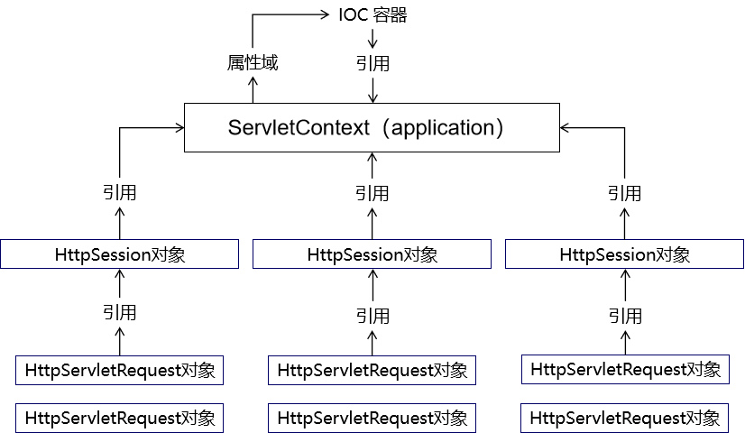

[TOC]

# 第一节 获取原生Servlet API对象

## 1、原生 Servlet API

- HttpServletRequest
- HttpServletResponse
- HttpSession
- ServletContext

原生：最原始的、本真的，没有经过任何的加工、包装和处理。

API：直接翻译过来是应用程序接口的意思。对我们来说，提到 API 这个词的时候，通常指的是在某个特定的领域，已经封装好可以直接使用的一套技术体系。很多时候，特定领域的技术规范都是对外暴露一组接口作为这个领域的技术标准，然后又在这个标准下有具体实现。


## 2、可以直接拿到的对象

### ①在 IDEA 中创建代码模板

使用快捷键调出代码模板能够极大的提升开发效率


### ②测试获取三个可以直接得到的对象

#### [1]创建超链接


```html
<a th:href="@{/original/api/direct}">可以直接得到的三个</a><br/>
```


#### [2]声明 handler 方法

```java
@RequestMapping("/original/api/direct")
public String getOriginalAPIDirect(
        
        // 有需要使用的 Servlet API 直接在形参位置声明即可。
        // 需要使用就写上，不用就不写，开发体验很好，这里给 SpringMVC 点赞
        HttpServletRequest request,
        HttpServletResponse response,
        HttpSession session
) {
    
    logger.debug(request.toString());
    logger.debug(response.toString());
    logger.debug(session.toString());
    
    return "target";
}
```


> ServletContext对象没法通过形参声明的方式直接获取，如果非要在形参位置声明ServletContext类型的变量，那么会抛出下面的异常：
>
> java.lang.IllegalStateException: No primary or single public constructor found for interface javax.servlet.ServletContext - and no default constructor found either


## 3、获取ServletContext

### ①方法一：通过HttpSession获取

```java
@RequestMapping("/original/servlet/context/first/way")
public String originalServletContextFirstWay(HttpSession session) {
    
    // 获取ServletContext对象的方法一：通过HttpSession对象获取
    ServletContext servletContext = session.getServletContext();
    logger.debug(servletContext.toString());
    
    return "target";
}
```


### ②方法二：通过 IOC 容器注入

```java
// 获取ServletContext对象的方法二：从 IOC 容器中直接注入
@Autowired
private ServletContext servletContext;
    
@RequestMapping("/original/servlet/context/second/way")
public String originalServletContextSecondWay() {
    
    logger.debug(this.servletContext.toString());
    
    return "target";
}
```


## 4、原生对象和 IOC 容器关系




[回目录](index.html) [下一节](verse02.html)